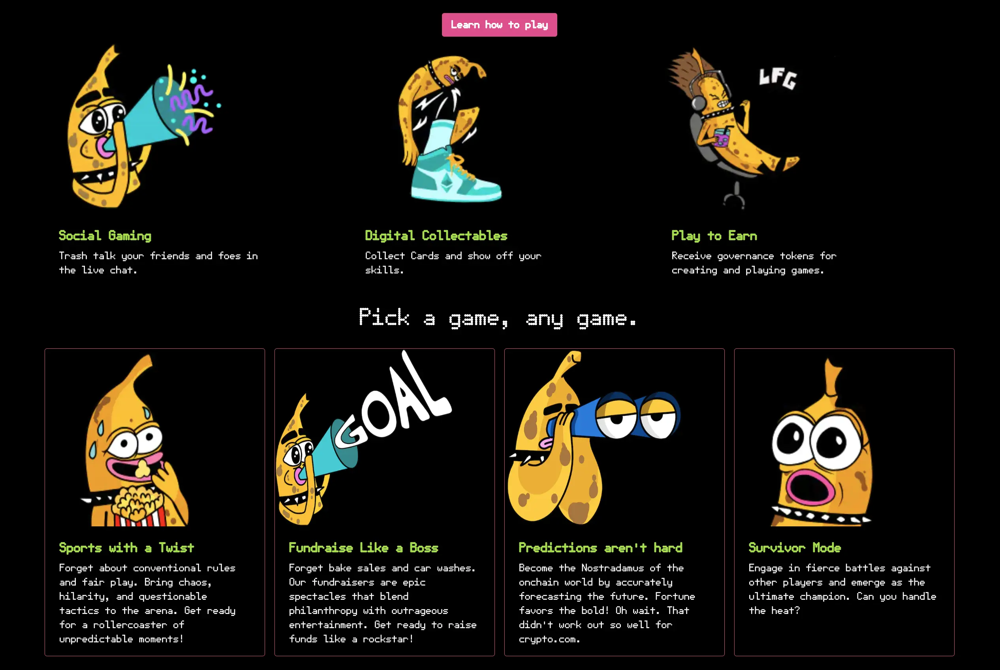
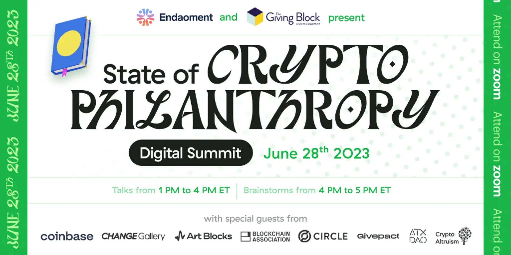

## ETH Waterloo Updates by Nicholas

Nicholas attended the ETH Waterloo last week and gave a speech on this event. The speech was about the token URI resolver and how users can make their own resolver with on-chain metadata.

And he also made a hackathon project with on-chain SVGs which won a prize among the 11 finalists projects selected from this event.

There were quite a few sponsors on ETH Waterloo, such as Gnosis Chain, World Coin, Polygon, Sismo and Hyperlane etc. which had been pushing for narratives of Zero Knowledge or Cross chain. Nicholas thought sponsoring this type of event can be very ROI positive to help propogating use of protocols or APIs. Maybe we could think of sponsoring on similar events and make the requirements more specifically so that participants would make more use and dive deeper into our Juicebox protocol.

Jango agreed with that, and said even from an auditing perspective, we could gain a lot from the points of contact, feedback and iterations in these events. So it might be worthwhile to have many people try to build stuff on our protocol, which would help us to improve the documentations and developer experience.

Nicholas thought that the biggest challenge for us would probably be getting technical people on site to both support during the hackathon and judge after it, which would be very helpful for users to integrate our protocol with what they aim to develop.

He also thought that ETH Global is a great event for us to partner with, and as ETH Global have almost one event every month, we don't need to wait too much time after we decide what we should do.

## Delegate Hackathon Updates by Jango

Our Delegate Hackathon in collaboration with Buidl Guidl would start this week. Jango would like to go through the process alongside anyone else who wants to hack on delegates, which are basically pockets of codes that get triggered whenever a treasury receives a payment or someone tries to redeem from a treasury.

He thought that it'd be cool to see some folks who are more used to working on other bits of the ecosystem to try their hands on some contract codes. The delegates could be something you do either for some non-programmatic purposes, or for fancy programmatic initiatives.

Earlier, TJL had asked about how we were going to do with front ends for this hackathon or whether everyone would need a Juicebox project to try it out. Jango thought that there would be a lot of Goerli projects made in the next week through this hackathon, some of which might end up feeling strange because they only have some half-baked delegate attached. When there were interesting cases that front end could help with, we would definitely want to call those out. But in general, the current front end will trigger all the delegates anyways.

It would be hard for the juicebox.money to know what would happen during this hackathon. If a project has a data source or delegate that it doesn't recognize, they will still get called. So that folks can still just make payments and know for their own sake that they're trying out a prototype of theirs.

Jango thought it'd be cool to consider supporting some of these projects with light weight, one-screen UIs that are more use case specific, but it's not a must. He pointed out that we could always make use of  Etherscan in a worst case scenario, with some good documentation of how to format all the parameters.

## Bananapus Demo by 0xBA5ED and Jango

Jango introduced that Bananapus is a project focused on L2 developments and trying to experiment how to make Juicebox function well in L2s. The major part of that lies in making cross chain operations workable and sensible for a group of people who share an interest in a certain token or an organization.

The pre-requisite of this system is to have a staking component for Juicebox project tokens. Although these token might have other use cases, it would be really useful to get us to L2s with these cross-chain capabilities.

The staking of Bananapus works in a way that instead of having NFTs denominated in ETH, it is going to use a payment terminal denominated in an arbitrary ERC-20 token of a Juicebox project, for example, a JBX payment terminal. The mental model of staking for Bananapus is that users can pay some ERC-20 tokens to a Juicebox treasury to mint an NFT, and also can redeem this NFT to get their tokens back from this treasury. We can reuse the juicebox.money UI and all the fuctionalities of a treasury to model it.

Once the users have one of these NFTs minted by staking their ERC-20 tokens, we can add more functionalities into the NFTs, one of which is rewarding funds from the reserved rate of another project treasury to the stakers. For instance, we can allocate 10% of reserved tokens of JuiceboxDAO to be shared between everyone who has currently staked their JBX and hold one of these NFTs.

On the Town Hall, 0xBA5ED demoed some NFT artwork that had been done recently. These were randomly generated onchain SVGs which will contain some information from the blockchain, such as the tiers and the cost of the NFTs.

These NFTs were the default of Bananpus, so anyone can easily deploy staking solution for their project tokens and start routing rewards to it.

Contract wise, minting and redeeming from an ERC-20 payment terminal had been basically ready to deployed and used, but it would still need some front end efforts to help supporting this ERC-20 payment terminal in the UI.

This would be our first scoped use case of an ERC-20 terminal, Jango suggested that we probably should consider working together to integrate the JB ERC-20 Terminal to one project (Bananapus) first, and testing if it would be working as expected, before adding it to the create flow and making it available to all project creators. After that, we could also have a project deployer contract where it just easily deploys a full-fledged project that has a staking solution baked in, so as to narrow all the parameters of creating a project down to just what's needed to run the staking stuff.

## Buyback Delegate Updates by Jango

Jango extended huge shoutouts to Dr.Gorilla for cleaning up the codes after the Code4rena audit contest, and to Viraz for writing some of the final tests to solve really edge cases.

There were a few deficiencies that the contract crew had been pushing towards, generally making this class of payment delegates easier to use. It would be much easier if the data source has access to pass information to the delegates it calls, so the team lately had been sprinting to put up a payment terminal version 3.1.1. They were at the final stage of wrapping that up and putting it on Goerli before running some tests again.

As buyback delegate is a core function of how tokens will work, Jango thought it was worth being more careful about those deficiencies and with the experience in developing it so far making sure that this piece of code would be cleaner for folks to understand and build similar things.

Also in exploring the treasury design models of Croptop or Defifa, which will be both unowned projects and won't have outward payouts, but instead making use of redemption mechanism more heavily, as redemption rate can be deemed as a small tax on redeeming token owners and also leads to outflow of funds from the ecosystem, Jango was thinking the legitimacy of charging same 2.5% Juicebox fees for redemption oriented projects similar to Croptop or Defifa when they are setting a redemptioin rate lower than 100%, and piping those fees through this buyback delegate.

## Legal Template Library by LJ

LJ had been working together with Filipv on a legal template website, where basically will have a template library to curate some legal templates after they are reviewed and audited by a law firm.

Also they want to make this a more collaborative effort, so they would create a GitHub repo where people can make a PR if they want to submit a template. After these templates are reviewed and approved by a certain committee, they will be published on the GitHub repo as well as on the template website, so that people who do not know how to navigate around GitHub can go there and download the templates they need to use.

Some project creators who may not know what kind of templates they need, can go to the site and check in the different categories, such as employment contracts and investment contract. Currently what they have are mostly commercial and company-to-company contracts, later they would want to provide more formats such as those for freelancers and folks who work in workshops, such as advisor agreement or service agreement.

The legal structures in the tradition world, like those regarding legal wrapper that helps DAOs to create a set of entity depending on different needs in different jurisdictions, will be their next step after this template space is successfully established.

LJ also said that it would be even more cool to have a coded contract that can enforce the legal temples, which will be also on their horizon so that they not only have paper contracts but also a smart contract which will be able to collaborate or sync with the legal contracts.

## Croptop Template Updates by Jango

There was a new Mac App released for Croptop available right now. Go to [croptop.eth.limo](https://croptop.eth.limo/) and follow the instructions there to try the "Self-serve personal websites accessible from .eth addresses, with content feeds and revenue streams baked in".

There's a [Goerli version of the Croptop Publishing Network](https://goerli.juicebox.money/v2/p/1016), which is the master network project taking fees from folks who minted on sites that they forked.

And owners of  .eth websites can create their corresponding Juicebox project by clicking the "fork" button on any sites created with a Croptop template, and then give permission to the croptop contract to mint to their Juicebox project on their behalf.  They can also set the parameters under what conditions NFTs can be posted on to their projects.

## Defifa Updates by Jango

During the town hall, Jango shared some exciting developments about Defifa, which is more focused on treasury management, specifically regarding a redemption oriented treasury. He had been exploring ways to handle it in a legally and accounting compliant manner, which has sparked curiosity and puzzle-solving discussions with some trusted legal experts.

Jango was excited about the implementing this concept in Defifa and Croptop, while ensuring it's defensible and by the book. If it proves to be successful, we would share the experience with our community, as well as projects like Blunt which are running more open-ended treasuries. We would always have the option to inch closer to something more automated, but for now we would be playing with these ideas.

In the meantime, Aeolian and Kmac had been working on some very exciting front end enhancements, and Filipv had done a fantastic job improving the how-to guide for Defifa and Blunt, making it easier for users to understand. Please visit [defifa.net](https://www.defifa.net/) to explore the current state of our prototype.

Both Croptop and Defifa requires a buyback delegate, which itself relies on the payment terminal as a pre-requisite. Our focus right now was to ensure getting those out the door, once those are in place, we can expect a lot of similar projects going to be created.

## Use Case Video by Matthew and Brileigh

Matthew and Brileigh had released their second Juicebox use case video for charities and non-profit the same day of this town hall. And for next one, they were planning to make another Juicebox use case video for open source softwares.

<iframe width="560" height="315" src="https://www.youtube.com/embed/FfXhLQ_rtEU" title="YouTube video player" frameborder="0" allow="accelerometer; autoplay; clipboard-write; encrypted-media; gyroscope; picture-in-picture; web-share" allowfullscreen></iframe>

## State of Crypto Philanthropy by Bruxa

Bruxa introduced that she was producing an event called Sate of Crypto Philanthropy for Endowment, which had really been a pleasure for her as it was involving so many people across the philanthropic crypto ecosystems, such as those from Coinbase, Art Blocks, Change Gallery, Blockchain Association, Circle, Givepact and etc.

Bruxa said hopefully she would create a really intriguing dialogue about things such as actionables,data and forecasting for the rest of the year. She would love to invite people who care about that to join the event, which she thought would be relevant to literally anyone building and also an good opportunity to ask questions.

