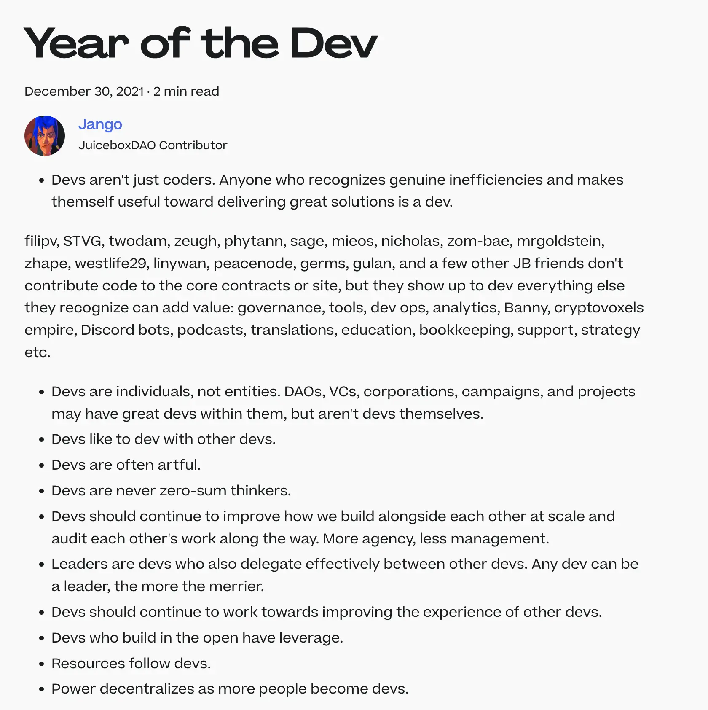

## Juicebox 2nd Anniversary Reflection

### Development history

At the beginning of this town hall, Jango reminded us that, July 15th this week marks the 2nd anniversary of the deployment of the Juicebox protocol. It was an excellent opportunity for us to reflect and share our feelings about this journey.

Jango appreciated how this community tended to manifest mostly on GitHub in general, which has been a theme since the beginning. This, along with propogating Bannys, had been our two primary modalities. However, he suggested we consider how we might relate more to the events in various local communities, and to ourselves as individuals spreading around the world with our own respective local communities. As we shift towards more application-oriented development, building stronger relationships will play an very important role.

The consistent cohort of individuals who feel a sense of agency over their contributions has been impressive. It's inspiring to witness organizations like Krause House building projects on Juicebox which are relating back to their own DAOs. We had been exploring our role as a Juicebox community and whether we should define it with specific objectives, or keep evolving organically.

Jango prefers that we take a flexible approach to our general value sets and our goals, while revisiting and discussing them on a week-to-week basis without rigid constraints, and being open to critiques along the way.

The Juicebox protocol started with a finite purpose, facilitating fundraising. And then that played itself out in the first year with some early research into how it might evolve.

In the second year, about this time a year ago, we were working on the early prototypes or pre-prototypes of the NFT delegate. We had the idea about what V2 would be and how it should evolve from V1 to support those open-ended delegates, so people can pursue more open-ended  projects. And then we created projects such as Defifa, Croptop and Blunt etc. as pockets of experimentation, allowing users to express themselves creatively while exploring different treasury designs.

As a community, we'll reflect on other people's visions, support their concepts, and envision what challenges and opportunities lie ahead a year from now. Jango emphasizes that we have many expressions of treasury design that our users might appreciate, but we need to ensure they can easily grasp the possibilities and benefits.

While the base protocol offers infinite ways to schedule and structure treasury designs, Jango encourages us to remain open-minded and creative. As we continue this exciting journey, we look forward to shaping the future of JuiceboxDAO and embracing the ever-evolving landscape of decentralized finance.

### L2 Deployment

Jango believes that there are clear market opportunities for Layer 2 solutions to build applications on. However, he recognizes that it would be challenging for a centralized entity like JuiceboxDAO to deploy across all these networks. Addressing issues like documentation and project owner relations would be very complex.

In his view, Ethereum is the most challenging environment, and he wants to ensure it is deployed correctly on the mainnet before rushing into other networks. The true value of Juicebox lies in creating organizations that are truly owned by their users. If it succeeds on the mainnet, it should succeed on other networks too.

Currently, there are no blockers preventing Juicebox from deploying to Layer 2 solutions. The team's focus is directed elsewhere at the moment. However, once other aspects are ironed out, and the core protocol gains enough traction, it would be beneficial for all applications to deploy on other environments in Layer 2 and make them accessible from there as well.

### On the Upcoming Year

Jango pondered on the possibilities for the upcoming year and wondered if the focus would be on Layer 2 and technical solutions or on integrating existing tools to unlock new opportunities. While he recognized the importance of Layer 2 solutions, he was more intrigued by the idea of organizations acting as intermediaries between Ethereum, Juicebox (as a database), and users.

He saw the next year as a time to bridge the gap between real-world users and use cases, moving beyond building generic infrastructure and sculpting it into specific and enabling toolsets that people could readily adopt for their projects.

Mieos expressed his belief that our current economic system was insufficient for a better future for people and the planet. He foresaw a significant shift in how businesses and innovation revolve around economics. He was particularly excited about Juicebox serving as a toolset ready for a cultural shift, empowering new ideas around economic models, business strategies, and user incentivizations.

Jango shared Mieos's enthusiasm and saw Juicebox as a programming language for money, allowing users to create new relationships between customers and producers, ushering in a promising era of possibilities.

### "Year of the Dev"

Jango looked back on the blog post [Year of the Dev](https://docs.juicebox.money/blog/year-of-the-dev/) that he wrote about a year and a half ago, realizing that its essence still resonates strongly with the community today, despite some changes. He cherished the fact that we are a developer-oriented community, where individuals build with their unique perspectives and support each other throughout the process.

As diverse individuals, we bring our own artistic approaches to making things happen, with values that may differ but contribute to our collective growth. Jango emphasized the importance of learning from one another, as well as from the diverse experiences and viewpoints beyond our commonalities, which continuously drive us forward.

Jango expressed deep gratitude and excitement for the past year of building, acknowledging that it came with its fair share of challenges. However, the team successfully navigated through those obstacles and embarked on a journey of showcasing new aspects of the project. They highlighted their tasteful discoveries and emphasized financial value sets that held great significance to them.

With confidence, Jango believed that these developments would propel the project forward for many years to come, and he felt a genuine sense of excitement to be actively involved in its ongoing development.

