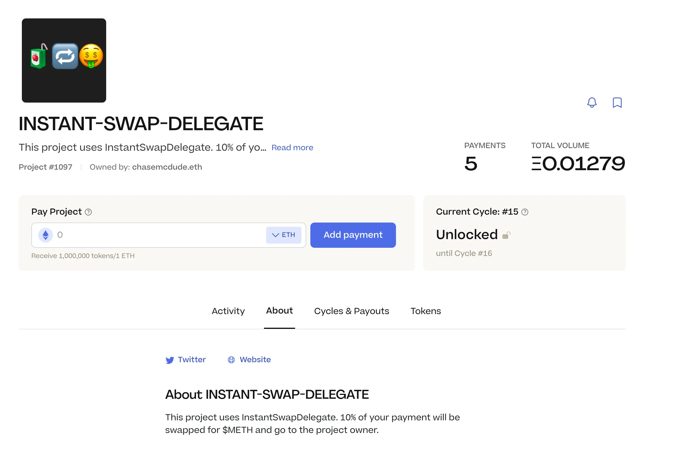
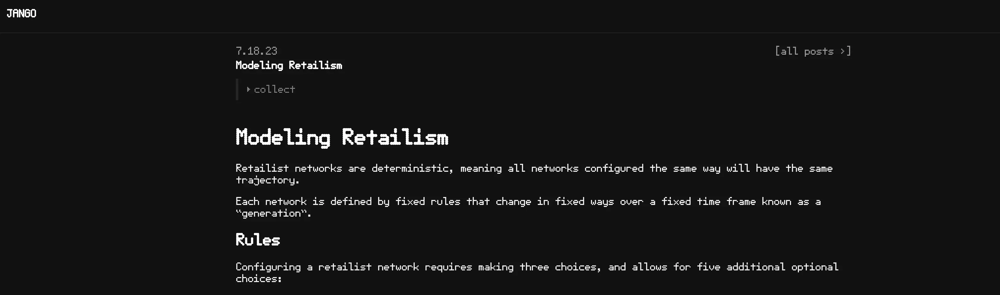

## Feedback on Documentation by Hackathon Participants

Nowonder, one of the the hackathon participants, suggestted that we have a visual material about the payment terminals, possible delegates and options of all possible configurations, which helps with the understanding of all the process, and reduces the friction of having to go over all the section of documentation.

Actually we had released a video of going through how to start a  repository of delegates, which was considered very helpful by certain participants. But as it was not posted on the right pages in the docs, it didn't reach some of the participants, and Filipv promised to solve this problem.

Jango thought some of the hackathon submissions with videos or solid readme file might might be useful for other folks in the future. He also suggestted that we keep an index of these open source delegates written by the participants with links to the authors, so that if audited or reviewed by the community, we can promote them in a different section.

## A Runthrough of Hackathon Submissions

### 1. Instant Swap Delegate

Submitted by: Aeolian

Description: A Juicebox protocol pay delegate for automating treasury token swaps.

Repo: https://github.com/tomquirk/juice-delegate-hackathon

Demo: https://goerli.juicebox.money/v2/p/1097

Team Juicebox project: https://juicebox.money/@etherfunkio

### 2. JuiceTable

Submitted by: LJ

Description: A version of Juicebox Protocol integrating with EthSign TokenTable, allowing projects to have the functionality to customize token unlocking schedules for project token distribution, while still raise funds through the secure Juicebox Protocol.

Repo (smart contract): https://github.com/boyuanx/JuiceTable

Repo (frontend): https://github.com/jbettenc/juicetable-interface

Demo: https://youtu.be/XFwiadWq0YI

Team Juicebox Project: https://juicebox.money/v2/p/540

### 3. JBStraws (Merkle Root Whitelist)

Submitted by: nowonder

Description: A data source which functions as a whitelist, allowing the project owner to upload new merkle roots over time. Includes access control via JBOperatable, which allows admins to set a new merkle root and enable/disable the whitelist.

Repo (smart contract): https://github.com/simplemachine92/JBStraws-Contracts

Repo (frontend): https://github.com/simplemachine92/JBStraws-Interface

Demo: https://juiceystraws.vercel.app/example-ui

Team Juicebox Project: https://juicebox.money/v2/p/542

### 4. JUICYBONUS

Submitted by: Meme Man

Description: A simple and highly configurable delegate to allow a project owner to give a bonus (or reduction) in tokens received for contributing to a project based on how much ETH is sent in that contribution.

Repo: https://github.com/Narwhal8/galactic-brain-delegate-just-trust-me-bro

Demo: https://youtu.be/dyB58nUyAkk

Team Juicebox Project: https://juicebox.money/v2/p/539

### 5.DominantJuice

Submitted by: Armand

Description: The main juice of this project is adding a JB project option to use a dominant assurance escrow contract that quadruples as a JB Data Source, JB Pay Delegate, and JB Redemption Delegate. The escrow contract features Alex Tabarrok’s “dominant assurance” contract idea, which tries to minimize the "free-rider problem" by rewarding early pledgers with an owner-deposited refund bonus upon a failed campaign/cycle. If the funding target is met, the pledger's pledges turn into payments that fund the project, and the project owner withdraws their original refund bonus deposit from the escrow contract / JB Data Source. This alternative mechanism can be extended to fund any type of crowdfunding campaign or public good.

Repo (smart contract): https://github.com/Starmand6/dominant-juice-hack

Repo (frontend): https://github.com/electrone901/Dominant-Assurance-Juicebox

Demo: https://dominantjuicebox.netlify.app/#/

Team Juicebox Project: https://juicebox.money/v2/p/543

### 6. JuiceboxDataSourceAggregator

Submitted by: weaver

Description: A project aiming to provide simple data aggregation for Data Sources. It features practical examples showcasing the utilization of average weights derived from multiple sources, as well as the implementation of multisource allow lists. Simple interfaces and implementations to be extended for further use.

Repo: https://github.com/calcifer11/JuiceboxDataSourceAggregator

Team Juicebox Project: https://juicebox.money/v2/p/544

### Thoughts on Front End Support in JBM

Jango thought it will be great to consider adding an optional datasource address in the create flow and reconfigure flow of Juicebox.money to folks who are deploying these delegates and want to provide a create flow throught JBM.

Filipv agreed with this, and said that more tightly scope and generic front ends will be very nice to have, such as a dedicated hackathon front end repo as a template for working with Juicebox contract specifically.

## Buyback Delegate Proposal Introduction by Jango

At the time of this town hall,  [A proposal to implement the buyback delegate on JuiceboxDAO](https://www.jbdao.org/s/juicebox/408) submitted by Filipv was under governance voting process.

Jango thought that a lot of things were  waiting on the deployment of this buyback delegate, and it would be exciting on many fronts. This governance proposal to implement it would help prepare ourselves for the outcome of this product.

This proposal also requires a migration of current buyback delegate version from 3.1 to 3.1.1 for JuiceboxDAO, which has the implication of incurring fees for JBX redemptions from JuiceboxDAO treasury. As this extra fees for redemption will have 1% negative effect on redemptions, Jango said this migration would be just for dev convenience to update to the version in conformity with our development goal.

Jango said the first step of execution of this proposal would be the migration only, and after we experiment successfully with lower risk project like Defifa or Croptop, our contract crew would advise the DAO to reconfigure it to the JuiceboxDAO project.

For the buyback delegate to be effective, we might also need to create a liquidity pool for a ETH and V3 JBX pair and add funds to it. Jango expected that there would be higher trading volumes for JBX on Uniswap.

Overall, Jango thought the deployment of buyback delegate would be a move with lots of risk. If this proposal gets approved by the DAO, it also means  the DAO acknowledge the risk and is willing to go forward.

## Dev Oriented Videos and Juicecast by Matthew and Brileigh

### Buyback Delegate Introduction Video

In the video recorded by Matthew, JuiceboxDAO contract crew, including Jango, Dr.Gorilla and Viraz gave a walkthrough for the buyback delegate contract and explained the working mechanism of it.

<iframe width="560" height="315" src="https://www.youtube.com/embed/ZFZ03Jj5mKM" title="YouTube video player" frameborder="0" allow="accelerometer; autoplay; clipboard-write; encrypted-media; gyroscope; picture-in-picture; web-share" allowfullscreen></iframe>

This is one of the efforts to provide some more developer oriented content. Also they were planning produce another video with Peel, to go throught the Juicebox interface, problems solved and subgraph queries, etc.

### New Episode of Juicecast featuring Nicholas

They also released the last epidosde of Juicecast with Nicholas. In this episode, Nicholas talked about the onchain SVGs, Juicebox metadata contracts, token URI resolver, the Juicebox cards project, and his ETH Waterloo project with the new ERC-6551 standard.

<iframe width="560" height="315" src="https://www.youtube.com/embed/1tQpVhB7qdo" title="YouTube video player" frameborder="0" allow="accelerometer; autoplay; clipboard-write; encrypted-media; gyroscope; picture-in-picture; web-share" allowfullscreen></iframe>

## EthCC Guide by Bruxa

Thristy Thirsty would be hosting an event during the EthCC, and Bruxa used the Croptop template to make a guild to this event on their ETH domain name website [thirstythirsty.eth](https://paris.thirstythirsty.eth.limo/). They would be releasing this guide to community members and allowing them to collect the content as NFTs without having to token gate any of those content.

Bruxa said this method of propagation feels very good to direct sponsors or clients to pay to their project, which in turn pays their people on the ground providing services. They plan to use this way to demostrate their transparent treasury and hopefully attract sponsors, partners and ultimately members to their community. She was excited about this experiment and grateful to launch it with Croptop and Juicebox.

## Retailism by Jango

Retailism is a concept that Jango proposed recently in the process of thinking about the treasury designs of Defifa and Croptop. For those projects created with these frameworks, instead of various Defifa games and Croptop collections are independent treasuries from an application perspective, but rather those applications take fees into a singular treasury, such as Defifa network treasury and Croptop network treasury in a way that there would be incentives to encourage developers to develop and network to network in peace.

Essentially retailism, in the background of Juicebox protocol, depicts a way projects are built, where its treasury doesn't have any outward payouts, any funds that come into the treasury emits tokens outward, and the only way to access funds in the treasury is to burn the tokens to redeem from it.

In this framework, how do developers, who often need cash flow to do certain things including paying themselves, get paid? how to build confidence in investors so that they are willing to invest and understand what the investment means? How to balance the necessary energy to push the projects forward?

Up till the moment of this town hall, Jango had written 4 blog posts to express his thoughts in this concept.

### [Retailism](https://jango.eth.limo/9E01E72C-6028-48B7-AD04-F25393307132)

The first one is an overview to this concept, explaining the What, Why, Who, When and How this framework of retailism will apply and outcompete within a broader capitalist marketplace and avoid retail extraction of generations of participants.

### [A Retailistic View on CAC and LTV](https://jango.eth.limo/572BD957-0331-4977-8B2D-35F84D693276)

Different from the business model of profitting from the difference between CAC (Customer Acquisition Cost) and LTV (Lifetime Value) in the traditional Software-as-a-services business world, retailistic software distribution encourages growth differently by presuposing a networked environment where participants share the things they like with one another, help one another learn how to use things, and troubleshoot problems together.

### [Modeling Retailism](https://jango.eth.limo/B762F3CC-AEFE-4DE0-B08C-7C16400AF718/)

This post describe the rules to shape a retailist network, a different combination of these variables might determine the different trajectory of these networks. And also the way these rules affect the network's growth rate and exit rate might give rise to some tensions.

It also provides a [spreadsheet](https://docs.google.com/spreadsheets/d/1R-3PyyF2chmsf_t3IdVi7oEWD0i0IHTcDNwQj4DEKaA/edit#gid=424465074) to play with different variables to feel various trajectories of these retailist networks.

### [Retailism for Devs, Investors, and Customers](https://jango.eth.limo/3EB05292-0376-4B7D-AFCF-042B70673C3D)

The last post analyzes why a retailist network will be productive certain groups of network participants and why not for others.

The last thing missing in this concept will be the buyback delegate, which helps easing the price fluctuations over time between the entrance rate (issuance rate) and the exit rate (redemption rate). Once these last contractual components fit together, we will have some experiments in practice through Defifa and Croptop. And we will study them live and find out what works and what does not, evolve them further, before forking the framework for different kinds of software projects.

## Peel Updates and Demo by Tjl

Peel team had pushed a new feature to the project page on Juicebox.money, which allows project owners to add updates for a project so as to keep their communities informed of latest changes, such as announcements, events, partnerships, development milestones etc.

The updates will also show the time of posting and the wallet address that posts it. And the project owners can delete a certain update and add another one, but they won't be able to edit the posted updates.

