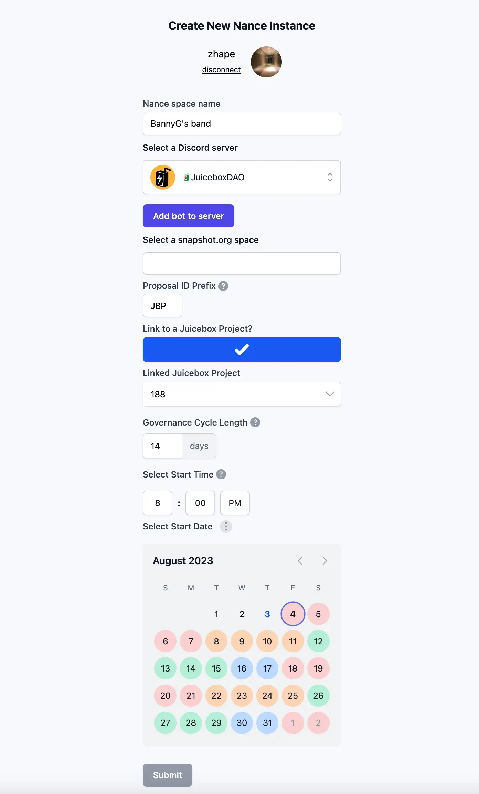

## Visibility Updates by Matthew and Brileigh

### Solidity Sesh Series New Episode

Matthew and Brileigh had been producing the new video series of Solidity Sesh, together with our contract crew Jango, Dr.Gorilla, Viraz and 0xBA5ED, to introduce parts of the Juicebox protocol, about its specific contracts or the architecture of the protocol itself.

The first episode of this series was released last month, which was about the buyback delegate contract and the working mechanism of it.

Today they published the second episode, Payment Terminal Inheritance Structure, to introduce the inheritance structure of payment terminals and how the uses can build their own payment terminals for a specific ERC-20 token.

<iframe width="560" height="315" src="https://www.youtube.com/embed/CWkmCh0wjdg" title="YouTube video player" frameborder="0" allow="accelerometer; autoplay; clipboard-write; encrypted-media; gyroscope; picture-in-picture; web-share" allowfullscreen></iframe>

Jango introduced that the Solidity Sesh was inspired by folks who had been trying to build stuff on Juicebox protocol. For example, the new episode of inheritance structure got its inspiration from Nicholas's questions during his development of the project NFTs for Juicebox.

Hopefully this session will be a start of our efforts to help people understand more about the Juicebox protocol. Any feed back or specific requests to this series will be very welcome.

### Juicecast New Episode

They were currently working on the production of the new Juicecast episode featuring a NFT influencer [DeeZe](https://twitter.com/deeze). This episode of Juicecast had been released at the time of this town hall summary.

<iframe width="560" height="315" src="https://www.youtube.com/embed/R5xoInP0JxE" title="YouTube video player" frameborder="0" allow="accelerometer; autoplay; clipboard-write; encrypted-media; gyroscope; picture-in-picture; web-share" allowfullscreen></iframe>

## Nance Sign-up Form Demo by Jigglyjams

During the town hall, Jigglyjams demonstrated the create flow of a new Nance instance which was still work in progress, and he called out for thoughts or feedback on this prototype. This was supposed to help other Juicebox projects to implement their governance process, making Nance a generic governance tool available for use in the Juicebox ecosystem. With this, projects should be able to unfold their governance procedures from drafting proposals, Discord community temperature checks and Snapshot voting with project tokens, etc.

The preliminary process of creating a Nance instance will be:

1. Users need to authorize to add the nance-bot into the Discord server that they have admin permissions.
2. Then they can choose a channel for nance-bot to post new proposals to, where community temp checks will be taking place.
3. Also users can link nance-bot to their Snapshot space as a member, so that it can automatically post on their behalf the proposals passing temp check to the Snapshot page for the next voting phase.

In this create flow, users can name their own Nance space, put a custom prefix to proposal IDs, and link this space to an existing Juicebox project. And a calendar of governance is also available to check the different phases of governance cycles with a starting date specified by users.

Jango suggested that maybe someday in the future Nance team can think of some iteration where users pay and mint tokens from the project of Nance, and then use those tokens as credits for their usage of Nance's governance services.

Also he thought that maybe Nance can work more intimately with Juicebox.money website, probably even consider integrations with the project create flow,  so that project creators can easily plug their projects to a governance system. Jigglyjams agreed with that, and said that he had been contemplating with the idea of a community starting off from a Snapshot and Discord server and launching their Juicebox project from a community proposal voting with the help of Nance.

Finally Jango mentioned the possibility of making use of Nance in those forthcoming retalist projects like Defifa and Croptop. These projects will be unowned and without any project owners, while a certain percentage of reserved tokens will be vested to a multisig for an initial duration of time as incentives for founding members.

## Payment Terminal Migration and Governance

In the end of this town hall, Nowonder raised a question about whether the payment terminal migration needs to go through the governance process before it is executed.

Jango explained that the way the protocol works is that anyone can deploy whatever contract they want without needing to ask permission from JuiceboxDAO. But if they expect the DAO to make use of the new contract or they want to get refunded for the expense of deployment, they will have to submit a proposal to that effect and get the approval from the DAO.

The migration of payment terminal is just a process of adding the new payment terminal to the contract library. As long as it adheres to the interface, anyone can call the migrate function. JuiceboxDAO doesn't need to give permission for any other projects to make something new up and move their things over there.

