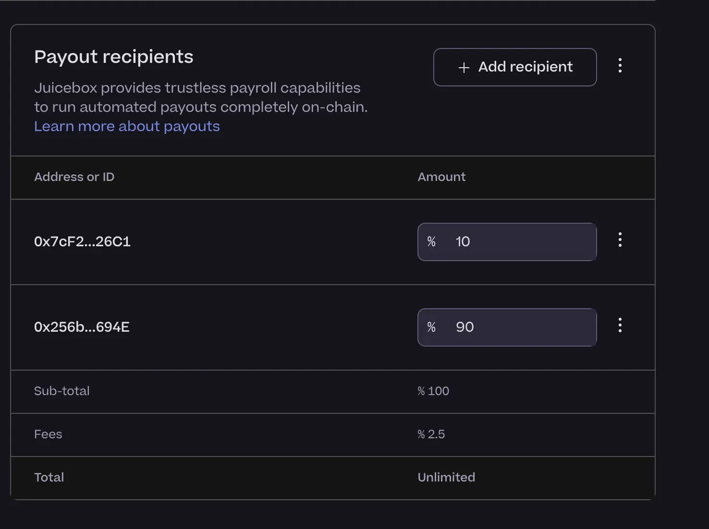
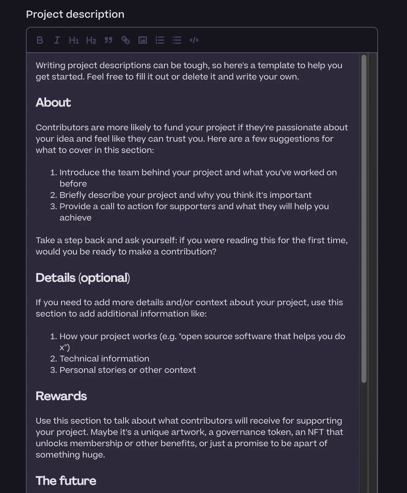
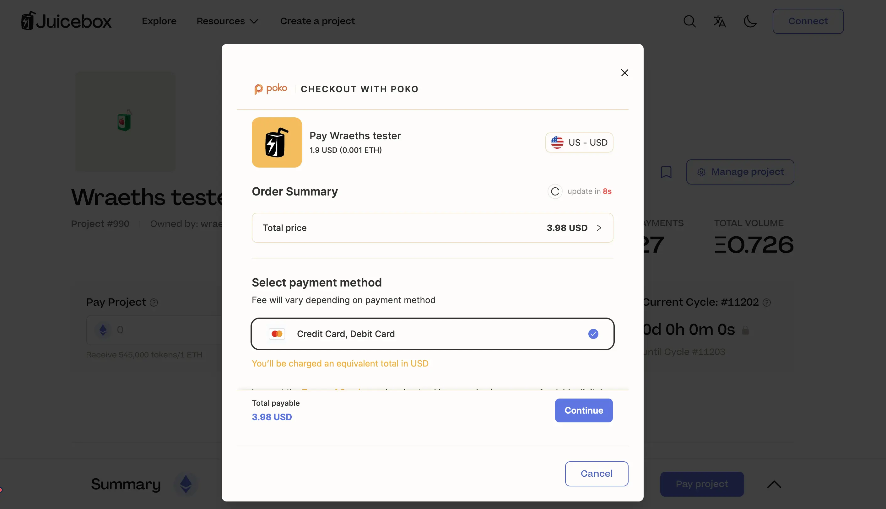
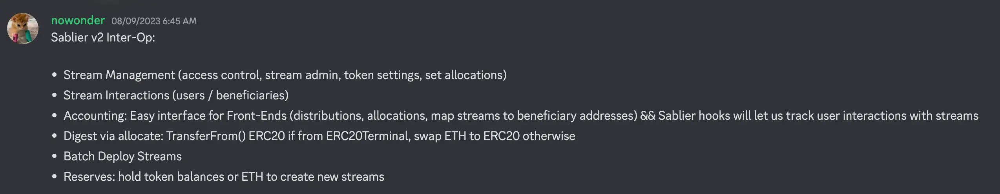
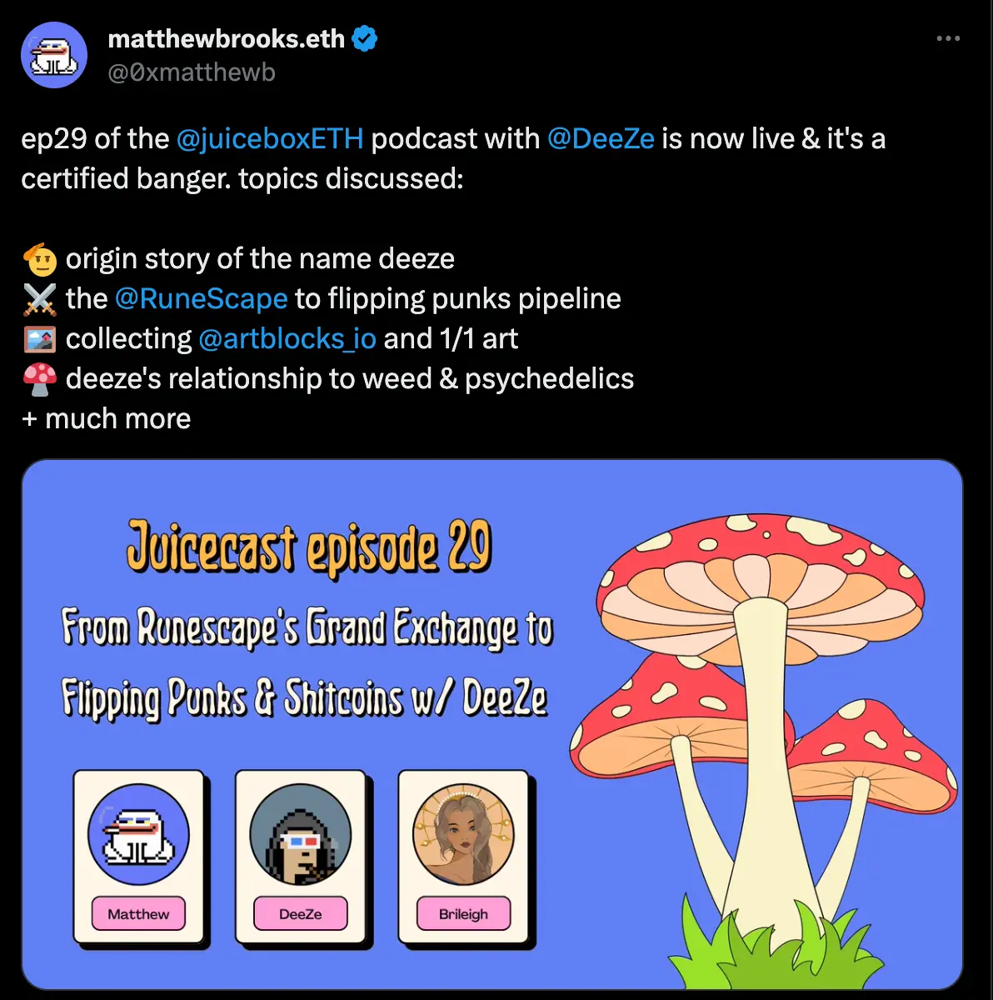

## Peel Updates

### Rich Text Editor Demo by Tjl

This is a feature that has been requested by many projects, for more customization and control over the project description. With this new feature, project owners can edit project description with Markdown formats, images and links, etc.

Hopefully this feature would help strengthen project's About section and give owners more freedom in providing detailed infomation about their projects.

Currently there were still some bugs in this feature, Peel team would fix those problems and deploy this new feature once everything was ready.

### New Payouts Table Demo by JohnnyD

At present, if the project owners want to edit someone's payout, they will need to go into a separate modal to adjust the numbers of that payout.

JohnnyD had been working on the new edit cycle form lately, and he had made a new payouts table to help editing the payouts more conveniently. Owners can edit everyone's payouts directly from the table without needing to open a modal for each payout again.

This will be easier for project admins to know exactly how much is going out of the treasury, and more importantly, the actual amount of Juicebox fees incurred with these outward payments will also be updated simultaneously with the editing of payouts.

Hopefully this new payouts table will give people a much better idea of what's happening with the distribution limit and the Juicebox fees that will be incurred with the payouts.

Peel team was still working to get this table to production, after some more reviews and tests to make sure it is functioning well as expected.

### Create Flow Education Sneak Peak by Tjl

Peel team had been putting quite some efforts into overhauling the create flow with user's education in mind, and Strath had been the one responsible for this work. Realistically the goal is to let people create a project from start till the end without needing to look too much to the contributors team for support or help, making the create flow as self-serving as possible.

Obviously one of the biggest challenges in this respect is about how to let the native Juicebox concepts, one of the hardest things to comprehend, play into the create flow much more intuitively and easier to understand along the way.

Peel team also introduced a few thigs to help increase project quality.

Firstly, when users click to create a new project, there will be a splash screen that gives them some tips to create a project, etc.

The team is also introducing the drafts, so that project creators can go back and forth without launching a project or having to reconfigure before all the details are finalized.

And more importantly, there will be a little educational panel on the right hand side of the create flow page, which will be fully collapsible if users feel that they don't need this kind of information while being well aware of the choice there.

### Keyp Integration and Fiat Checkout with Peri

[CupOJoseph](https://twitter.com/CupOJoseph), the founder of Game Wallet, is going to launch a project on Juicebox to sell his Gameboy wallet cartridges as a hardware wallet. At this moment, the Game Wallet has got about 10,000 people on their waitlist, while the project team is still finalizing some details, one of which being the ability to pay not only in Ethereum, but also in fiat as well, so that the project can be open to a wider audience.

Peri, who is the person mainly responsible for the support of this Game Wallet project, said that there are currently two important components in this upcoming project.

The first one, also the main problem for Game Wallet is concerned with the fiat checkout integration, as right now payment to a Juicebox project is still limited to ETH. The integration that Peel team is building right now is to make use of [POKO platform](https://www.pokoapp.xyz/), so that when users are paying a project, they have the option to transfer to an embedded form to check out with fiat. The working theory behind the scene is to buy ETH on payer's behalf and automatically transfer them into the relevant Juicebox project.

But the dilemma here is that, we will still require payers to have a crypto wallet connected to the project, so that we can have a place to send the project tokens minted from the payments. This in turn give rise to the second important components of this project. We're going to integrate with [Keyp](https://www.usekeyp.com/), which is a service that allows users to authenticate with an email adress and create an account to be allocated with a crypto wallet address. With that integration, when users click the connect button on the Juicebox app, they will have the option to use between a standard EOA wallet or the Keyp wallet. The Keyp wallet will work totally the same with a normal EOA wallet, including sending transactions or checking balance, etc.

Tjl thought that we could further discuss the possibility of making these integrations generic for all other projects to use, also there might be some other unforeseen potentials on the horizon for us to explore in this respect.

### Hackathon Partnership Discussion

Tjl introduced that the Peel team had been reaching out to some hackathon companies and platforms to talk about the possibility of coming into a partnership with them, in a hope to get some hackathon projects onto the Juicebox protocol and help them raise funds to further improve their development.

He said that we had come into verbal agreement with both ETH Global and Devfolio, to run a trial partnership during the period from mid September to January. If we get it right, we coud become more hackathon tooling oriented with constant projects coming in from developers.

Mieos said that the WAGMI team is thinking about how to make sure that we use the hackathon events as great brand moments to propagate Juicebox not only in terms of technicalities, but also through its cool Juicebox culture, vibe and art.

Jango suggested that other members of our community in the broader ecosystem could contribute to these efforts as well. He also saw an opportunity to create alignment and collaboration throught various events, such as presence and active involvement of our contract crew in hackathons, and partnerships with other communities.

He also took Thirsty Thirsty, a community that arranges more food and beverage oriented events, as an example to get inspiration of how we move into these hackathon worlds and physical land, how we can encourage a cross-disciplinary ecosystem emergence, following and supporting Tjl's efforts.

Jango thought that it had been pretty clear that the Banny is definitely a top-of-funnel phenomenon, especially with our experience and the feedback from the pay delegate hachathon we ran last month. But it takes time to really grok how it can be useful and how we might lead the way.

## Buyback Delegate Updates by Jango

We now have a buyback delegate version that will be easier to deploy and attach to a project. Our contract crew is now piecing together the accompanying contract that will be generic for any project to initialize from.

The metadata standard for the 721 delegate is now complete. Our contract crew will work with the front end team on how to pass metadata to delegates or the pay functions under the new standard, which will help projects attach multiple delegates to their projects and pass information to them cleanly so that a project can have both buyback delegate and 721 delegate attached.

The team aimed to have everything deployed by the end of this week, but it was definitely worth more time to address some of the final trade-offs, between getting things baked in forever from the beginning and allowing for granular control over time.

Now we are just left with a few of these concerns which are mostly risk management related, but generally everything is looking good and Jango felt excited to deliver this product very soon. It feels like so many potentials are unlocked with this delegate and we will see them come to fruition over the next couple months.

Hopfully we would have a really tight spec for Juicebox.money to follow if it wants to integrate with new stuff sooner rather than later.

Jango thought that JuiceboxDAO would be ready to take on buyback delegte as soon as it's proven reliable. He was grateful to everyone that accompanied and voted on the proposals to get the termials to their most robust state.

## Bananapus Updates by Jango

Jango thought that we would probably have some prototypes in the upcoming weeks. He would be very stoked to see some prototypes that people can play with the soonest, because he thought that would be increasingly relevant part of Juicebox's future, especially as we started to get into hackathons and people had the option of launching projects to get paid in them. We need to make sure that people can do so on cheaper chains and not be locked there.

The beauty of Bananapus is that we are basically creating options for projects to start on a particular chain and then they can evolve easily around the ecosystem. This is a very flexible patten. As it's pretty abstract to most folks, Jango expressed his willingness to continue explaning the working mechanisms of Juicebox protocol in the Solidity Sesh video series, hopefully helping people deepen their understanding and try out their ideas.

He also hoped that the dev efforts of Bananapus would end up merging really nicely with the convenient wallet connection and fiat checkout mentioned earlier during this town hall that Peel had been building. Certainly this will be a longer term effort, but he insisted that we shoud continue exercising that muscle of grokking what that means for the whole ecosystem.

Although he thought that Mainnet is always going to be the place where the larger pockets of experiments happen, but we definitely need the protocol to extend past mainnet for things to really improve and get accessible, and we are inching towards a place where people can start off in cheaper environments with real tradable volumes and then over time take up multiple footprints across chains, which sounds very exciting.

## Sablier Interop Updates by Nowonder

Nowonder's proposal to integrate Sablier with Juicebox had been approved by the DAO lately, in this town hall, he expressed his gratitude towards our community for allowing him to work on this job.

The Sablier interop is basically a split allocator that allows project owners to deploy Sablier Stream to distribute project tokens to people in a granular manner over time.

According to Nowonder, the major use case of this integration lies in where project owners want to onboard new contributors, while not being too sure whether they deserve the payout. Project owners can issue streams of token to new contributors and cancel those streams if the work doesn't turn out to be satisfying. Basically his main point is encompassing everything under a single contract, the split allocator contract, which will also be an admin panel and a user interface for people to withdraw from their streams. Both project admins and users can interact with the same contract for their respective purposes.

Another feature that Nowonder was thinking of adding to it is either an ETH reserve or a project token reserve, which would allow project owners or their operators to add new streams even if they aren't instantiated when the allocator is deployed in the very beginning.

Jango thought that this looked sound and great for prototyping to really leverage the opportunity. It would be cool to introduce more about Sablier to our community, and Juicebox to theirs, as well as how in the future the tool Nowonder was going to build would be worthwhile for projects to try for themselves.

Jango also suggested that we consider making a Juicecast episode or some coverage on Juicenews, in order to support and inspire in both directions in a consistent manner. He thought that a large part of the next sequence of the Juicebox project as a whole essentially lies in the integration with all these other communities.

Nowonder and Matthew both agreed with this idea and expressed their willingness of making a joint effort to produce a Juicecast episode.

And Nowonder also announced his plan to build a split allocator template, for the purpose of dev documentation so that somebody could understand how to start writing tests and forge for a split allocator of their own.

## Juicecast New Episode by Matthew and Brileigh

Last weekMatthew and Brileigh had released a new episode of Juicecast, featuring the NFT influencer DeeZe.

And they were also planing to do a Twitter Space with [The Dapp List](https://twitter.com/thedapplist) next Wednesday. The Dapp List is almost like an index and a curated selection of Dapps in the Web3 world, where Juicebox is also curated. They are going to talk on this Twitter Space about how Juicebox works and how people can make use of it.

Jango acknowledged and appreciated the efforts of the Juicecast team, i.e. Matthew and Brileigh. He thought that the Juicecast channel now feels warm and consistent, finding a rhythm and groove that listeners really enjoy.  Jango also extended his thanks for their capturing various works, including encouraging developers to record content and then managing the post-production work afterwards.

Jango thought that there had been a lot of insightful and educational content created that goes unnoticed due to everyone being busy working with their own projects. He encouraged cross-disciplinary collaboration from our community to contribute to Juicecast channel.

