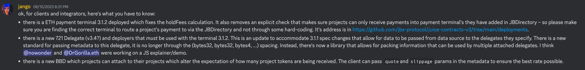
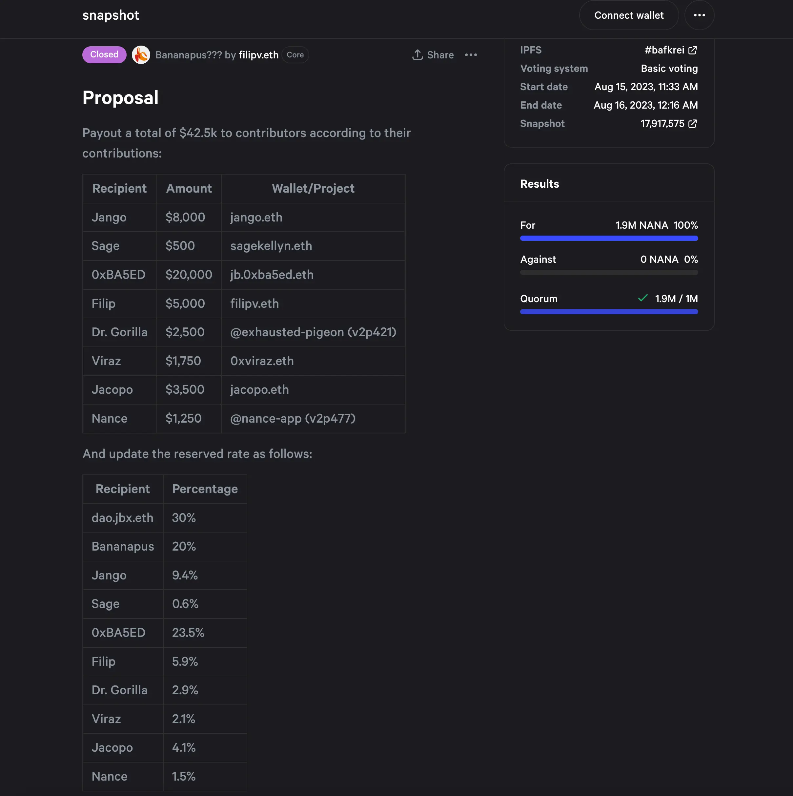
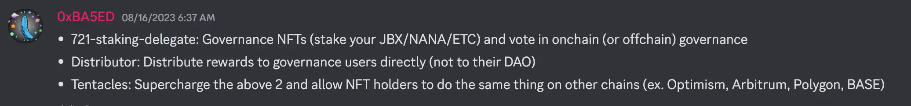
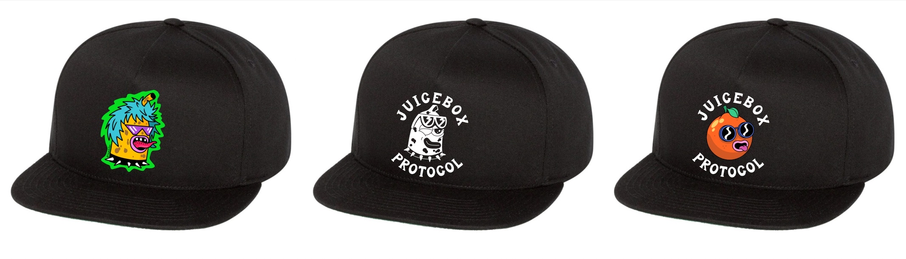

## Buyback Delegate Deployment by Jango

Jango announced that we had deployed the Buyback Delegate contract after resolving some important little details. The only thing left to do is to attach it to a project and see how it play out in the wild.

Whether the incoming payments to a project get routed to an AMM to swap tokens there, or to the Juicebox contracts to mint new project tokens, will be affected by the current circumstances of the relevant liquidity pool.

Also it will also be affected by the way the pay function is called, either being called from the outside world from a web client like juicebox.money, or being called by another smart contract in the protocol.

In the case of being called from the outside world, the web client can pass to the buyback delegate the expected swap price and its slippage tolerance, which will be important for the trade to be executed in a reasonable range, otherwise the trades might be suject to MEV attacks from adversary players on the blockchain.

In the other case, where the pay function is called as a part of another operation, such as someone calling `distributePayoutsOf` which will trigger the payment of Juicebox fees, it will be impossible to pass in the quotes and slippage at the same time. So the contract crew had decided to use instead a TWAP (Time-Weighted Average Price) oracle to determine a reasonable quote and slippage range, to create the boundaries for these trades.

These were the two aspects our contract crew had tried to research very thoroughly, but it would be very difficult to do things very precisely in a testing environment. That is the reason why we would still have the delegate battle-tested in the open world, and try to fix any inefficiency from there.

The next steps will be some collaborations with the Peel team to figure out how to allow payers to specify the parameters of trades, or at least we will provide the quotes and average expected slippage in the front end in some way for them to make their choices.

The contract crew had written a library to allow not only clients to pass data to one delegate, but also Juicebox projects to attach to themselves multiple delegates, such as a buyback delegate and an NFT delegate, at the same time.

The buyback delegate should give a lot more price efficiency to everyone involved, including the reserved token recipients. If ETH funds are paid into a project deployed with buyback delegate and there is a better price on the secondary market, the project treasury will not take in the funds and mint new tokens correspondingly, but instead route the funds to the market and get the best price there before allocating the tokens between payers and reserved token recipients.

Alongside with the deployment of buyback delegate, there was also the payment terminal 3.1.2 deployed which fixed [the Hold fees calculation error](https://docs.juicebox.money/dev/v3/resources/post-mortem/2023-07-24/), and a 721 delegate update which uses the new metadata pattern to support multiple delegates attachment to a project, as well as the payment terminal 3.1.1 spec for passing data from a data source to a delegate.

## Bananapus Update by Jango & Filipv

### First Governance Voting

The Bananapus community had voted on their first governance proposal this week, distributing payouts to conributors who made their contributions to this project and updating the reserved rates for all the current contributors.

### Working Mechanism of Bananapus

Bananapus project consists of three main components, [Bananapus 721 staking delegate](https://github.com/Bananapus/bananapus-721-staking-delegate/tree/feat/concept), [Bananapus distributor](https://github.com/Bananapus/bananapus-distributor/tree/juice-distributor-alt) and [Bananapus tentacles](https://github.com/Bananapus/bananapus-tentacles). They are going to work on Ethereum Mainnet and other Layer 2 chains respectively.

**Mainnet - Step 1**::

1. Token Issuance. Juicebox Project A accepts ETH and emits project tokens (Token A) in return, and Token A can be used to redeem a portion of ETH in the treasury if there is overflow. Project A operates exactly the same as the current ordinary Juicebox projects. For example, you can pay [JuiceboxDAO project](https://juicebox.money/@juicebox) to get JBX tokens.
2. Staking: Now we will create a new project B next to project A. Project B runs with very fixed rules and doesn't have any project owners or payouts, it accepts Token A and emits tiered NFTs back out. These NFTs can be used for purpose of governance voting either on-chain or off-chain, and also can be burned to redeem Token A. This process is implemented by Bananapus 721 staking delegate. For example, you can stake your JBX tokens to get an NFT representing your staking position.
3. Staking Rewards: Project A or any other project can now route a portion of its reserved tokens to stakers / holders of NFT as staking rewards. This part is implemented by Bananapus distributor. For example, JuiceboxDAO now can allocate 10% of its reserved JBX tokens to be shared among whoever is staking JBX.
4. Vesting: The staking rewards are vested over a locked period of time. If a position is unstaked, any unvested tokens will be forfeit, allowing the project to share its growth with token holders who are committed over time.

**Layer 2 Blockchain - Step 2 (in prototype)** :

1. Token minting: NFT representing staking postion in Step 1 can be used to mint an ERC-20 token that will be bridged over to a specific Layer 2 blockchain. This is implemented by Bananapus tentacles contract. For example, NFT of staked JBX can be used to mint the OPJBX up to the same amount of JBX staked for this position, which will then be bridged over to Optimism blockchain.
2. Staking: The OPJBX can be staked with a Bananapus 721 staking delegate in the JuiceboxDAO project on Optimism, just in the same way as what's happening in Mainnet.
3. Staking rewards: Now JuiceboxDAO project or any other Juicebox projects on Optimism can route a portion of their reserved tokens to OPJBX stakers via the Bananapus distributor contract deployed over there.
4. Vesting: same as in Step 1.

Instead of having one organization that exists and issues its identical project tokens across all these networks, and all of which are redeemable for one single project token supply balance, a project can have smaller treasuries on various respective different chains, and have tentacles for any number of chains. Anyone can deploy their own network of cross-chain operations, and there is no permission needed.

We will use Bananapus's project token $NANA to demonstrate a full end-to-end example in the next few weeks. All the components are ready, they just need to be tested, and supported with nice UI to help smooth out the process.

This mechanism can scale to any number of interactions across any number of chains, because one JBX staked position can be used to create many tentacles respectively for various L2 chains. But in order to unlock the staked Mainnet JBX,  stakers will have to return all of their tentacles, essentially destroying everything in order to access the original JBX again.

## Juicebox Merch by Sage

Sage's proposal to produce and distribute [Juicebox Merch](https://www.jbdao.org/s/juicebox/422) is currently under Snapshot voting. The goal of this proposal is to distribute Juicebox merchandises, such as stickers, hats. T-shirts etc., on ETH NYC in September to help propagate Juicebox ecosystem.

And Sage also thought of sending any leftover, or holding 25% -30% to people who are not able to attend the ETH NYC event. Jango suggested that we can send them out in batches to someone, so that when they go to conferences or events, they can hand them out from there.

The grants that Sage was applying from the DAO is USD4,000, and Sage was planning to include all the distribution cost so that basically people can get the merch for free in stead of having to pay for them.

Jango and Sage both agreed that it would be a good idea to do a simple vote and let the community choose some designs that will be put on the merch. And any ideas or suggestions about the designs of merch will be warmly welcome.
