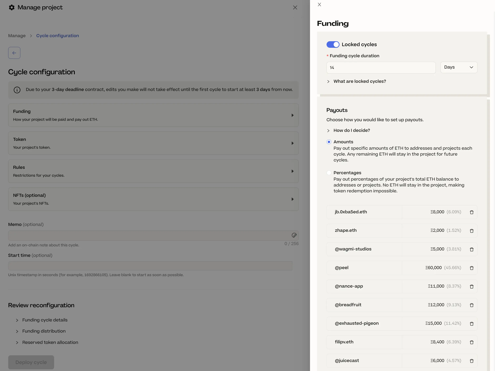
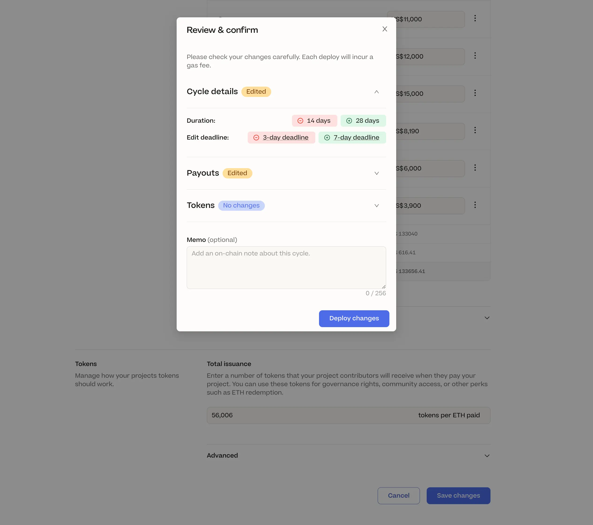

## Buyback Delegate Updates by Jango

Jango had announced the depolyment of Buyback delegate last week. Right after that, the contract team thought of a small optimization which would improve the working logic of this delegate, so they decided to get back into coding and add this detail, before officially pushing out the delegate and suggesting people to attach it to their projects.

When people pay a project and expect the buyback delegate to work, this change allows them to specify a portion of the payment to be routed towards AMMs for swapping, while the rest to be allocated towards the project treasury and mint new tokens.

Originally, in a case of insufficient liquidity in the relevant token liquidity pool, the buyback delegate will skip the swapping operation altogether and route all the funds back to the project treasury to mint new tokens. With this update, it allows the delegate to get the most out of the liquidity pool first, while routing the leftover funds to the project treasury.

## New Edit Cycle Page with JohnnyD

During this town hall, JohnnyD shared his scree and compared the difference between our current cycle configuration page and the new page he had been working on.

For the old one, we had four main sections (Funding, Token, Rules and NFTs), which would expand to their sub-sections on the side of this page.

And in the new design, everything had been arranged into one single form, with different sections categorized into various fields.

And Peel team had reduced the original four sections to three sections of Details, Payouts and Tokens, while they were planning to take the NFT section out of this cycle configuration payge and make it a separate page. Also they had included a few links of educational content, to help project creators better understand the native concepts of Juicebox protocol during this process.

Also on this new cycle configuration page, once details are edited and changes are saved, there will be pop-up Review and Confirm window to specify all the changes, before users want to finally deploy the changes onto the blockchain.

At the moment of this town hall, this was still a feature under development, and JohnnyD called on our fellow members to try using it and provide feedback to Peel team. To try this new feature, you can go to the [feature flags](https://juicebox.money/experimental/flags) of Juicebox, enable the `newCycleConfigPage` and refresh on [the settings page of JuiceboxDAO](https://juicebox.money/@juicebox/settings/cycle) or other projects.

## Tax Q&A with Zactt

Zactt comes from [TokenTax](https://tokentax.co/), he joined our town hall and helped answering the tax related questions from our community members. His opinions only represent his personal views and don't constitute any tax or financial advice.

### Tax implications of gift cards

When asked if buying gift cards with crypto has the same tax implications with selling a same amount of crypto, Zactt responded that the answer is yes. He explained that every time you make a trade of anything, you are actually selling something and buying something else. So if you use ETH to buy a gift card, essentially you sell ETH and buy US dollars, before putting those US dollars immediately into a gift card.

At a high level, selling or disposing of any crypto is a taxable event in most countries, which is definitely the case in the U.S.

### Impact of different cost valuation methods

Zactt also introduced that, when we were selling cryptos, the use of different inventory / cost valution methods may make very big difference in termst of taxable income / gains, which in turn would lead to very distinct tax amount.

He gave an example by assuming that we had bought three Bitcoin at three different prices sequentially, one at USD1,000, one at USD50,000 and one for USD10,000. If we sold one of the Bitcoin, we could have very different tax scenarios with different cost value methods. For example, assuming the current market price of Bitcoin was USD30,000,

- If we used FIFO (First In, First Out), then the cost would be USD1,000, and the capital gain was 30,000 - 1,000 = 29,000.
- While using LIFO (Last In, First Out) would make the taxable capital gain: 30,000 - 10,000 = 20,000.
- The third choice would be specific identification which tracks the costs of  all specific items, and it would turn the capital gain all the way around if the highest cost was used: 30,000 - 50,000 = - 20,000.

If the assets were all sold in one time, the use of valuation methods wouldn't make much difference. But if not, the methods used would change the timing of these capital gains, and it would always be better to defer the taxes into the future.

### Ordinary Income and capital gain / loss

If people work for an organization and get paid in ETH or other crypto currencies, but they don't have the intent to sell those cryptos and rather hold on to them, they will have to report it as income and pay estimated tax within the same quarter. The tax will be calculated on the basis of the price of ETH at the time of its acquisition.

And if the ETH price drops in the future and they sell their holdings at a discount, the difference will be regarded as capital loss. And as capital loss can not be used to offset ordinary income, they will still need to pay income tax according to the original value of their income, while each year having only 3,000 quota of capital loss that carries over to offset ordinary income. But if they do have other capital gains, they will be entitled to offset  them with their capital loss altogether.

For example, if you get paid 30 ETH and the price of ETH is USD3,000. You will owe the income tax for USD90,000 income to IRS within the same quarter that you are paid. If the price of ETH drops 50% and you sell it out at USD1,500, you will still owe taxes for USD90,000 income, but now you have USD45,000 realized capital loss.

For this reason, Zactt suggested that, if you are getting paid in crypto, and even if you really believe in the future of this project, it would be a smart thing to sell half of your income into fiat currency and set it aside to pay your taxes.

The due dates to pay your taxes quarterly in the U.S. are April 15th, June 15th, September 15th and January 15th of the following year.

### Questions from EU based members

We have a few EU based contributors wondering who they should invoice to when they get paid since the DAO is not an legal entity, and whether they should pay VAT as JuiceboxDAO doesn't have a clear jurisdiction.

Zactt replied that every country has their own rules, but he would suggest that they report their income to the government, assuming that they are self-employed as sole proprietors.

As far as VAT is concerned, he suggested that they research the VAT law in their own countries, and be more conservative when paying their taxes.

## Sablier Interop Updates by Nowonder

The [Sablier](https://sablier.com/) interop contract developed by Nowonder is a split allocator that can be deployed as a part of funding cycle splits of Juicebox projects. When the split allocator receives payout in ETH, it will deploy splits of token streams as pre-configured in the project's funding cycle. Basically, it helps projects to allocate their payouts in one token to many streams of different tokens. For example, a project with ETH in its treasury can deploy payouts to multiple recipients with streams of different tokens, such ETH, USDC, JBX and etc.

It uses the same swapping logic that our buyback delegate is using, because Nowonder thought that it would be the best choice since those contracts had been audited and proven reliable. When the split allocator receives ETH from the payment terminal of a project, it will get a quote for the token that pre-configure in the project's funding cycle and route the ETH to swap those tokens.

And the interop contract supports all the Sablier [types of streams](https://docs.sablier.com/concepts/protocol/stream-types), such as linear with duration, linear with range, dynamic with deltas and dynamic with milestones, which control the way that token will be vested to their intended beneficiaries.

Also Nowonder added a CI (Continuous Integration) to the repo, in case anyone interested in this project might want to work together on its development.

Finally, Nowonder said he would also show this project to the Sablier community, hopefully sparking some interest in Juicebox protocol and how it might be used in their community.

Matthew and Brileigh had recorded an interview with Paul, the lead author of Sablier contracts, and they talked about what Sablier is and the upcoming interoperation between Juicebox and Sablier that Nowonder is building. This interview covers a high level overview of what's being built and how it can be used with Juicebox, as well as serving as an introduction of Sablier to our community.

At the time of this town hall summary, Matthew and Brileigh had released this interview on the [JuiceboxDAO Youtube channel](https://www.youtube.com/@JuiceboxDAO).

<iframe width="560" height="315" src="https://www.youtube.com/embed/2Pq6u4JgSf4?si=M-2BJ1xRbKltAsXA" title="YouTube video player" frameborder="0" allow="accelerometer; autoplay; clipboard-write; encrypted-media; gyroscope; picture-in-picture; web-share" allowfullscreen></iframe>

