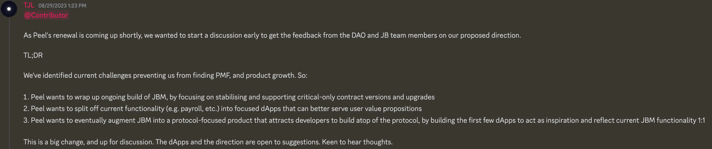

## Juicebox Merch Discussion

Jango thought that we could consider sending a box of merchandises to our contributors in EU or Australia etc. , so that they can be distributed in more fine-tuned way in future events or conferences.

But we would also have to beware of the import taxes and customs declaration procedures if shipped by freight transportation.

Sage expressed that she would be happy to share the art files and the websites for making these merchandises, as well as a portion of the funds granted from the DAO, so that folks in different regions might be able to arrange locally and thus mitigating the shipping and importing cost across the world.

Filipv also suggested that it might be cool to upload the art files onto Github or somewhere else, and build a page on some print-on-demand websites, so that people can just order those merchandises from there directly.

Though Peel team had been recently pushing for our hackathon partnership with organizations like ETH Global or Devfolio, and there were some ideas to distribute these merchandises on upcoming events like ETH Istanbul etc., but as Peel team were still under their efforts to revamp some fuctionalities and designs of our front end, it might be more ideal to carry out our current distribution of merchandises, without having to wait for the accomplishment of this partnership.

## Sablier V2 Interop Updates by Nowonder

The Sablier V2 Interop is an extension being developed by Nowonder, it aims to help Juicebox project owners to attach a split allocator their projects, and add payouts of multiple token streams for their contributors, in order to realize fine-grained control over the distribution and vesting of those payouts.

Nowonder told us that Paul, the lead author of Sablier protocol, had come to help review the code base of Sablier interop, put in a PR with some changes, and refactored the imports in the contract, which reduced the size of this repository by a big extent and made its running more efficient. Paul also expressed his recognition towards this product of interoperability between Sablier and Juicebox by Nowonder.

And Nowonder said he would keep on developing and try to ship this prouduct soon as an extension to the Juicebox project treasuries, and see if any projects are interested in making use of it to distribute payouts to their new contributors.

As we currently didn't have corresponding front end UI to support the attachment of this extension in juicebox.money, Jango recommended that Nowonder could consider trying to implement the attachment to a Juicebox project through Etherscan or somewhere else similar first. When people start to use this product and interact with Juicebox protocol outside of Juicebox.money, it might leave the website in a state where relevant transactions might not be queried and properly reflected on the project page on Juicebox.money, which resembles a bug in the page and hopefully can be prioritized by Peel team to create a dedicated UI in the project page to help implement the use of this extension.

Matthew and Brileigh had released a new episode of Juicecast of their discussions with Paul from Sablier and Nowonder last week, which were mainly about the introduction of Sablier protocol and its interoperability with Juicebox protocol. According to Nowonder, the Sablier community was quite exited about this integration effort, and hopefully this could be a very good starting point for dev relations development among different communities.

<iframe width="560" height="315" src="https://www.youtube.com/embed/2Pq6u4JgSf4?si=aj-FIVuKtHpVquKT" title="YouTube video player" frameborder="0" allow="accelerometer; autoplay; clipboard-write; encrypted-media; gyroscope; picture-in-picture; web-share" allowfullscreen></iframe>

Jango thought that it was very cool for this episode to bring other voices into our Juicecast channel. As for the interop extension by Nowonder, we might not want to develop strategies for its marketing efforts or its APP interface, until we have a product thesis or projects that are keen to leverage it specifically.

But this will provide a great opportunity to keep on building and researching, to look for potential interest in both communities to pursue more generic use cases. If there is any synergy or interest in the componentries of both Sablier and Juicebox protocol, there can be a very good excuse to build something and raise funds for both communities in the future.

### Potential use case of Nance

Jigglyjams had the thought of finding a way to create the business model of Nance project, which allows their users to pay Nance project to get their project tokens which will in turn be used as credit credentials for using the services of Nance.  As there will be ongoing uses or subscriptions of their services, Jigglyjams was wondering whether there would be a possibility of using the Sablier token streams as a way of funding for Nance.

Jango thought that the current model of this Sablier interop will be a payout split allocator for projects to arrange their outgoing payouts, while the needs of Nance will be accumulating funds into a project from many different users, so it didn't seem that what Nowonder had been developing right now might automatically be useful for Nance.

Nowonder thought that it would probably work by setting a project like Nance as the recipient of token streams, and it would be a really cool idea since users now could use token streams to subscribe some services of a project and cancel the subscription by simply canceling those token streams . Jigglyjams agreed with him that this might be some kind of mechanics that our protocol is currently lacking for users to make payments continuously, which would be a great direction to research further.

## ETH Global Partnership Updates by TJL

Tjl said that they had been thinking about the partnership of hackathon events with ETH Global,  and they had made some really good progress in this respect.  But after some discussions among the Peel team, they came to the conclusion that,  given the current challenges that are preventing us from finding the PMF (Product Market Fit), it might not be a perfect timing for us to implement the partnership with ETH Global right away, for the reason that currently we might be able to fulfill the needs of hundreds of devs from these events in a best possible way.

So Peel team were proposing a big change to our front end development, and Tjl called on community members to read [the proposal by Peel team](https://grand-popcorn-c81.notion.site/Peel-Renewal-Proposal-September-23-2eb418b4bf17417db9cdeef5e0111369) and share their thoughts and feedback for this matter.

