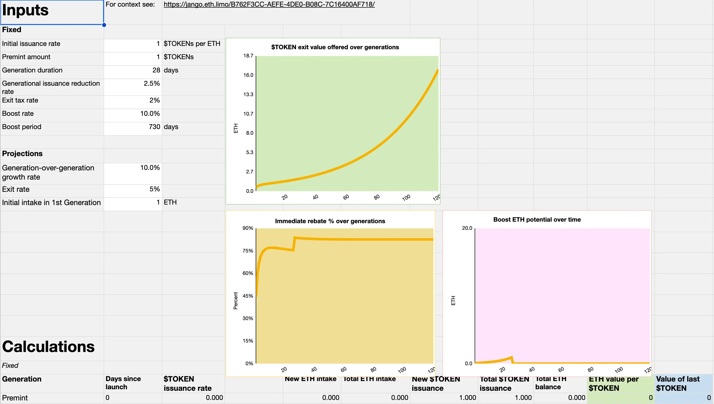

## Buyback Delegate Updates by Jango

The contracts of Buyback delegate are looking good, it's in the last phase of getting eyes on it to double check with last minute test, before we are going to attach it the JuiceboxDAO project.

If there's enough interest for this product, Jango expressed his willingness to do another line-by-line session to go over how it functions specifically.

It's very important to review the contract because it gives the power to mint arbitrary amount of project tokens on behalf of the people who pay the project, according to the rules set in the buyback delegate. Generally, this product is very delicate and deserves more caution to its deployment and use.

Jango said that we had been expecting to attach the buyback delegate first in experimental projects like Defifa and Croptop, so that we could have it battle tested before deploying it to the JuiceboxDAO project. But recently as the development of Bananapus and cross-chain interoperability is getting a more solid shape, we were yet to decide which network we should deploy Defifa and Croptop to. So we might decide to deploy the buyback delegate directly on JuiceboxDAO project, since it's feeling very good after days or weeks of edge case testing by the contract crew.

## Revnet: Productization of Retailism by Jango

Jango had shared his thoughts on Retailism and some relevant blog posts about it during town hall in July, which can be found [here](https://docs.juicebox.money/town-hall/23-07-18/#retailism-by-jango).

According to Jango, Revnets are a special configuration of Juicebox project that applys Retailism, which includes these following parameters:

1. A Juicebox project that has neither project owner nor payouts. When funds are paid into it, project tokens will get emitted back out in turn.
2. There is a reserved rate in this project which is called boost, and a funding cycle duration is callled generation.
3. The issuance reduction rate will be called entry curve in this case, which means there will be x% fewer tokens issued out when the network receives a unit of funds.
4. Exit curve, the redemption rate, which means the percentage of funds people can burn their tokens to access the funds in the treasury, while leaving some funds on the table for those who burn later.

A lot of experimental projects, such as Defifa, Croptop, Blunt or Bananapus, have very compelling concepts at their disposal, but they also need to figure out a destination to route the collected fees to fund the development, to the extent that their community sees fit, so as to foster the continous growth of the network as a whole.

Different from the model JuiceboxDAO is implementing its governance, where there is a regular reserved rate and the project is owned by a multisig to execute the decisions made from governance on a regular basis, the answer for projects like Defifa or Croptop lies in a less management oriented configuration with incentives for builders, investors and customers aligned, in order to ensure the growth of these networks, as people might not want to spend too much time to participate in the governance of these long-tail treasuries.

Here is the mechanism might work for these networks:

- **Customers** pay in fees, and they may have an immediate rebate of redeeming the tokens received to get some funds back. But if they hold their tokens and the network grows, the value of tokens will increase together with the network's growth.
- **Builders** can have their boost period to compensate their work in the establishment of this network, where a percentage of network's growth will be reserved and allocated to them. For example, if a project is launched with 28-day funding cycle and a 2-year boost period, the funding cycles keep rolling over every 28 days forever, only with a pre-set configuration to remove the boost two years from its launch.
- **Investors** don't need to worry about the whereabouts of the their money, since there will be no more future reconfiguration by project owners or multisigs.

We could balance these forces that make a project run in a trustless and permissionless way, and projects like Defifa and Croptop etc. could further instill and develop their own patterns on how to use and connect their revenue stream.

We were still trying to find out how to position this as somehthing useful for others to experiment alongside and create the horizon that we would be moving towards.

### Demo of Retailism mechanics

During the town hall, Jango showed a [spreadsheet of Retailism Financial Modeling](https://docs.google.com/spreadsheets/d/1R-3PyyF2chmsf_t3IdVi7oEWD0i0IHTcDNwQj4DEKaA/edit#gid=424465074), where people can input their initial issuance rate, generation duration, entry curve and exit curve etc. to play with the mechnics and see how this model of retailism would play itself out.

## Bananapus Gameplan by Jango

In Jango's words, although Bananpus had been a bit confusing and technically elaborate, hopefully it could have a core essence that we can treat it as a neatly packaged box.

The development team had promised to experiment it as an L2 connect point on EVM chains, by running it on layer 2 chains like Optimism, Base or whereever we can to figure out how to reliably run it and test out the mechanism for cross-chain organizations.

For example, how can Juicebox, a protocol on L1 chain, also be launched on an L2 and help maintain a sense of financial community across all of the applications and across each implementation. Let's say we deploy another JuiceboxDAO treasury on an EVM like Optimism and issue its own tokens there. What does that mean for JBX? How do we create an affordance while leaning into the JuiceboxDAO fee collecting structure, as we need to support the body of work and grow it so that everyone such as builders, users and investors is involved.

We might be able to point a certain percentage of the project's reserved rate, boost in the context of Revnet, to another project on another EVM chain, not to the its owner but to the token holders, in order to allow networks to cross pollinate, which can be carried out either on the same chain or across different chains. For instance, if we deploy another Juicebox protocol on an L2, we can find a way for JBX holders to claim issuance from that L2 version of the protocol.

But this will be a very fragile operation as far as cross chain bridging and multiple tokens management are involved, so we might not want to do it directly on the JuiceboxDAO project, in case that might lead to some unexpected outcome and risks.

So we might deploy a fork of the Juicebox protocol in the Bananapus project, to experiment these cross-chain primitives including staking and bridging of tokens, management of multiple treasuries across various EVM chains, and also the Revnet networks based on the theory of Retailism, without compromising the stability and safety of Juicebox protocol itself.

In terms of the websites that will be used to interact with the Bananapus contracts, Jango didn't think it would be the responsibility of Juicebox.money to chase after the next experiment and bring that to commercial readiness right away, because the experiment is very risky and it's not worth the risks.

Jango said we might be making smaller and scoped sites which would play with these ideas specifically. For example, there would be a Bananapus website for the staking interaction and token bridging, where people can stake their tokens and get an NFT position to claim rewards and mint the Bananapus tentacles onto other chains.

### Demo of Bananpus.com by Filipv

Bananapus.com is a website serves to display the ongoing development of Bananapus, and also as a web client for users to interact with the contracts of this project.

On the town hall, Filipv demonstrated the web pages of bananapus.com which was still a WIP (work in progress), and explained the process of staking tokens and claiming rewards.

Bananapus project consists of three main components, [Bananapus 721 staking delegate](https://github.com/Bananapus/bananapus-721-staking-delegate/tree/feat/concept), [Bananapus distributor](https://github.com/Bananapus/bananapus-distributor/tree/juice-distributor-alt) and [Bananapus tentacles](https://github.com/Bananapus/bananapus-tentacles).

Users can stake their ERC-20 tokens of a Juicebox project using the Bananapus staking contract, in return they will receive NFTs to represent their staked positions, which can be unstaked to retreat the original ERC-20 tokesns if the holders want to.

With Bananapus distributor contract, anyone can send ERC-20 token rewards to it and let stakers in the last step to use their NFTs to claim a portion of token rewards over time.

Furthermore, the NFT holders can interact with Bananapus tentacles contract to mint corresponding tokens of various L2s and bridge them over, so as to be eligible for rewards or other usescases in those EVM chains.

## Networks of Bananapus and Revnets

### Context of Revnet networks

During the town hall, Jango shared some of his thoughts of different networks, which would be created on the fork of Juicebox protocol by Bananapus project and running as Revnets across various EVM chains. His blog post to elaborate on the details of these networks can be found [here](https://hackmd.io/@jango/networks).

The Bananapus project would try to deploy a fork of Juicebox protocol, and the networks that would be created and running on it will experiment their revenue management, token staking and rewards distribution, bridging and etc. across multiple EVM chains.

First, Jango went through the context of building networks on Bananapus with a Revnet model, emphasizing their goal to streamline the organizational and legal operations and expectations, and to make them more accessible to investors and customers.

Also he said that the desire to operate a project primarily through Revnets on Bananapus is not certain and not required, these Revnets can stand beside other forms of operations and even be led by their fans without the consent from their builders.  But broad alignment will be important too, as the lack of legitimacy or planned revenue from builders may diminish an investor's confidence when choosing to support a network.

Lastly, Jango also encouraged our community members to acutally play with these new various networks and take a bit more active and meaning role as builders together.

### Purpose of Bananapus

Bananapus is a way for networks of token holders (Juice projects) to relate across chains and forks. Organizational money rails, modeled as tentacles.

Jango explained that Bananapus would be a Juicebox V3 fork, so it would be the same codes as the current Mainnet Juicebox protocol, with all the latest versions of terminals and controllers etc. And it would be depolyed on Ethererum mainnet, Optimum, Arbitrum, Base and other EVM chains, we would start with one of them and scale up from there.

And we would enable projects to cross pollinate by implementing the native staking-based bridge, and support them to queue multiple funding cycles in advance so that a project can be set in motion with multiple changes pre-configured along the way.

And there were also other considerations with this deployment of Bananapus, such as removal of functionalities that had been proved useful, integration of 721Delegate and BuybackDelegate, options to accept and store funds in ETH, DAI,  USDC or other coins, and etc.

### Purpose of Revnet

Jango introduced that Revnets are a special configuration of Juicebox projects applying the logics of Retailism, with the 4 basic properties characterizing their launching and future operations, namely the premint, entry curve, exit curve and boost period. These basic properties help create a venue for decentralized networks for builders, user and investors to accumulate resources to further the growth of their respective communities.

The purposes of Revnets consist of productivity improvement and community participation, transparency and unobscured access to the funds, initiatives for existing projects like Peel and Nance to better guarantee the incentives and legal clarity for their communities, and the research and prototype means for traditional banked businesses.

### Conclusion

Jango felt very excited to see how the work would unfold. And he said there would be a proposal in the recent cycle to prompt more discussion about this among our community, so that we can make some decisions together if we want to support this experiment and how should be commit to it.

Jango thought that as a lot of us had been cross-pollinating across various ideas, treasuries and concept, we were all pacing towards a similar fun place to be where JuiceboxDAO's funds hopefully make investments towards those ends. Now that we had places where we can take risks more confidently and point revenues to, we could try to make moments of exploration into the wild.

It also felt a cool moment where we can call attention to existing projects continuously worked upon, and have a vision what folks are excited about, before we could go to pockets of both retail and VC investors to create relationship with them again.

