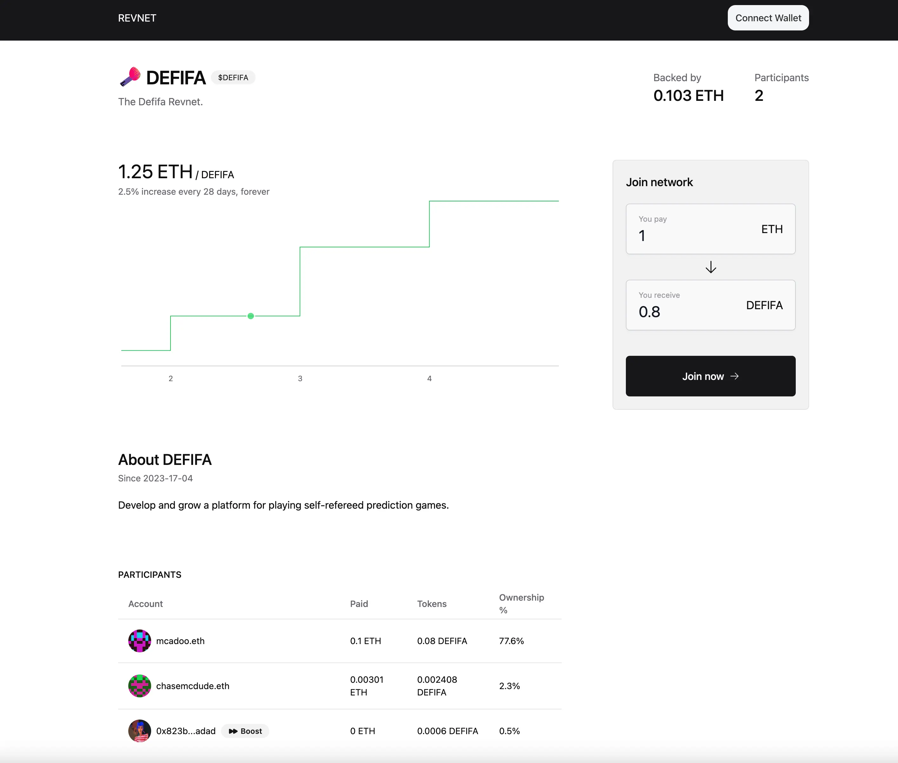
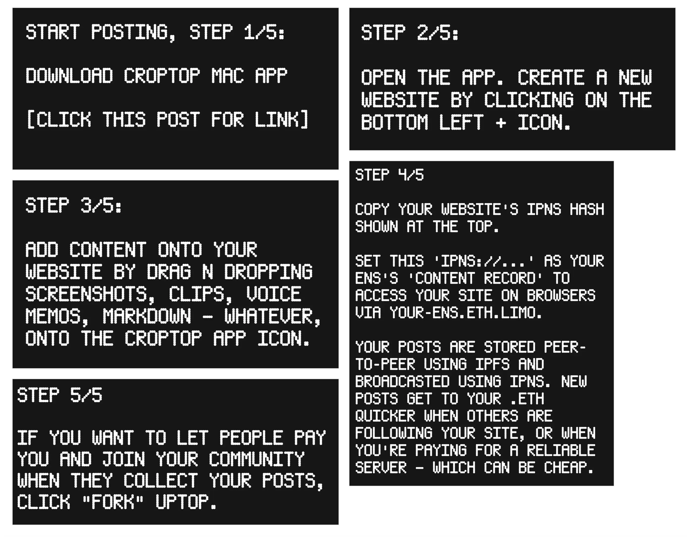

## Buyback Delegate Deployment Plan by Filipv and Jango

The buyback delegate had been expected to get deployed during the current funding cycle, but the contract crew led by Jango decided against it out of an abundance of caution.

The development work of this contract had been pretty much finished, and contract crew had been reviewing and testing for edge cases for a while. Jango thought that the contract feels very good and super greenlit for deployment in the next funding cycle.

But, as the buyback delegate does have permission to mint arbitrary amount of tokens by design because it needs to be able to manage token supply, theoretically if there is an edge case arises unexpectedly, it could probably lead to a adversely inflated token supply. If we have redemption enabled at that moment, the inflated token supple might be used to redeem for the ETH in our treasury.

So Jango thought that it would be wise to turn off the redemption before the depolyment of buyback delegate, and he would submit a proposal to do so in the next funding cycle. After the proposal is approved and executed, we should be able to attach the buyback delegate to JuiceboxDAO treasury right away. The time line would be at the beginning of the funding cycle after next, i.e. roughly in three weeks.

## Proposal of Juicebox Project Accelerator Fund by Filipv

Filipv said that he and René from [Artizen](https://www.artizen.fund/) had put up a [proposal of Juicebox Project Accelerator Fund](https://www.jbdao.org/s/juicebox/438), to launch a match fund between Juicebox and Artizen and in turn to support community-driven projects from creators at the frontier of innovation. If this proposal is approved, Artizen will match the funds that granted by JuiceboxDAO for up to 50,000 US Dollars. This Juicebox Project Accelerator Fund will be used for the funding of potential Juicebox project creators.

Also Filipv had been working with René on getting a governance token issued for the Artizen platform on Juicebox protocol.

This plan of partnership between JuiceboxDAO and Artizen was still open-ended, according to Filipv. He encouraged our community members to come forward with feedback or ideas to help shaping out this plan.

## Bananapus And Revnet Updates by Jango

During the town hall, Jango shared a Revnet website prototype.

According Jango, some of the data was still being hard-coded, but the basic contract was ready for deploying a Revnet project, and a basic web client was already work in progress.

The plan was to work with a six-week sprint, first deploying the Revnet site onto all testnets between Bananpus and Revnet, then after the testnets are tested and proved reliable, hopefully implement the deployment on Mainnet within this time frame.

Currently contract crew was working on the devops of Bananapus project, which was mainly focused on the experimental L2 deployments. Filipv was helping with some formal papers which would be used to communicate with a more academic audience. And Jango was working on some tutorials, as well as some video clips to explain the concepts concerning Bananapus and Revnet.

Jango thought that many people are interested in our development on L2s, and it will play a big role in the what Juicebox might be capable of in the future. We were now experimenting without involving the current Juicebox protocol on mainnet in case of any unfavorable changes, since we were really looking to stablize what we have had implemented, and allow Peel to play with the objective of creating more scoped front ends, which can be pointed to the L2 forks if our L2 experiments play themselves out and we gain more confidence over them.

## Croptop Updates by Jango

You can go the site of [Croptop site](https://croptop.eth.limo/) and get to know more about this project. Or you can just download the dedicated Mac App for Croptop [here](https://pinnable.xyz/dl/croptop), and follow the instructions below:

Recently, the team successfully built the aggregate Croptops, by which a Croptop aggregate page can aggregate feeds from many other Croptop hosted feeds, so that users don't necessarily need to host their respective feeds anymore. This feature allows for concentrated curation of contents within a community, which can be very helpful. Other than that, it also enables a user to post contents from multiple clients, such as PC, mobile or tablets and have them all aggregated onto one hosted site.

Furthermore, arbitrary RSS fees, whether they are posted on Croptop sites or not, can also be aggregated onto one specified Croptop site, which are greatly expanding the sources of contents for a community.

It is really starting to open up the capability of Croptop to curate content feeds in a way that incurs no fees or transaction cost, serving as a web client to host and broadcast those contents.

This project had already been deployed on Goerli testnet, it was waiting on Revnets' deployment so that it can move to production while having a governance-less and productive venue to accumulate fees collected from its network.

## Buyback Delegate Demo by Jango

If  a Juicebox project is deployed with the buyback delegate, whenever there is a payment made to the project, it would route the funds either to mint new project tokens from the treasury, or swap for tokens from the AMM exchanges, or do both in some scenarios, depending on how the difference between interior issuance rates and market swap rates of that token will be, or wether there is adequate liquidity in the relevant liquidity pools.

Let's take the JuiceboxDAO treasury as an example, there will be three scenarios under which the buyback delegate will work.

1. When there are inbound payments made to the JuiceboxDAO project as contributions to the project, web clients like juicebox.money will pass the metadata, which is information such as the minimun swap amount out and the amount to swap with, to the buyback delegate as instructions to proceed with the swaping transactions.

2. When the funds are paid into the project as internal payments such as a fee, e.g. projects distributing funds out of the Juicebox protocol will be subject to a 2.5% protocol fee which will be paid to the JuiceboxDAO project, there will be no metadata passed to the buyback delegate in that circumstance. In that case, the buyback delegate will make use of a TWAP (Time Weighted Average Price) as an oracle for pricing to carry out the swaping trades.

   The TWAP has a few parameters that project owners can tune, as to how aggressive they want the oracle to suggest a price. If pricing turns out to be too aggressive and the actual swap ends up outslipping the TWAP suggestion, the contract will default to mint the tokens from the treasury instead of swapping on open markets.

3. If the funds paid into the project surpass the available liquidity in the AMM liquidity pool, web clients can split up the funds and use a portion of it to make most of the liquidity pool, while the leftover funds will be routed to the project treasury to mint new tokens.

Overall, this contract is fairly simple at its core, covering some pretty important edge cases and adding some flexible and powerful edge case features. It will definitely help people get more JBX when they are engaging with the JuiceboxDAO treasury, and perhaps can also work for other projects within this ecosystem in the future. We can definitely imagine buyback delegate as a very core part of any projects that scale up and want to offer its community the best token prices possible for payments coming into them.

