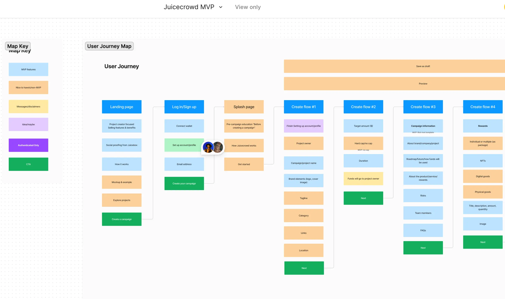
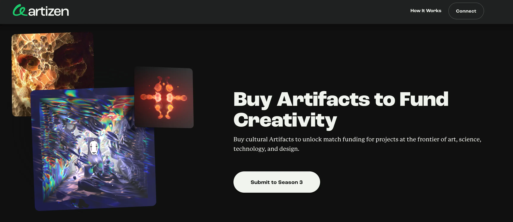
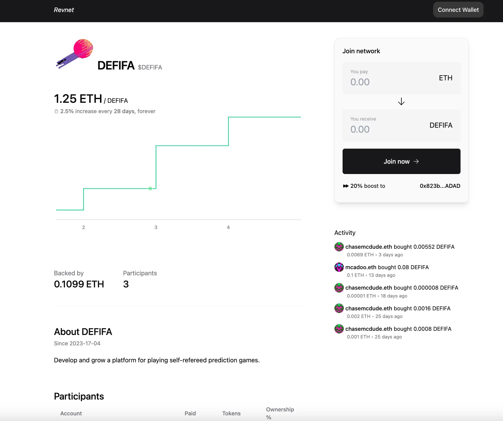
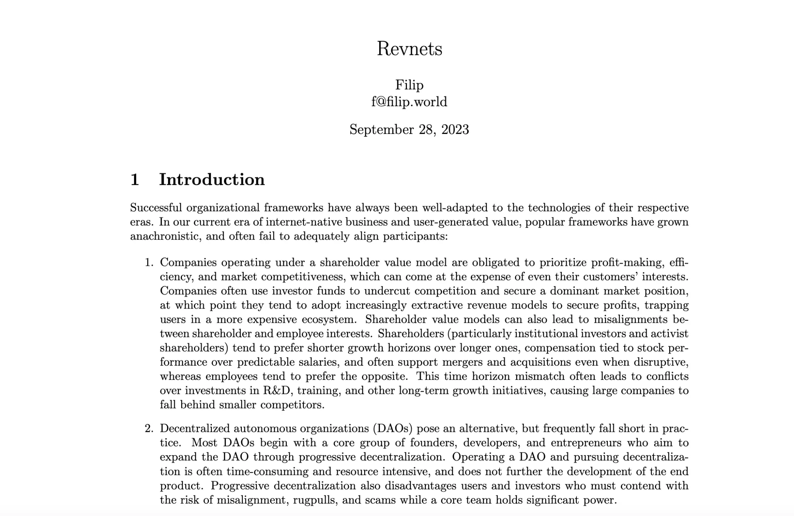
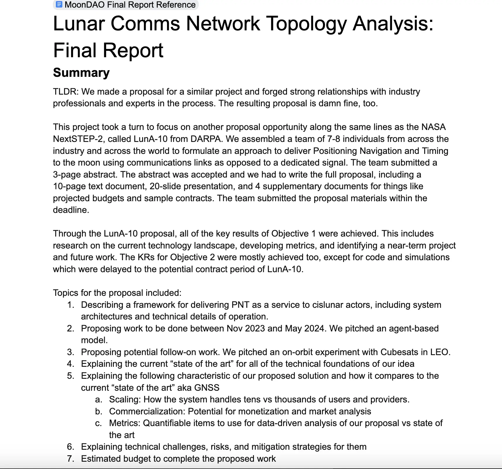

## Peel Updates by Tjl

Tjl introduced that the Peel team was currently developing the focus front end for Juicecrowd, which  is a more specific, Blunt style and Kickstarter-esque fundraiser. They had completely defined the project by the time of this town hall, and they would be testing and prototyping it over the next few days.

## Artizen Introduction by René

René is the co-founder of [Artizen](https://www.artizen.fund/), which is a fund that partners with mission-driven brands to find and fund artists, scientists and all other kinds of creators to help boosting their organization's ecosystem or fueling their missions.

René introduced that Artizen is pivoted around the idea of allowing many different stakeholders to come curating projects together and collectivly providing funds to reward the most promising projects, making it a platform that is funded and curated by the Artizen community itself.

He thought that Juicebox would be a really wonderful partnership to work togerther with, both for his admiration of the product built by JuiceboxDAO, and also because of the fact that Artizen and Juicebox community have many aspects overlapping with each other. He felt that it would make  a lot sense for both communities to pool our resources and help fund talented creators and encourage them to use Juicebox for fundrasing throughout the life cycle of their projects.

During the current funding cycle of JuiceboxDAO, René had submitted a proposal of [Juicebox Project Accelerator Fund](https://nance.app/s/juicebox/438) with the help of Filipv, in an attempt to launch a match fund between Juicebox and Artisen to support community-driven projects in Juicebox.

## Bananapus Updates by Jango

0xBA5ED had wrapped up the implementation for the staking delegate, the rewards component  which allows folks to route tokens to stakers as well, and the tentacles component which allows stakers to bridge their tokens to other chains in order to collect staking rewards with a similar mechanism.

Dr.Gorilla had been cleaning up some tests for the 721 delegates, which is a pretty delicate contract. He would be up to the adjusting tests while the buyback delegate is going to be deployed to the JuiceboxDAO's project.

The contract crew had several pull requests open against the V3 contract repository, and these changes were made for the Bananapus fork and would not be a version pushed on the standard Juicebox protocol as it currently exists. We would be running this fork of Juicebox protocol as an experiment on Bananapus project.

The most meaningful changes was the one that will allow for queuing multiple funding cycles in the same block, so project owners can now deploy a project with multiple funding cycles established at its deployment, instead of having someone to execute a public transaction to implement each following cycle.

### Audits for Bananapus

Matthew wondered if there would be an audit for Bananapus once the development is finished.

Jango said that there would not be an audit for Bananapus fork of the Juicebox V3 protocol, which had already gone through a Code4rena audit last year, but he was expecting an auditing contest for the new Bananapus components, including  [Bananapus 721 staking delegate](https://github.com/Bananapus/bananapus-721-staking-delegate/tree/feat/concept), [Bananapus distributor](https://github.com/Bananapus/bananapus-distributor/tree/juice-distributor-alt) and [Bananapus tentacles](https://github.com/Bananapus/bananapus-tentacles).

The Bananapus V4 fork actually is a Juicebox V3 protocol all over again with mostly small adjustments, so Jango felt we should keep monitoring those adjustments and revisit them in certain intervals to see if they merit a formal audit. Generally he thought that the current Juicebox V3 protocol had gone though the process of getting audited and hardened for production, and we have established strong versioning protocols to get to this hardened state.

Jango also thought that the way to get to a trustworthy Bananapus experiment, would be to deploy it with good economics, so that if in the future it does develop legitimacy as a trusted fork, we can move forward with confidence and JBX holders can understand very well how the economics relate to this fork. But he stressed that any mission-critical experiments in the near future should probably still point to the Mainnet V3 implementation.

It would always be hard to say no to audits, Jango said. It takes some mental gymnastics to go yolo and see what happens. If we give something too much legitimacy at first, we will probably be confronted with odd things that happen when it's in production and least expected. Maybe it would be more ideal to make clear all the risks along the way, and we could put community resources to auditing and legitimize it when it's needed in the future.

## Revnet Updates by Jango

Jango introduced that the productization of Revnet had been coming along fairly nicely. On the town hall, he shared the updated prototype of a Revnet website, this prototype is using all real data and a Revnet contract which is an orchestrator of Juicebox contracts under the hood.

He had also refined some of the Juicebox contracts for deploying Revnets, which can be found in the [Revnet Github Repository](https://github.com/rev-net/revnet-contracts).

Filipv had been working on a more formal paper that describes the mechanism of Revnets, which can be found [here](https://github.com/rev-net/revnet-writing/blob/master/whitepaper/revnet.pdf). He encouraged folks to take a look at that file and provide their feedback, if there is any, to help improving the language of ths document.

Jango thought that it would be awesome to try figuring out how to communicate this concept out to folks who are thinking about operating a project, or looking for a way to actually monetize an open source endeavor or various other applications.

Jango also thought that it's very cool to be working on sereral of the APPs that are using the underlying protocol at the same time, and those APPs should stand to benefit from one another. As we push forward and learn from different use cases, it would be very interesting to find out which audiences gravitate to these different kinds of APPs.

## Juicecast Updates by Matthewbrooks

Matthew and Brileigh released the 31st episode of Juicecast, featuring Jess from Seed Club, which is a venture DAO funds early stage founders who are building crypto products.

<iframe width="560" height="315" src="https://www.youtube.com/embed/iJz1w9evs-E?si=A_J2T-yJILMbb7pg" title="YouTube video player" frameborder="0" allow="accelerometer; autoplay; clipboard-write; encrypted-media; gyroscope; picture-in-picture; web-share" allowfullscreen></iframe>

They would also be releasing the next episode with Peacenode from Seed Club, to talk more about building the Seed Club brand and its graphics.

## Updates from MoonDAO by Pablo

Pablo, the co-founder of MoonDAO, joined our town hall and shared some of the recent updates of MoonDAO development. He introduced that they had been working on the network topology for lunar communications, which is a fancy way about how to route messages from the Earth to the Moon in a way that's true to the principles of Ethereum, in an incredibly neutral way that is more bottom-up instead of relying on a few key infrastructure nodes.

Pablo also expressed his gratitude towards Juicebox for helping them build their project and community by fundraising on this protocol, and he thought it was very cool to see all of the amazing things Juicebox help make possible.

