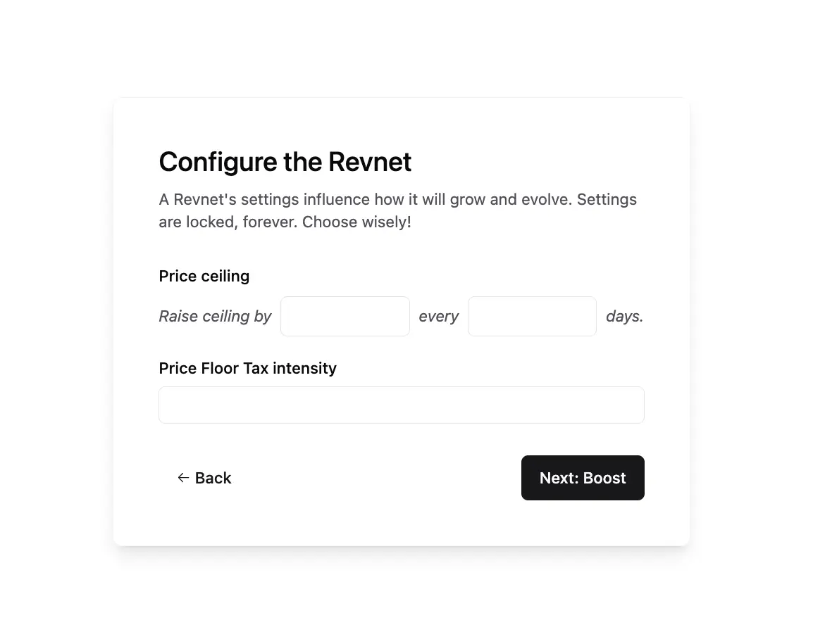
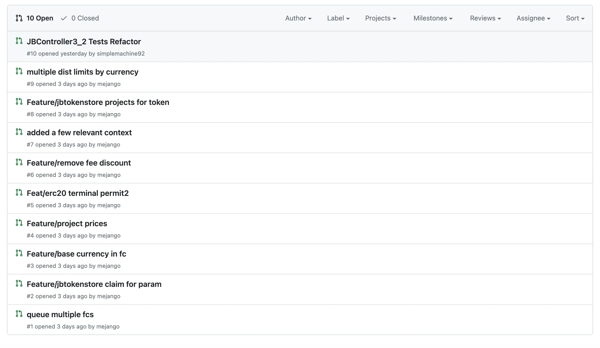
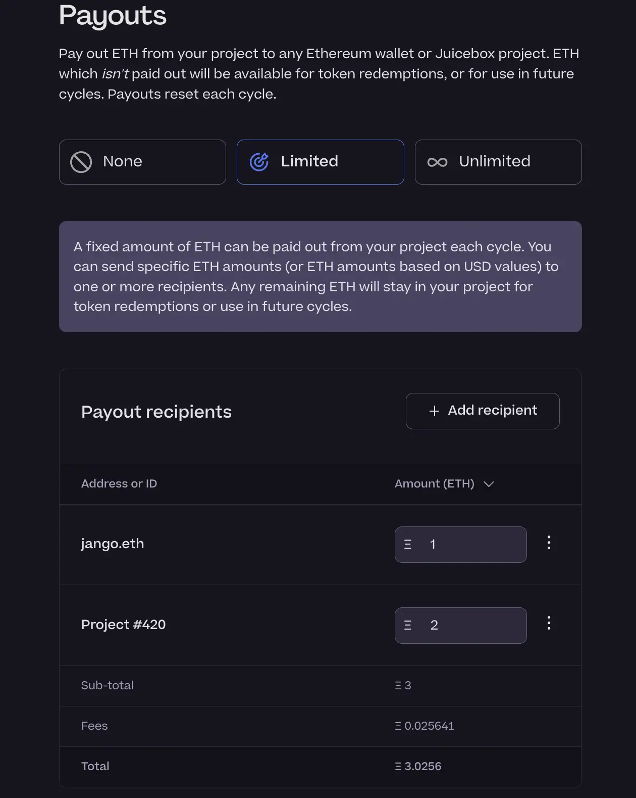
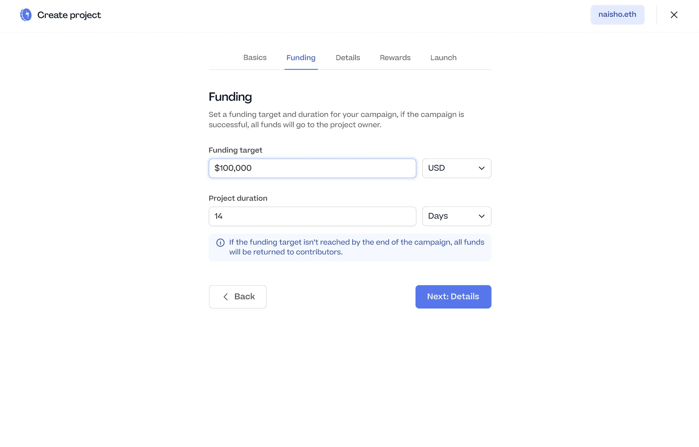

## Revnet and Bananapus Updates by Jango

### Revnet Create Flow

We now have a prototype of Revnet create flow, people can play with all those scoped concepts of Revnets, such as Price Ceiling, Price floor tax intensity, Premint, Boost and Boost duration, etc.

After this create flow is getting more developed, Jango expected that their work would be more focused on the project dashboard on Revnets in order to make it multi-dimensional.

Also there would still be some ongoing efforts for data visualizations, which Jango thought would be more ready in next week and by then they would be embeddable everywhere.

### Bnananapus New Repo

In the Bananapus GitHub repository, we have a new repo which is a little more experimental with looser permissions. There is still some work in progress in the PR section of this repo, which Jango expected can be finished within one week and then folded into the main V4 repo in the Bananapus GitHub thereafter.

The Bananpus fork of the Juicebox V3 protocol will be deployed on multiple blockchains such as Mainnet, Optimism and others, which will be very scalable. It's an open opportunity to revise some bits of the V3 protocol, which includes the addition of ability to queue multiple funding cycles ahead of time at a project's deployment, rather than currently having to manually trigger those reconfigurations before each new funding cycle. So project owners can propose some kind of games by deploying projects with different rules automated for each cycle from the very beginning.

The economic model they will be using for Bananapus will not affect JBX directly. From a risk perspective, the Bananapus experiment can be carried out without putting Juicebox at risk. The Bananapus Revnet will pre-mint tokens committed to the outstanding JBX supply, and allocate them to the Juicebox multisig to be governed by JBX holders.

## Buyback Delegate Updates by Jango

The transaction of deploying the buyback delegate had been queued together with reconfiguration of a new funding cycle of JuiceboxDAO, and it would come into effect by the start of next cycle.  Jango thought that it would start paying dividends right away for reserved rate recipients and projects that are paying fees to JuiceboxDAO.

It will really give us more confidence in JBX tokens and in the treasury that backs them, so that we can lean a little bit more onto JBX and take a more hands-off approach with the general issuance properties of JuiceboxDAO. Hopefully in the future, other projects can grow to this scale and make a similar use of this function.

## Peel Updates by TJL

### Payout Table

The payout table developed by JohnnyD from Peel had been implemented into the create flow of Juicebox.  Project creators can now add their payout recipients, which can be either an Ethereum address or another Juicebox project, and specify their respective payout amounts under the limited payout model, or have those automatically changed to percentages under the unlimited model.

### Juicecrowd Prototype

Juicecrowd is a slimmed-down version of Juicebox, especially for people that are trying to crowdfund on Juicebox but understanding that the current project creating process is too complicated from a perspective of functionality for them to do whatever they want.

It's a simple fundraiser like Blunt without project tokens, but instead enabled with NFTs as possible rewards (optional) to contributors. Compared with the current Juicebox create flow, it also strips down the recurring funding cycles to a single cyle under the hood and replaces the complex multi-cycle payouts with just a simple withdrawal of funds.

The prototype of Juicecrowd has been put together by the Peel team, which can be found [here](https://www.figma.com/proto/fV02sJ1bihdNgjR1T3JCSR/Juicebox-Apps-Exploration-%E2%80%93-Sep23?page-id=434%3A19818&type=design&node-id=499-36268&viewport=427%2C-525%2C0.13&t=vZFc1ycVdpxCAtb9-1&scaling=scale-down&starting-point-node-id=759%3A86140). The Peel team will still be working to further improve this prototype in the near future.

## Ideas on Patreon and Revnet integration by Jango

Jango introduced that there are a large body of content creators on [Patreon](https://www.patreon.com/home), and they are receiving monthly membership fees from their fans. He had been exploring about what it would take for those creators to keep using Patreon and route the funds contributed into Revnet projects, since Revenets are more deterministic and have a lot less obligations or implications with where the money could go.

He was also wondering if it would be possible to reward someone who pays a patreon through a backward process. By that, we can set up a middle service that takes in the patreon fees, applies them in the blockchain world, and sends the payers their shares of tokens.

Jango thought that a lot of people are comfortable with Patreon, which does a very good job of allowing people to contribute whatever they want. But obviously Patreon also has control of the money, they can block payouts and everything in between. It would be ideal if we can prototype for a few Patreon projects that want to integrate with Juicebox projects, and Jango was interested in figuring out how to run a middle service between bank accounts and blockchain accounts.

Jango admitted that there would be a lot of management, operation and points of potential failure in between when moving large sums of money is concerned. And he was trying to know more about the legal and logical implications of such a business model.

Also he was trying to investigate if there would be an option to hook into currently existing business models and services in the Web2 world, and have a broader go-to-market solutions for some of these ideas like Revnets. It would not be easy to get the activation energy to get projects that already have broad visibility to come and try it out.

