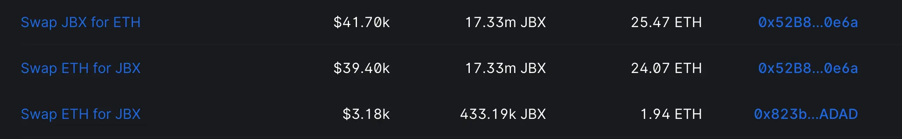

## Buyback Delegate by Jango

The buyback delegate have been installed in the current funding cycle for Juicebox and it is working as intended. Whether someone is contributing to JuiceboxDAO, or some projects is paying their Juicebox fees when they are distributing funds out of the ecosystem, everyone will be winning here as they can now get more JBX in exchange for the payment they make, except for the ETH balance of JuiceboxDAO's treasury, which will not increment anymore when funds come in.

The power of JBX is in full swing at this stage. As the project looks to build momentum and volume, the role that JBX plays in motivating the ecosystem forward becomes more meaningful now.

The next steps would be to work with Juicebox.money to surface a quote in the payout flow, to make sure folks get the best possible token issuance. And there had been a few inquiries from folks about if they can install the buyback delegate on other Juicebox projects, we will keep monitoring these needs and hopefully keep tuning it from the perspective of both contract and users.

### MEV Sandwich

But if Juicebox projects distribute their payouts out of the ecosystem, which will incur 2.5% Juicebox fee and buyback delegate would route these fees to purchase JBX in the AMM pool, there will be an opportunity for MEV bots to sandwich the transactions and steal some value from them, unless the person who triggers this distribute call use some MEV blocking RPC in their wallets.

This is out of reason that the fees get paid into JuiceboxDAO without any metadata in the case of protocol fee payment, so we don't have an opportunity to specify the expected quote that the fees should resolve at, and instead the contract uses a TWAP (Time Weighted Average Price) oracle to look at the recent prices of the exchange.

There are two parameters that we can tune about this TWAP oracle. The first one is the TWAP window, e.g. 30 minutes or 24 hours, which means how far the buyback delegate will look back to determine the proper average prices that the transaction will be resolved at.  The second one is the slippage tolerance from that average price that we can accept to deviate from the TWAP price.

With these two parameters, we can automatically determine the price that we expect. And then the difference between that expectation and the actual price can be arbitraged, which will be especially tricky for highly volatile or low volume token pairs. If the Juicebox fees that will be routed to AMM pools are of size like $10, $100 or $200, and the depth of the liquidity pool is around $30,000, the impact of the trades is very decent and the arbitrage opportunity is relatively small, MEV sandwich  won't likely be happening. So long as the trades are small related to the liquidity in the pool, or the liquidity itself is increased by liquidity providers as what Jango has done recently, the chance of MEV sandwich will decrease over time.

### Question on Distribution Bot

There were some ideas floating around concerning whether we could run our own bot which would be looking throughout the protocol to monitor any distribution calls and try to distribute before a MEV bot can do.

Jango took the example of the distribution of payouts by JuiceboxDAO recently, which incurred a 1.94ETH Juicebox fee (And yes, all projects including JuiceboxDAO making outbound payments will be subject to a Juicebox fee).  The total volume to arbitrage from this MEV trade was around $85,000, and the paid 1% liquidity fee  which was more than $800. This activity would incentivize more liquidity providing actions to the pool, which will in turn decrease the opportunity to arbitrage.

We can also choose to build a bot and take advantage of the information asymmetry that we have, but Jango thought that we have more important things to do than that. As always, he was open to any proposals to fund this kind of effort if there is any interest.

Jango also planned to submit a proposal to JuiceboxDAO next funding cycle, suggesting that the DAO add more liquidity to this LP pool in order to lower the probability of MEV arbitrage when buyback delegate is in action.

## Juicecast Update by Matthew & Brileigh

Matthew and Brileigh released the new episode of Juicecast, featuring Peacenode from Seed Club, talking about Peacenode's role as creative director at Seed Club, how he helped to build the Seed Club brand, and how they are approaching the idea of branding through the creator-led lens.

<iframe width="560" height="315" src="https://www.youtube.com/embed/3OLk_pMTzrg?si=vrEf6Ui0vcpikWWt" title="YouTube video player" frameborder="0" allow="accelerometer; autoplay; clipboard-write; encrypted-media; gyroscope; picture-in-picture; web-share" allowfullscreen></iframe>

Matthew also said that they were thinking of making some sort of partnership with Seed Club, so that we could get some folks from their network of early stage projects to come in and create a project on Juicebox. The information they want to convey with these series of podcast is to build bridges with other communities and leverage these relationships in the future.

Brileigh added that she liked the idea of cross community ecosystem, where, for example, cohorts of projects can maybe raise their funds and get their guidance in one platform, while later coming to Juicebox to manage their treasury, or use Nance for the governance of their community. Projects can start somewhere, but as they grow, they are free to use all of the different tools available, such as those offered by Juicebox, to further their development.

Bruxa from Thirsty Thirsty agreed that the partnership opportunity with Seed Club could be valuable for relationship establishment, especially around early DAO education, Revents and treasury building education. Jango also recognized the value of maintaining relationships through conversation in the form of podcast, even if these efforts might not pay off in a short period of time.

## Nance Updates by Jigglyjams

After the feedback from the temperature check of their proposal, the team has been working on some simplification of the Nance system, so that it can be easier to onboard new users or new communities.

Also they are going to implement a new proposal editor which will be a pure Markdown editor, to replace the current editor which has been doing a lot of converting between HTML and Markdown formats. The old editor seemed to have a few compatibility issues when proposal are viewed on other sites such as Snapshot.org, so they are working to refine that bug and make it better for proposal viewing.

Comments or feedback for Nance wll be warmly welcome, Nance team members including Jigglyjams, Twodam and Zeugh will all be keen to work on whatever things people are interested in.

## Thirsty Thirsty Update by Bruxa

Ongoing efforts have been made to continue creating more foundational structure in the Thirsty Thirsty community, especially around their TT tokens.

Bruxa had a pretty big proposal approved a couple weeks ago distributing tokens to compensate the time she had contributed to their community. They decided to make Oct. 20th an opportunity for other contributors in Thirsty Thirsty to do the same thing.

Bruxa also said that it had been a really interesting journey, to interact with so many cool people and products being built on Juicebox.

## Ideas of Juicebox Merch by Matthew

Matthew, Brileigh and Sage have been discussing about launching some NFTs that could be used to redeem for some Juicebox merchandises, as well as trying to finalize some high quality merchandise such as a hoodie, T-shirts, hat with embroidered designs, etc. They are thinking of bringing those to ETH Denver on February next year,

Matthew also introduced that they were trying to establish a partnership with a coffee brand to put Banny on some of their coffee bags, as he felt that coffee is lower in entry barrier because it's such a broadly appealing product and can be a very easy pitch. So coffee bags could be a starting point to put Banny onto some products.

