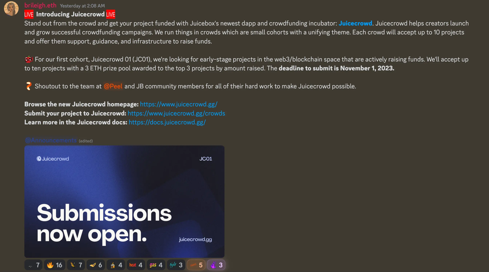
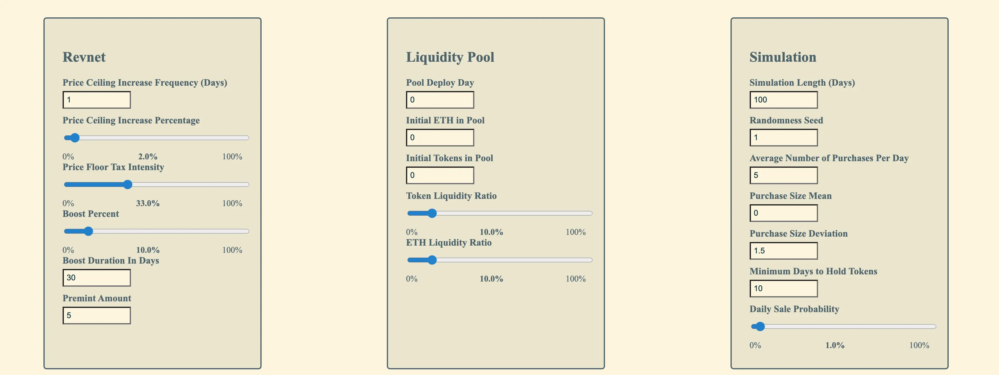
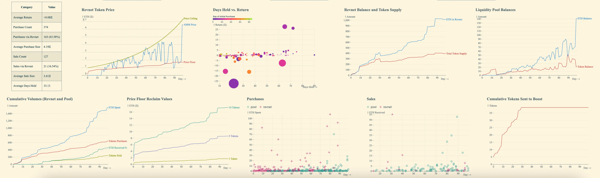

## Juicecrowd Updates by Tjl

During the time Peel team had been building our website juicebox.money, they noticed that in some crowfunding specific cases, projects tended to need assistance to get some traction after they were launched, while some of the features on juicebox.money weren't very relevant for those purposes. So Peel team created a new DApp named [Juicecrowd](https://www.juicecrowd.gg/) for this scoped purpose of crowd funding.

With the deployment of this Juicecrowd App, they also launched a program called Crowd, which will accept submissions from cohorts of up to 10 projects at a time, help them create and polish their Juicebox projects, and support their propagation and give as much visibility as possible for an interval of 30 days, so as to help them get momentum and funded.

Shoutout to the Peel team for their great work in the past two weeks, to the efforts of Matthew and Brileigh for creating this Juicecrowd 01 program, and also to the support from Filipv.

## Artizen Partnership by Nene

The [proposal](https://www.jbdao.org/s/juicebox/443) of setting up a match fund between Juicebox and Artizen has been approved.

According to Nene, Artizen had launched the Season 3 competition of Artizen Fund, and they had over 50 projects qualified for the Juicebox Project Accelerator. The next steps would be onboarding those projects and help them create their Juicebox projects in order to receive their fundings from the Artizen Fund.

Tjl thought that this would be great for the ecosystem and bring in some art related projects, while at the same time establishing a relationship with Artizen. He expected that there would be many projects coming into Juicebox and kickstarting their fundrasing journey.

Nene introduced that all the funds would go to the [Artizen's Juicebox project](https://juicebox.money/v2/p/580), before they are distributed to creators through their own Juicebox projects.

Also, Nene said that they would be launching their Artizen tokens through Juicebox protocol, and he was very excited to start distributing ownership and the Artizen funds to their investors and community.

## Naming Scheme Updates by Filipv

Our contract crew had been working on a few different updates to the Juicebox protocol for some of the L2 deployments of Bananapus project. The team had also been discussing about the probability of renaming some of the names within the contracts, because some of the terminology used in the contracts was a bit different from what we used on front ends and other places, which can be quite confusing for people who are coming into the protocol to develop or work on things.

Filipv gave brief explanations to some of the current names and made polls in the town hall to let community members to vote on the names they feel appropriate.

#### ERC-20 vs. IJBTokens

Filipv thought that there had been a lot of confusion over the distinction between the internally mapped tokens which are tracked in the token store contract, and the actual claimed ERC-20 version of those tokens. He suggested that we call them all by ERC-20 tokens and use ERC-20 in all of the naming and references to these tokens, while accepting that this might be slightly misleading in rare circumstances.

Jango expressed his objection to this suggestion by the reasoning that the token don't have to be ERC-20s, e.g. an ERC-1155 can be wrapped up as IJBTokenERC20.

The context for this problem goes as follows. In V1 protocol, the internally accounted for tokens were called tickets, and the token store was called the ticket booth, to make a distinction with the claimed tokens. In the V2 protocol, we decided that ticket was confusing as people just considered them as tokens, so then the ticket booth was named to token store, unclaimed and claimed tokens were used to differentiate their different state.

#### Project Payer vs. Pay Relay vs. Payment Router

Project payers are the contracts which forward funds to a project, for example, when ETH is sent to these contracts they will be forwarded in the projects.

Filipv supplied some possible choices as Pay Relay, Fund Forwarder, Payment Router, etc.

#### Issuance Reduction Rate vs. Decay Rate

The Issuance Reduction Rate, which was formerly called discount rate, has not proven really accepted very widely.

Filipv thought that Decay Rate might be a good alternative.

#### Funding Cycle vs. Cycle vs. Ruleset

We are now using [Funding Cycle](https://docs.juicebox.money/v4/deprecated/v3/learn/glossary/funding-cycle/) or Cycle to define a set of rules of a project, which will last for an infinite or finite length of time.

Jango thought that a Ruleset might be more specifically accurate for this concept, although it will be a departure from the way we currently talk about things a bit more than Cycle would be.

#### Ballot vs. Approver

[Ballot](https://docs.juicebox.money/v4/deprecated/v3/learn/glossary/ballot/) contract is a contract which looks at the upcoming changes made to a project, and then either approves or rejects them.

#### State vs. Approval status

The status of approval or reject by the Ballot contract is now called state, which can be approved, rejected, pending and etc.

#### Weight vs. Issuance rate

Weight is a term we currently use for issuance rate, which is just the number of tokens issued per ETH in each cycle. The justification for naming it weight in the contracts, from what Filipv understood, stems from the fact that weight doesn't necessarily correspond to an issuance rate, as the contract are pretty modular and people could use that number in other ways. But as it has only been used for issuance of tokens so far, so Filipv thought that we could use issuance rate to make it clearer.

#### JBProjects vs. JBProjectNFTs

[JBProjects](https://docs.juicebox.money/v4/deprecated/v3/api/contracts/jbprojects/) is the name of the NFT contract which mints the administrative NFTs representing the ownership of Juicebox projects.

#### Operator vs. Admin

The [JBOperatorStore](https://docs.juicebox.money/v4/deprecated/v3/api/contracts/jboperatorstore/) is a contract that allows addresses to grant permission to any other addresses to interact with the protocol on their behalf. Filipv felt that we can call them admins instead of operators, as those addresses receiving permissions are actually administrating on behalf of someone else.

#### JBDirectory vs. JBContractDirectory vs. JBContractRegistry

[JBDirectory](https://docs.juicebox.money/v4/deprecated/v3/api/contracts/jbdirectory/) is a contract that can be thought of as a mapping between projects, the controllers and terminals that they are using. Filipv suggested that we add contract in its name to make it clear that it's a directory of contracts.

#### JBController vs. JBProjectManager

[JBController](https://docs.juicebox.money/v4/deprecated/v3/api/contracts/or-controllers/jbcontroller3_1.md) is sort of like a surface layer contract that people directly interact with, and administers project rules and tokens etc. When people launch or reconfigure their projects, they will be interacting with JBController contract. The suggested alternative is JBProject Manager.

#### Distribution Limit vs. Payout Limit

The maximum amount of funds that can come out of a project in a given cycle.

#### Payment Terminal vs. Payment Processor

Payment Terminals are the contracts that administer the inflow and outflow of funds for any give project. When people pay a project or redeem from it, that's the contract they will be interacting with.

#### Overflow vs. Excess Tokens vs. Redeemable Tokens

[Overflow](https://docs.juicebox.money/v4/deprecated/v3/learn/glossary/overflow/) is the treasury ETH assets that a project has in excess of the distribution limit in a given cycle. With the upcoming depolyments of Bananapus on different L2s, the native tokens might not be ETH, but Matic, OP, ARB and etc, so it might be wise to call it excess tokens.

#### Refund Held Fees vs. Unlock Held Fees

When projects withdraw their funds out of the Juicebox ecosystem, these withdrawals will be subject to a 2.5% Juicebox fee. Projects can select to enable the Hold fees function to keep the fees in their balance without them being automatically processed. If projects return those funds in a later time to their treasury via a `add to balance` method, those fees will be also be canceled out and available for use of redemption or payouts by the project again.

#### Process fees vs. Collect fees

Filipv thought that when Hold fees are enabled, the fees remain in the project's balance the whole time, so from the angle of JuiceboxDAO, "Collect fees" will be more accurate than "Process fees".

#### Data Source vs. Data Provider

Data source is a contract that provides some custom data when someone is paying or redeeming from a project. After the payment or redemption, the data source can optionally call a delegate, a contract that implements the delegate interface or defines a function to execute a certain custom functionality.

#### Delegate vs. Hook vs. Callback

The contract that will be called by data source.

## Revnet Simulation by Filipv

Revnet is a concept that Jango and others have been working on lately, the idea is to set up unowned projects which have their parameters set in place ahead of time, and those projects evlolve over time according to these pre-defined rules. Also the buyback delegate will be deployed to route payments to AMM pools when situation requires.

It can be a little difficult to reason about how all the parameters work together over time, so Filipv developed a simulator which let people put in some of the parameters to check how the revnets will evolve with the simulation. The Revnet simulator is now available at [sim.revnet.app](https://sim.revnet.app/).

With the suggestion from another community member Kmac, the randomness of purchase and sales can be made deterministic by inputting the same randomness seed on the Simulation field. So with the same other parameters, the charts will look exactly the same even on other computers, which make the replication of certain scenarios much easier.

Increase the Pool Deploy Day in Liquidity Pool section by pressing the up arrow in your keyboard, you can see the animation of how these charts change over time.

 Filipv was thinking of adding an option to export or important all the parameters of this simulation, so that people send them to other people and make comparisons. He said he could start with JSON file compatibility in revnet.app, and it would be awesome if Nance or juicebox.money might also eventually have support for it. Jigglyjams suggested that except for the file import/export function, he could also consider the option of encoding all the parameters of a simulation into a Base64 URL, with which this simulation can be easily recreated.

