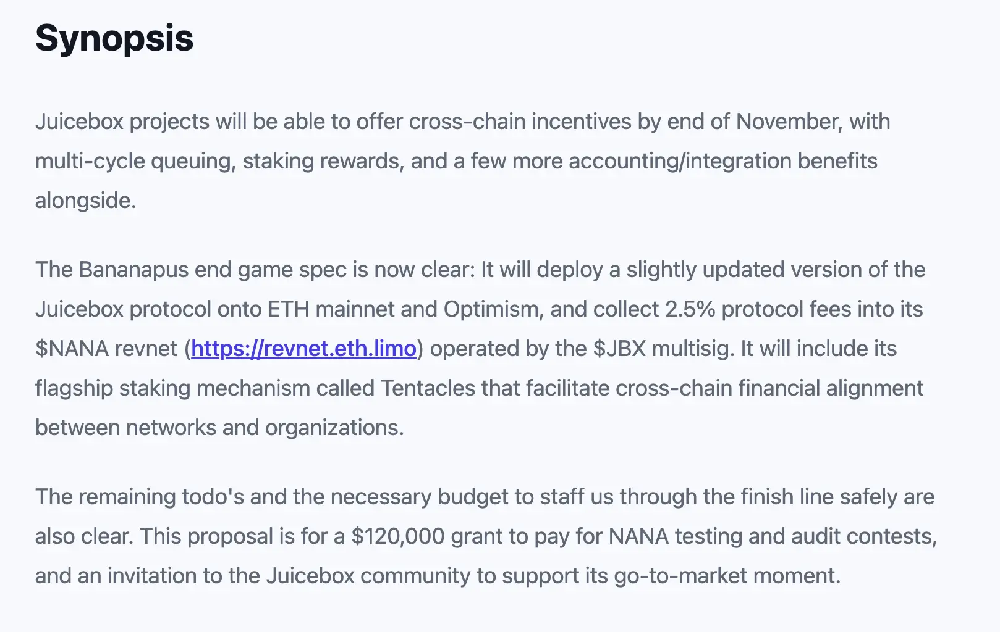
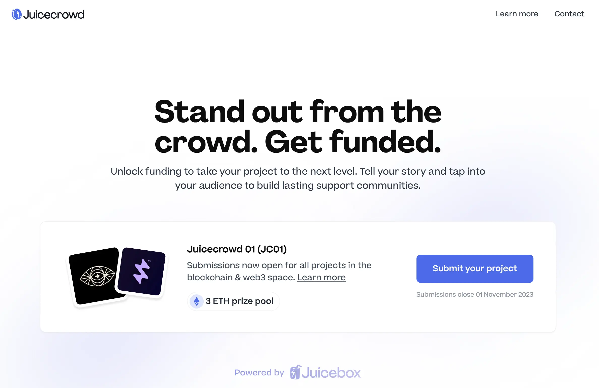

## Bananapus Updates by Jango

The fork of Juicebox protocol that will be used and deployed by Bananapus project is still under development in its [GitHub repo](https://github.com/Bananapus/juice-contracts-v4/pulls). The most important PR will be the [multiple funding cycle queuing](https://github.com/Bananapus/juice-contracts-v4/pull/1), everything else will be out of convenience for integrators and multiple currency. 

According to Jango, the V4 fork of Juicebox by Bananapus will be deployed on Ethereum mainnet and Optimism together, after they are tested in the respective testnets there.

The specific roadmap of Bananpus development can be found in [Jango's proposal for grants to Bananpus project](https://www.jbdao.org/s/juicebox/444), which has been approved by the DAO in our last funding cycle.

The complicated part will be the rewards component of Bananpus. Jango thought that we could get it really tight and sensible, so that people can get paid as the networks that they are staking with grow. 

Filipv said that the front end that is currently in the Bananpus GitHub, the bananapus.com repo, was originally meant to be a basic testing front end which allows interaction with the contracts for one project. If the Bananapus is used by many projects across multiple chains, the current design doesn't really scale for that purpose and we might need  to develop something more robust. 

## Juicecrowd Updates by Matthew

We now have a project applying for the [Juicecrowd 01 fundraising program](https://www.juicecrowd.gg/crowds). This project is called Brume Wallet, which is aimed at developing a private Ethereum wallet with a built-in implementation of Tor protocol. 

Matthew expected that we would see some more projects to submit their applications when it is getting closer to the deadline of this program, which was set as Nov. 1st, 2023.

He introduced that once they have received all the submissions by the deadline and chosen which projects would be in the cohort, they will open up the project creation flow to those selected projects. After all the Juicecrowd projects are made, they will be curated on the the Juicecrowd page.

Although the eventual goal of the Juicecrowd dApp is meant for a fully permissionless project creation, the team wanted to start with cohorts of projects. The idea is to to keep a very high quality of early projects that are using Juicecrowd, and the team will be giving all these projects a lot of support, guidance and making them as successful as possible, so that Juicecrowd can have an excellent track record of successful fundraising which hopefully will help bring it to a bigger audience in the future.

The projects that are going to be launched on Juicecrowd run in exactly the same way as they are created on Juicebox.money, except that the Juicecrowd project creation flow will be more simplified and tailored specifically to the needs of crowfunding.  In terms of tokenomics, there will be no ERC-20 tokens issued, so contributors will likely receive an NFT to verify their contributions to the projects.

Matthew, Brileigh and Filipv also discussed about the possibility and potentials of having some kind of cooperation of match fund with different crypto organizations, or applying for grants with multiple L2 chains like BASE, Arbitrum or Optimism, etc. They agreed that it might be worthwhile to at least try to reach out and expand the operation of Juicecrowd to other L2s in the future.

## Buyback Delegate Updates by Jango

The buyback delegate has been deployed to the JuiceboxDAO project for some time now, Jango said it has been working great till this moment. He was going to make a proposal to fine-tune the parameters of the buyback delegate and add more liquidity to the relevant AMM pool.

If another project wants to use it, we could work with them to fit that together too. When all the revnets are launched in the near future, they will also have buyback delegate baked in automatically. So we will be expecting many more of it gets put into actual use.

Peel, our front end team on Juicebox.money, is also making good progress to display the actual token swapped from the AMM pool when buyback delegate is put into action.

## Governor Contract Implementation Discussion

Jigglyjams was wondering if there would still be some interest in using governor contract for the Bananapus project.

Jango said the current Bananapus Juicebox project is temporary and just to manage the development of Bananapus. Its governance was meant to be on-chain as an experiment of Revnets, which are unowned projects without need of governance.

But JuiceboxDAO is expected to receive a lot of $NANA token from the Bananapus Revnet after its launch, and these tokens will be managed by the JuiceboxDAO multisig. While this is not something to worry about in the near future, Jango expressed his interest in exploring the possibilities of on-chain governance with the $NANA holding by JuiceboxDAO in a long run. If Bananapus project works and JuiceboxDAO sit with a lot of $NANA tokens, something also needs to be done, by either distributing them out to $JBX holders, governing together or doing some kind of token swap thing.

Jango thought that the end game is certainly not six persons on a multisig carry out executions on behalf of the DAO, but rather the opportunity we get to play with an on-chain implementation of governance. The idea of locking the tokens for a long time and not having access, or making access more formal, makes a lot more sense in the post-multisig experimental direction. But he thought that Revnets will be the final goal to put our effors towards.

