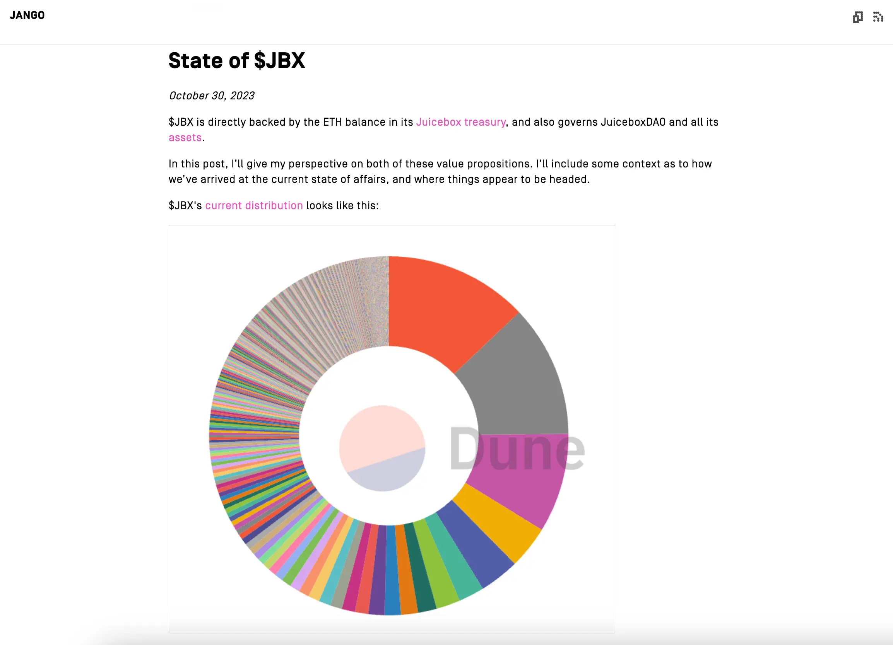
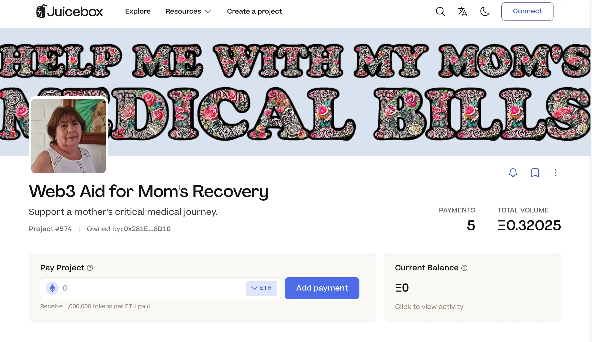
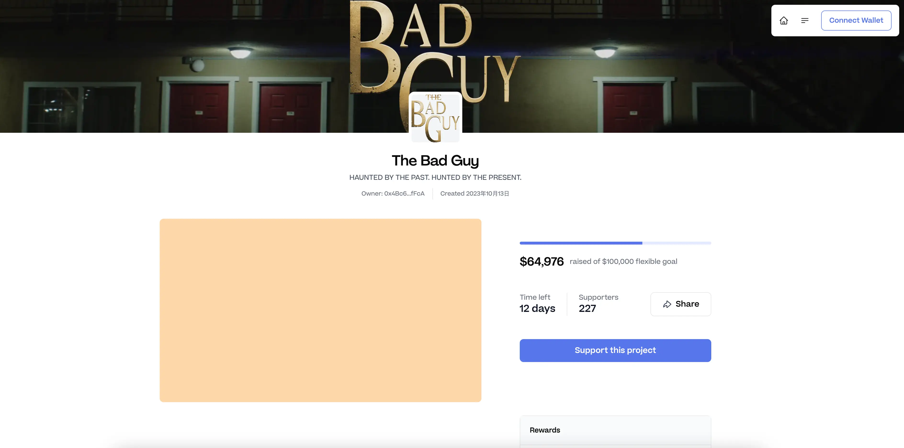
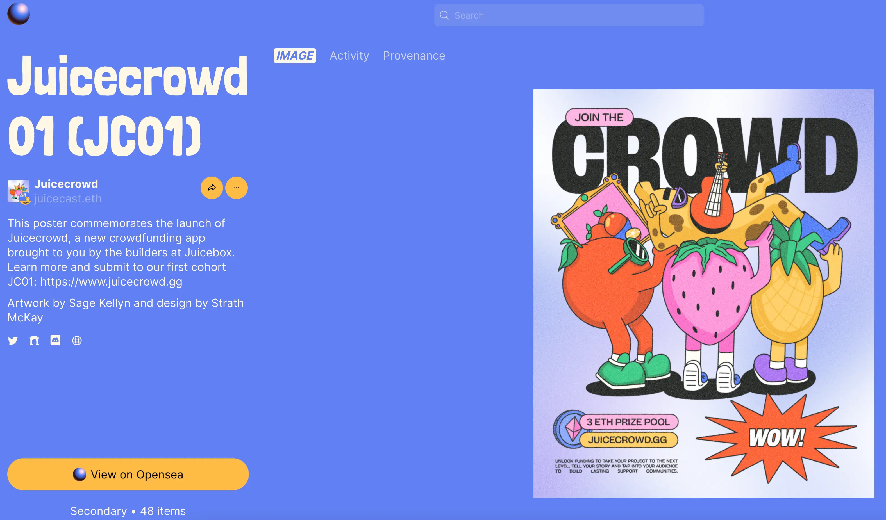
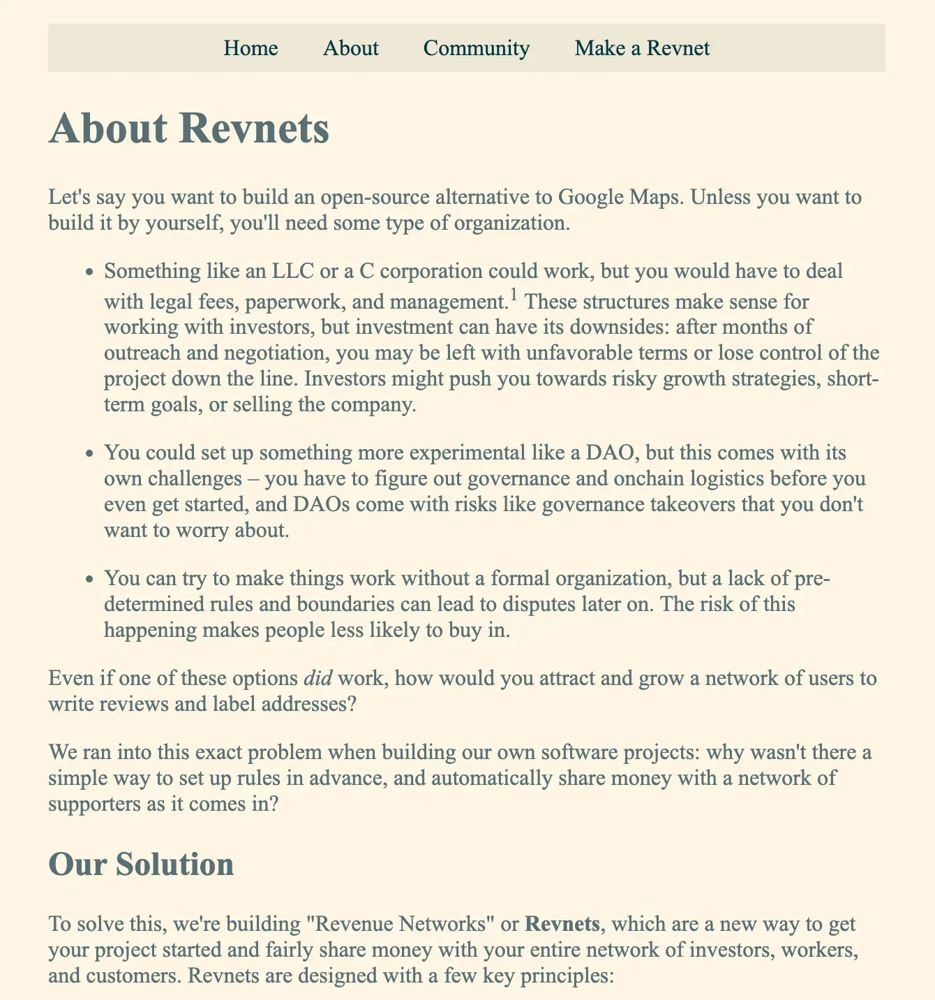
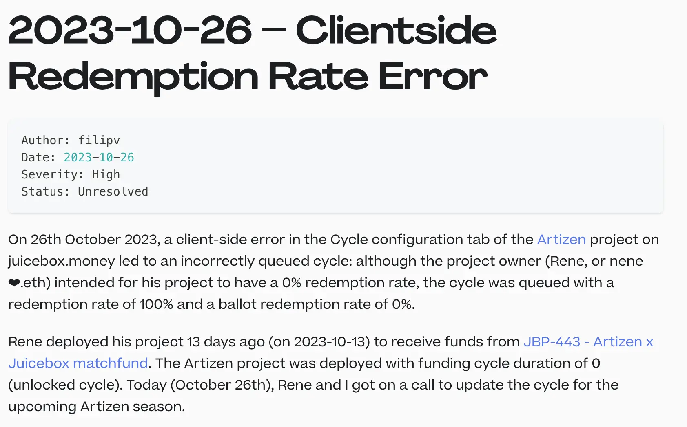

## State of $JBX by Jango

On the town hall, Jango went through the article he recently wrote on his reflections on JBX, which can be found [here](https://jango.eth.limo/0B0EE09E-54B5-453E-8897-C4A4D8093743/).

Jango felt that with the Buyback delegate being installed, it was a good time to reflect on where we are as a community that has governance responsibilities and also manages a treasury provided by JBX holders. We had been using this treasury to do all the marvelous things, but every now and then we would need to stop and reflect.

Thanks to the patience of all JBX holders, the army that gets us where we are and pushes us forward, we managed to sort throught a lot of versioning work to allow us to really make these big strides from a protocol perspective. It will also take patience to understand where the user experience is, so as to have folks start projects, build their communities and determine what their community needs are.

We now have about a million US dollars worth of ETH in the treasury, with the payout cadence of around US120,000 every two weeks on the current schedule. We've accomplished a lot over the past few years, but we are in this moment of figuring out how to use this $JBX to really power us through to this next chapter of what we're now trying to get to, which includes projects like Bananapus, Revnets and Juicecrowd, etc. It's very much a continuation of our work, but we'll also have to figure out what levers we should renegotiate to really unleash the potential energy here.

In the blog post written by Jango, he reflects on the two value propositions of $JBX, a token that is backed by ETH in the treasury, and the token that governs JuiceboxDAO and all its assets.

### $JBX as an asset ETH-Backed Asset

$JBX gets issued whenever there are funding coming into the treasury, they can also be burned to get funds out of the treasury.

After the deployment of buyback delegate in October, inbound payment will be routed to buy back tokens from the AMMs until its market price catch up with the issuance rate, so that payers get a lot better yields in exchange for what they paid, and reserved token recipients now also have better incentives. But if investors want to get the best deal for JBX, they should buy on AMM instead of buying on protocol, because that way they will bypass the reserved token issuance.

Over the past period of time, we have been spending from the treasury, so $JBX is backed by less and less ETH in the treasury and the price floor has been somewhat dropping as we spend more. 

### $JBX as a Governance Token

$JBX as a governance token has also seen a wild journey over the past few years, from not being a thing at all, to now having a very predictable cadence to conduct the cycles, participate and execute, which is a massive progress for us all as builders to get to where we are.

We also have a fairly sizable $JBX balance which has been sitting there mostly for the past while. It's our biggest asset apart from the ETH in the treasury. Jango thought that we could be a lot more creative with how we use this $JBX balance to empower the network to propel itself forward.

### Jango's observations and Suggestions

We've finished building a lot of the fundamental technology that allows us to facilitate this financial fabric in money in various ways. Jango thought that we are starting to recognize that we have to figure out how to grow very productively. At the same time, we have a responsibility to manage the ETH left in the treasury in a way that is productive to move us forward on this mission.

If we want to empower $JBX, we have to add to $JBX as opposed to reducing its bottom line. It's a tightrope walking, because both are important. We want to push forward and the work that we do needs our time, focus, attention or love to get it there. We have to find that balance, if we don't, the balance will be found for us.

He also suggested that we remove individual entities from the reserved rate and have more reserved tokens go to the treasury. Then everyone will have to play a similar proposal game, which is a lot more scalable than having individual entities on the reserved rate list.

### Takeaway

Jango thought that it was an opportunity to really think creatively as we move into the future. It might be a little bit of growing pains along the way, but that's normal.

Jango said that he would try his best to lead with proposing things along the way, trying to shape things and build relationships with outside investors and other communities so that there would be forward momentum from a financial perspective too.

### Discussion about JBX's liquidity pool

LJ asked what Jango's opinion was for JBX on the secondary market, since the current liquidity pool for $JBX was quite shallow. He agreed with Jango's idea of utilizing JBX versus just spending ETH from the treasury, but he thought that we should be also thinking about the secondary market for$ JBX, since an active secondary market might help driving in more attention and bringing more retail users to the platform.

Jango agreed that adding more liquidity allows for more price stability, but the prices on AMM are temporary and may fluctuate from time to time. He said that the price that we can really rely on is the price floor, i.e. the backing value for $JBX, everything else is just a consequence of the work we do in telling the story and making JBX a desirable part of either of value propositions mentioned before. 

## Crowdfunding for Medical Bills by Felirami

Felirami recently launched a Juicebox project called [Web3 Aid for Mom's Recovery](https://juicebox.money/v2/p/574), to raise fund for his mother who got seriously ill and hospitalized in ICU of a hospital. 

On the town hall, he expressed his gratitude towards the Juicebox platform and those who had donated to his project. But he also said that he had been having issues reaching out to more people in order to get more help to pay the medical bills for his mother.

TJL said that as we were currently working on the problem of helping projects better tell their stories, craft more incentivizing reward, market and launch their projects, he invited Felirami to join the Juicecrowd Discord and offered to take him through the recent Juicecrowd 01 program. Hopefully Feliram might be able to take what he wants from an education perspective to improve his campaign and get more visibility.

## Juicecrowd Updates by TJL

Peel team identified that there were too many types of users for juicebox.money, which was causing a lot of complexities, so they wanted to see if they could come up with a product that counld better cater towards the crowdfunding users and ensure a higher level of success. For this reason, Peel team set out to build a more focused DApp for crowdfunding, which is now called Juicecrowd, to help bring in a higher caliber of quality projects and have a more holistic look at what a campaign actually is.

Peel really started looking at what makes a campaign successful from a holistic perspective, such as their story, their mission, their vision, the way their project is structured, how are contributors incentivized, how they are marketing. Together with the more tightly focused DApp Juicecrowd, they also kickstarted a program to recruit cohorts of high quality projects and help them with all the components of their crowdfunding campaign. 

By the time of this town hall, they had successfully got 16 projects submitted to the JC01 program. They also extended the deadline of application by projects to Nov. 8th, in a hope to get around 20 projects to submit their application.

TJl expected that they would have a test project up and running by the following week, while the program will start in two weeks' time.

Also he praised Matthew and Brileigh for what they had done to get this program launched and projects applying for it, and Wraeth, Aeolian and JohnnyD for their great job to pull together the basic parts of the project page of Juicecrowd.

## Juicecrowd Poster and Mint by Matthew

Sage and Strath collaborated to make the poster for Juicecrowd 01 program, and this posted had been put on Zora for free mint. Matthew thought that we should keep trying different strategies to find a place on-chain for some of the art that gets made, instead of only being shown on our website.

Jango thought that the poster game had been incredible, and he sees Juicecrowd not only as a dedicated product for crowdfunding, but also as an exercise of setting time boundaries and pushing towards it, as well as making creative moves in promoting it.

## Revnet Introduction by Filipv

In the website that Filipv made for the simulation of Revnets, he recently updated the detailed introduction to what Revnet is and why people may want to create and make use of one. Filipv said that he would try to make this information as generally applicable as possible.

## Artizen Project Updates by Filipv

Last week a slight issue occurred with the front end while Artizen project was being reconfigured by its project owner Nene and Filipv, this error led to an unintended 100% redemption rate in the project's configuration of its new funding cycle. 

To avoid any unexpected behavior in this project, a decision was made to archive this project and create a new Artizen project with the correct configuration to replace it. As the old project was configured with a duration of 101 days, the funds inside can't be retrived temporarily, Jango and Filipv decided to put forward their personal funds to the new project instead, and they will submit a proposal to get reimbursement from the DAO later.

The error has been mitigated with a PR created by Wraeth and JohnnyD, and the whole process of treatment of this issue written by Filipv can be found [here](https://docs.juicebox.money/dev/v3/resources/post-mortem/2023-10-26/).

Tjl would be meeting with Nene to go over the submissions for the Juicebox and Artizen Match Fund, and he would report back if there are any updates afterwards.

## Bananapus Updates by Jango

Jango said the V4 protocol, which is a fork of Juicebox V3 protocol by Bananapus, would probably be finished by the end of this week. The week after that, the contract crew will be in a mode of heavy reviews. After the reviews, he would expect a Code4rena audit contest be arranged for the Bananapus contracts.

Hopefully, by the end of November, the Bananpus project will be going live, at least on test nets first. Thanks to the reviews by Nowonder, 0xBA5ED and Dr.Gorilla, Jango said he was very confident about the contracts and their deployment in the near future.

## Origin Ether Integration by Slagathor

Slagathor from Origin protocol mentioned his interest of integrating their Origin Ether token on the back end of Juicebox. According to his introduction, Origin Ether is a yield aggregator on Ethereum mainnet, essetially a token backed 1:1 by both ETH and several LSDs(Liquid Staking Derivatives), and the collateral of their users would be deployed across a handful of protocols for yield, while the yield gets passed back to the holders.

Jango said that we were making the foray into multi-chain and going to support multiple tokens in a very scoped way, so hopefully in the near future we might be in a position to give Origin protocol some more straightforward path to integrate their tokens into Juicebox without needing any permission. 
