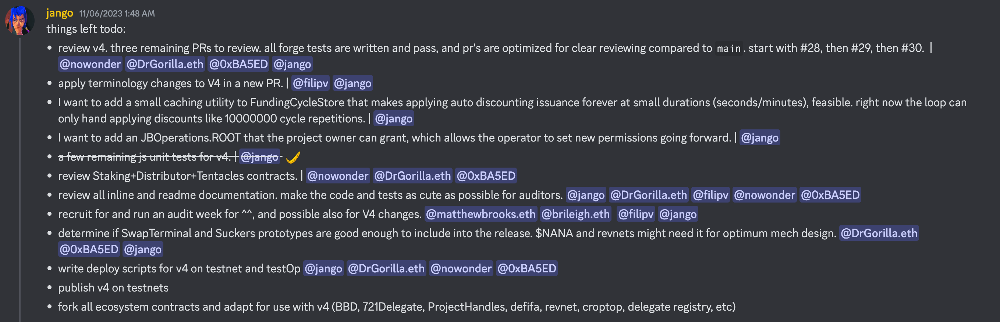

## MoonDAO Updates by Jango

MoonDAO was established on Juicebox protocol roughly two years ago. After their successful fundraising campaign, they aquired two tickets to space on a Blue Origin spaceship. In August of 2022, They managed to send a person into the outer space on the Blue Origin, which was a feat first done by a DAO.

Last year MoonDAO also held a contest of randomly drawing a winner of its Ticket to Space free mint NFTs, the winner, a MoonDAO member from China called Yan, won the second ticket to space. But Yan has not been able to get a visa to go to the U.S., even with the multiple efforts to help by MoonDAO for a very long period of time.  Finally the community decided that they have to re-raffle the ticket and get another community member to take this trip to outer space.

MoonDAO is also working on a lot of projects, and they have close relationship with institutions like NASA. Pablo, one of the founders of MoonDAO, is very dedicated to their mission with the ambition to go to space and put a base on the Moon. At the same time, Pablo has been staying very close to the stuff that JuiceboxDAO is working on recently, and sharing some ideas from their perspective. In the town hall, Jango expressed his admiration for MoonDAO and Pablo for their persistence in pursuing their goals.

## Juicecrowd Updates by Matthew

Juicecrowd JC01 program had received applications from 35-36 projects by the time of this town hall. Matthew called on the community members to help spread the news and refer some projects they know to apply for this program.

Peel JuiceboxDAO contributors will be able to vote on the projects to help select which projects will qualify for the JC01 program. The Juicecrowd team will be working with the first selected cohort of projects, which will be launching their Juicecrowd projects on Nov. 17th.

Next week the team will hold seminars for one or two hours each day and invite the people in the first cohort to talk about how they are going to strategize their fundraising campaigns, launch their projects and promote them and get more visibility. Tjl, Brileigh and Matthew, and probably some other contributors will be sharing some information for crowdfunding by way of some kind of curriculum during that period.

After all the projects are launched, they will be running until Dec. 15 to compete for their fundrasing outcome. Top 3 projects will get awarded from the prize pool of 3 ETH.

## Bananapus and Revnet updates by Jango

The short-term roadmap is to get Mainnet and Optimism depolyments by the end of this month, which will likely be running on the testnets through the rest of the year, while the team will continue to write a lot of tests and documentation, make sure everything is good to go, and use these deployments in pseudo production environment.

Here under is the work expected to be done by next week, which will make sure that we will see the end of the month get us to a solid testnet deployment with everything running Revnets for this Bananapus experiment. That will allow us to run testnet implementations for anyone who is interested in framing their project as a Revnet.

Jango said the team used to be expecting a Code4rena audit contest for the contracts of V4 protocol, which would be a scoped updated fork of Juicebox V3 protocol. But as Code4rena had quoted us a cost of US$80,000 for this audit, it did not feel very worthy of doing it anymore. Instead we would be providing some incentives ourselves and invite auditors whom we are familiar with or folks from around the ecosystem who want to help review this well-written and well-tested set of repos, in order to get the project as tight as possible for a mainnet deployment after the holiday season.

## Juicebox V4 Naming Updates by Filipv

During the town hall on Oct. 17th, Filipv shared the updates for the naming scheme of V4 protocol, which will be the fork of Juicebox V3 protocol by the Bananapus project. Filipv provided some possible choices for the names and explained the reason about their re-naming, before making some simple polls in our Discord channel and let people make their choices and leave their feedback.

Last week, Jango met with Filipv to go over all the feedback from that town hall, and made some changes from it. In this town hall, Filipv were presenting the revised versions and asking for further opinions or reviews for them.

#### JBTokens

When a project deploys the claimable token using JBTokens contract, which is the default implementation of that contract, those methods will be called with ERC-20 added to their names, like `deployERC-20TokenFor(...)`, while references to other implementation will be called just token as in `setTokenFor(...)`

We are now making distinctions between tokens internally mapped and actual ERC-20 tokens by calling them unclaimed and claimed tokens respectively, which has been pretty confusing for a lot of people. Jango suggested that we call the unclaimed tokens as "token credits" which can be claimed as actual tokens at any time in the future, and call thoses actual tokens just "tokens" to clear up the ambiguity.

#### JBRulesets

People seem to pretty widely support the idea of changing Funding Cycle to Ruleset, which is just a set of rules within a fixed or infinite length of time. So for example, we will be changing the `JBFundingCycleStore` to `JBRulesetStore`.

What is now called the discount rate, we will be calling it "decay rate", because it is like the decay of the issuance rate or the weight that issuance is based off of.

#### JBPermissions

This contract is currently called JBOperatorStore, with which permissions can be granted to other people to manage the project or interact with the protocol on behalf of the project owner. It makes more sense to rename it to JBPermissions, but the operator term is still useful in names of methods such as `setPermissionsForOperator(...)`, which will clarify things a bit better than `setOperator(...)`.

#### JBController

We are changing some things just to make it a little bit clearer. For example, `reservedTokenBalanceOf` reads the number of reserved tokens that are pending distribution, so renaming it to `undistributedReserveTokenBalanceOf` sounds more clarifying.

#### Payout Limit

The idea of going from distribution limit to payout limit seems pretty widely supported, which expresses the maximum amount of ETH or whatever currency that a project can pay out from a terminal within one cycle. 

#### Runway vs. Overflow

This is a possible change that was still quite controversial in this town hall. 

Jango thought that overflow is a fun Juiceboxy word, like a juice glass that overflows, and it conveys the idea that when something fills up, there will be excess and it overflows. But also a lot of projects read overflow as runway where projects have periodic payouts or pay obligations and whatever is left over is the project's runway. It's neat to communicate that a community of funders constantly has access to the runway, otherwise the project can make use of it, depending on how the project is configured.

Matthew felt that runway tends to give an overtone of how long a project can continue to exist, and it does not immediately have the meaning of the excess of project's payouts, whereas overflow do.

Filipv thought that runway feels easier to convey to people who are going through the create flow for the first time that they can have their payouts and everthing beyond that is the runway of the project. And if a project has a lot of extra runway, it can be redeemed by the community with their tokens. Also people conceive of runway as the future amount of funds that will be available for the project.

#### Terminals

We are shortening the names a little bit for terminal, like from `IJBPaymentTerminal` to `IJBTerminal`, as the basic implementation for terminals are just supporting payments.

Because the V4 protocol will be deployed on multiple blockchains, a lot of the ETH terminology will need to be changed accordingly, such as changing from `JBETHPaymentTerminal` to `JBNativeTerminal` to go with the native tokens of those target blockchains.

Compared with `JBERC20PaymentTerminal`, `JBERC20Terminal` makes more sense, because there are other things can be done through this terminal.

#### JBERC20Token

Currently this contract is called JBToken.

#### JBProjectPaymentForwarder

This contract is currently called JBProjectPayer, which forwards inbound ETH payment to the projects. We think that forwarder makes a lot of sense in this case.

#### Hooks

We were thinking of how to more clearly communicate the pattern of data source and delegate, which is something that has been confusing for people from time to time. In the polls in last discussion, people seem to think "hook" makes a lot more sense in many different programming contexts. 

Data source is the function which provides data to the pay function beforehand, and delegate actually takes the action after the pay function or the base pay logic goes through. We decided to break these down into "pay data hook" which provides data and "pay action hook" which takes the action. And the same goes with redeem data hook and redeem action hook, etc.

The current Ballot is a contract that checks if the conditions are met before a funding cycle is approved, it can be defined with whatever behavior that is desired. We think that by putting these all in a framework of hooks, we can make it clear that people can write their own verions of these contract and extend the protocol easily. For this reason, "Ballot" will probably be called "Ruleset approval hook", and "State" which depicts the status of approving or rejecting can be better expressed by calling it "approval status".

## Artizen Updates by Filipv

There were around 75 projects that had gone through Aritizen and qualified for the Juicebox Project Accelerator Fund.

Filipv thought that there was a bit ambiguity in the rules about how the project would qualify for the fund. It would be nice to have projects meaningfully distribute the ownership or governance to their community through Juicebox in the future events.

The projects which have been coming in through Aritizen were mainly art project, it was really awesome to have them on Juicebox. But some of projects are already within crypto and have their tokens, a lot of them don't really have a strong need for using Juicebox at this point. So he suggested that we follow a stricter set of requirements for similar events like this in the future, so that project would more meaningfully make use of Juicebox instead of deploying a project and leaving it there.

But all in all, Filipv thought that things had been pretty great, and there were a good number of promising projects. He also thought that the Juicebox Project Accelerator Fund is probably one of the best grant spending we have ever done, there could be some pretty cool stuff that comes out of it.

