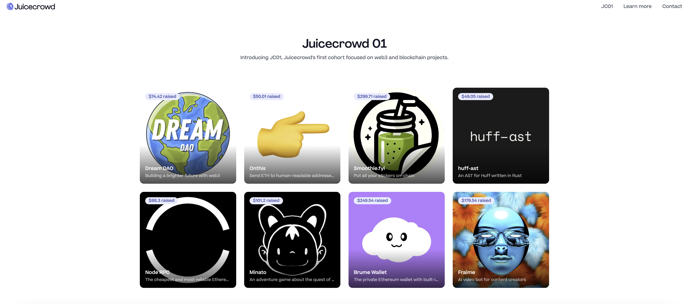
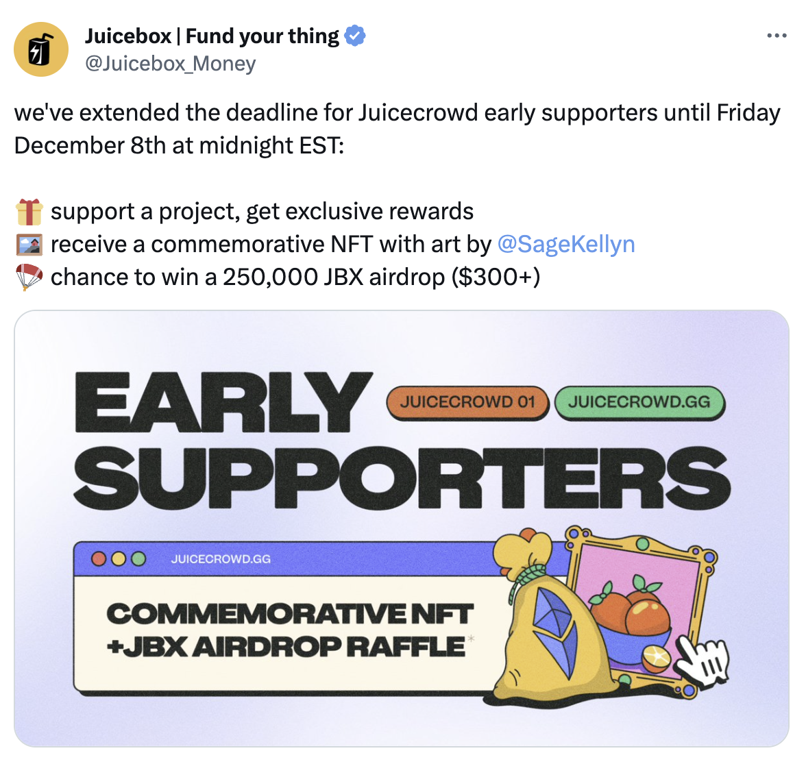
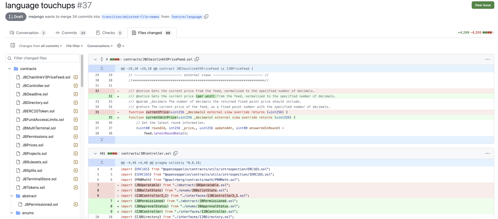
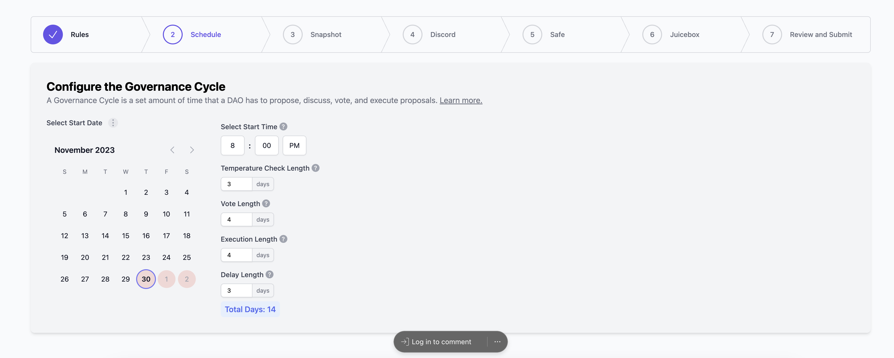

## Juicecrowd Updates by Matthew

The Juicecrowd Dapp has been deployed and running for several weeks. And the Juicecrowd team, Matthew, Brileigh, TJL and other Peel members have launched a Juicecrwod program to assist projects with a Web3 or blockchain vision in organizing their funding campaigns, enhancing visibility, and catalyzing community growth. 

As of now, the first cohort of Juicecrowd projects have all been meticulously crafted and put into operations on the blockchain. 

The Juicecrowd team has also offered some incentives for early project supporters, which include an exclusive airdrop of commemorative NFTs made by Sage and Strath, along with an opportunity to participate in a raffle for 250,000 JBX. The deadline for early supporters has been extended to Nov. 08, 2023, making sure that more people can engage with and contribute to all the JC01 cohort projects.

Matthew called on our community members to share out the projects and spread words for them. He also introduced that the team would be working closely with these projects to amplify their outreach, so as to get more support or even secure grants from other platforms.

Filipv thought that a lot of the projects in this cohort seemed to have great potential, and he was excited to see which projects could gain their momentum and realize their growth in this program.

## Bananapus Fork Updates by Jango

All the open changes that we are merging and getting ready for the Bananapus deployment in testnets have all been consolidated onto the main branch of its [GitHub repository](https://github.com/Bananapus/juice-contracts-v4). 

Presently there still remain two pull requests open for merging. One involves the language adjustment scheme that Filipv has been working on for a while. These changes have also been reviewed on our previous town hall sessions. 

The other pull request focuses on enabling meta transactions on payment terminals, which essentially allows clients to have more flexibility in choosing their relayer nodes. With meta transactions, an end user can sign a message indicating their intent and pass it to a relayer, which in turn submits a transaction and pays gas for its execution on behalf of the end user, while contractually all of the accounting related to the transaction's message sender remains consistent and accurate.

Once this very exciting batch of work gets consolidated in the next few days, Jango expect that this V4 fork of Juicebox protocol can be deployed on Optimism and Ethereum testnets by the end of the week. After that, we will be able to use it as the core protocol dependency for the Revnet contract, the Defifa contract, the 721Delegate contract and the Croptop contract. All of these applications will also be launched on testnet for their final testing shortly after that.

Then we will carry out comprehesive testing in the December, while at the same time turning our attention to the web clients such as revnet.app and defifa.net, which will all be integrated into their respective testnet deployments to allow us to try out and test for any possible bugs.

There is another matter noteworthy according to Jango, the team has restructured the payment terminal architecture to facilitate a single payment terminal managing multiple token accounting contexts in the future. The Bananapus fork will be implemented with a vision for multi-terminal and multi-token accounting, catering to the needs of projects and multi-chain organizations.

## Token Table Revnet Development Updates by LJ

The TokenTable team was granted some funds to develop token unlocker contract and Telegram bots tailored to the use of project creators and contributors on Revnet, as outline in proposal [Fund JuiceTable (TokenTable) team to co-develop with the RevNet Core Team](https://snapshot.org/#/jbdao.eth/proposal/0x740cc558c73fc33c93df4150493583112890f78e99e51983bdec5cdd3b0891c1), which has been approved by the DAO. The products are expected to be delivered in three sprints with the DAO's grants distributed accordingly.

LJ reported that significant progress had been made in the first sprint, encompassing the creation of the Telegram bot Figma wireframe, and feedback from the community has also been actively incorporated into the development. They planned to put more ideas into written form about Revnet shortly.

## Nance Updates by Jigglyjams

The Nance team is working on a new create flow, which will be ready early next week, anyone who has a new project and wants a Nance space for automated governance can reach out to the team. It would be ideal to have some real users to actively engage with and test out this product.

## Banny Warhol Updates

Jango introduced that the Banny Warhol channel in JuiceboxDAO's Discord server has realized a significant update. Now, users can engage with the Banny Warhol bot to create Banny-related images or inquire about the Juicebox protocol by simple providing relevant prompts or question. 

Jmill, Genekogan and other Eden team members are in the process of transforming their generative art service into a platform capable of crafting characters for users. Initially they are starting with Banny as a prototype for this innovative transitioning.

What Jmill shared in the discussion better explains their vision in this venture, "We’re moving towards a self-service character system, with potential for a character to speak as, know about, and create visuals in the style of whatever you want. "  

 Jango thought that this is a tool of incredible potential. Beyond its applications in making images, project logos, or entertaining contents, it also has the potential to help shaping and expanding the concepts surrounding specific characters, such as that of our Bannyverse.

Filipv said that Stable Diffusion recently unveiled a new model of SVD (Stable Video Diffusion), if that can be integrated into Banny Warhol in the future, it might be able to deliver some very impressive results.