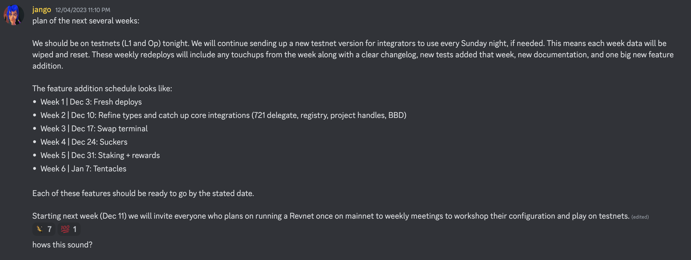

## V4 Naming Changes Updates by Jango

The fork of Juicebox V3 protocol by Bananapus has been officially cleaned up, the only thing left over is the language touch-ups pull request. This pull request covered 95 files with renamed words, and there is no implementation changes in the contracts.

This has all been the hard work by Filipv during the past several months, and the changes have also been reviewed in our previous town halls and relevant discussion threads.

During this town hall, Jango introduced some of the top-level changes that have been made in this pull request, and said that he was quite certain that we would run into these changes as folks start integrating with the experimental V4 protocol over the next few weeks when the protocol is deployed on testnets.

#### Rulesets

Funding cycles are now changed to rulesets, so we can talk in terms of what the project's current ruleset is and what the queued rulesets are. 

Now the V4 protocol supports multiple queuing of configurations, project owners can queue multiple different rulesets over time, for example, they can deploy their projects with clear instructions on how the rules should change over the next year in various different ways. Jango was very excited to see what folks might end up building with this open-ended feature.

#### Tokens and credits

We used to make distinctions between the different states of tokens by unclaimed tokens (those tracked and accounted for within the protocol) and claimed tokens (ERC-20 tokens under the custody of their holders), but we now instead calling them credits and tokens respectively.

By default, when projects receive payments, they will distribute credits in return to the payers. If project owners  choose to issue an ERC-20 token or bring their own tokens later on, then the credits can be claimed into those tokens. 

#### Decay rate

We now use decay rate instead of discount rate to describe the decreasing cadence of token issuance of a project over time.

#### JBPermissions 

We change JBOperator to JBPermissions, where project owners can delegate other addresses to manage vaious parts of the contracts on their behalf. Also a root permission is introduced into the contract, so that project owners can give someone else permission to do everything on their behalf, including  adding other permission for different operators.

## Game Plan for Bananapus by Jango

When the merging of the language touch-up pull request is done in a short period of time, Jango will deploy the V4 protocol on Ethereum Sepolia testnet and Optimism testnet, which means deployments on both an L1 and an L2 blockchain.

The game plan is that every week on Sunday night, Jango will collect all the approved changes that have been workshopped during that week, and redeploy the contracts if necessary, so that every week we will basically start clean and iterate on the latest version.

There will be some PRs that will be created throughout the weeks, things like language related touch-ups, small implementations, or other optimizations that have been on our minds, will make their way into the contracts. We will be playing the role as incubators of the deployments on testnets, and we can make the change logs very clear on a weekly basis about what has been changed.

We will also be continuing to add a lot of tests to make sure the contracts are as good as we can get them, together with a documentation of very high quality.

And then every week we will add one of the new features that we have been working for the last several months, bring them into production and fold them into the protocol. The addition of features will be carried out one step at a time, according to the plan shared by Jango in the discussion.

Swap terminal is a component that allows projects to receive payments in any cryptocurrency. The received cryptocurrencies can be swapped into the project's treasury asset currency, which will be great for collecting fees in various tokens.

The [sucker](https://github.com/Bananapus/bananapus-sucker/tree/master) facilitates cross-chain token transfers between projects, using a messenger for communication and a redemption mechanism for token exchange.

## Revnet Testing Sessions by Jango

As there are many people want to run revnets for their projects, and we are also preparing for the first cohort of revents, so Jango expects that we will be doing more testing sessions for revnets. We will get together and start to workshop how to configure a revnet and test it, which will be a reciprocal situation, as it also can be very helpful in improving the language of cntracts and the overall fuctionality of V4 protocol.

Hopefully towards the mid or end of January next year, we will have a production candidate that can be used by various potential revnets, such as $NANA, Revnet, Defifa, Croptop or Juicecrowd, for purpose of testing or experimenting their own projects.

## Project Updates by Filipv

Filipv said that the [CryoDAO project](https://juicebox.money/@cryodao) was doing some pretty exciting stuff, and he encouraged our community members to join their Discord server and get more involved.

The Roman Storm project is planning to launch with the next week. And Rene from Artizen is also planning to do a launch essay and promotion for the Artizen project in the same period as well.

## Telegram Group by Jango

Jango introduced that there is a Telegram group now live for $JBX discussions with more inclination toward token trading matters. Jango said that as he had got off the recurring payroll from JuiceboxDAO recently, he would be willing to get more involved with he JBX storytelling and education work over the next short period of time. 

And he thought that when folks are asking good questions, it would always be nice to show up and answer them in an honest way and reveal the right risks, while at the same time introducing the right opportunities of the things we had been working very hard on. We will all acknowledge how powerful $JBX can be.

