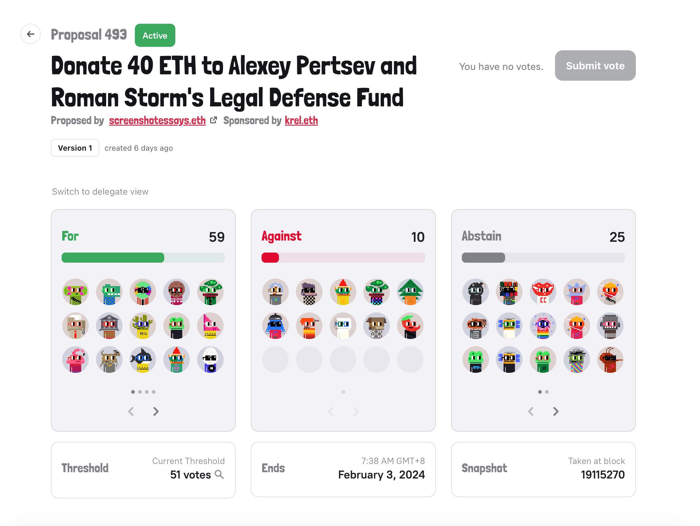

## Deploy Plan Updates by Jango

#### Bannyverse

The pieces that we now need for the deployment of Bannyverse revnet include media content, naked Bannies, outfits of Banny, education materials, as well as some more efforts in the respect of outreach, social media and marketing.

The timeline for Bannyverse's deployment will be:

- Target testnet production candidates will be deployed on Ethreum mainnet, Optimum or even Arbitrum around February 12th;

- The production deployment will be February 17th - 20th.

There are a lot of prerequisites and other things that make up this release, so it will be a coordination amongst lots of people and lots of delicate pieces of infrastructure. The timeframe above will be 3 weeks away for the team to really push this project through the finish line, getting all the things deployed on testnets, well tested and looked over as many times as possible, before officially launch this very scoped experiment.

The idea of Bannyverse being the first project stems from the consideration that Banny can probably do a better job than any of us in explaining what is going on with Revnet and Bananapus. Through the Banny NFTs and this cultural tidbit, and a matter of engagement with the art and a few buttons on screen, we can hopefully convey to new users all the powerful tools which can then be scaled to solve arbitrary other problems in this ecosystem.

At this moment, the team is still working on some early prototypes of what the experience of interacting with Bannyverse will look like.

#### Revnet

Currently Aeolian is working on the development of the website of Revnet, revnet.app. There might still be some framework things to get right, get tight and get ready. 

And from a UX perspective, we need the support of setting different stages in a revnet, which is the only things holding Revnet from being able to support Bannyverse into production. 

The specific websites revnets like Bannyverse will be trying to tell their own different stories, but they will also have links back to revnet.app if people are more interested in the financial models of those revnets, or if they have $BANNY or other tokens and they want to access the revenue of those networks.

#### $Bananapus

From a Bananpus perspective, we need fee-collecting project No.1 on Ethereum mainnet, Optimism and/or Arbitrum, wherever we want to deploy the protocol. We need the fee-collecting treasury to work and be there.

There is this swap terminal developed by Dr.Gorilla, which helps a project to allow anyone to pay any token to it, while swapping into the token in which project's accounting is based on.  With its deployments in multiple chains, Bananapus needs a swap terminal because it doesn't know what tokens people are going to paying their fees. It might not always be ETH, but rather the native tokens of those different chains. So we want to make sure that Bananapus, as the fee collecting project, has a swap terminal attached to it and can scale to accept fees in various tokens.

Another piece of infrastructure we want for Bananapus is the Cross-chain Sucker, which is mainly developed by 0xBA5ED. A project would take in revenue on any chain, and then that revenue and the token issuance will get sucked down to the main network where the project's token is being issued. Obviously this infrastructure is necessary for selling Bannies on multiple chains, as well as Bananapus project's fee collection on multiple chains and having them all puddle back to the $NANA tokens, where JuiceboxDAO will have its main exposure after the deployment of Bananapus.

Other less technical but more social things that we could get a step forward on, would be the partnerships with other chain environments, such as Optimism, Arbitrum, Base, Zora or any chain we end up going. We will bust through the front doors, they can have a headsup and do whatever they want, if they want to help drive traffic at that point in time.

We will put a lot of efforts in testing out Bananapus. When we scope Bananpus down to revnets, we basically will remove 3/4 of the Bananapus code base from an attack surface perspective. By starting with one project, we can really focus the tests down the line to make sure this works well for all other revnets.

#### Others

Most of these pieces have been pretty much lined up, and it's just a matter of getting them through the door, making them look nice and fit in with everything else, making them easy to read and be documented, etc.

During this cycle, Jango submitted [a proposal which suggests JuiceboxDAO to pay 40 ETH in the upcoming Bannyverse revnet and get some naked Banny NFTs and $BANNY token](https://nance.app/s/juicebox/473). Jango also said in the town hall that, whether or not the proposal gets approved, JuiceboxDAO will have skin in the game from a perspective of a brand equity, and from the scheduled allocation of some pre-mint $BANNY tokens for JuiceboxDAO's early investment and support in the development of Banny.

Filipv suggested that we should have someone to write the grant proposals to different L2 chains such as Optimism or Arbitrum for Bananapus and Revnets, which can be a time consuming effort as those L2s might have different in-depth procedures to go through. Jango said that we should focus our efforts on Optimism in the beginning, as that's where Banny NFTs are going to be sold first. Matthew and Brileigh both have some experience making grant proposals and they were going through the process to help the project [Free Alexey & Roman](https://juicebox.money/@free-pertsev-and-storm) gain more support with Arbitrum, they expressed their willingness to help out in this respect.

## Nouns Proposal Updates by Matthew & Brileigh

Matthew and Brileigh managed to get a [Nouns proposal](https://nouns.wtf/vote/493) for the [Free Alexey & Roman](https://juicebox.money/@free-pertsev-and-storm) project, which is to support the legal defense for the two Tornado Cash developers, submitted in the Nouns community and it advocates NounsDAO to pay 40 ETH for this project. 

Matthew called on our community members who might have any connections in the Nouns community to help get more support for this proposal. He said that it would be a huge success to see the Nouns community to come together to help defend the right of publishing code and privacy, and also it would be very cool to have the Nouns treasury actually pay a Juicebox project for the first time and interact with the Juicebox protocol.

Matthew also shared a [voting note](https://www.mmmogu.com/tx/0x8ce9d8806cfc714d69862e980085495e18291b958f0f20f9de9194c30c6ac12d) written by a dev called brennan.eth from the Nouns community. Matthew expressed his great recognition for this article, that it articulates very well some of ideas at play, and shows that people really do care about what we're working with the Alexey and Roman campaign.

