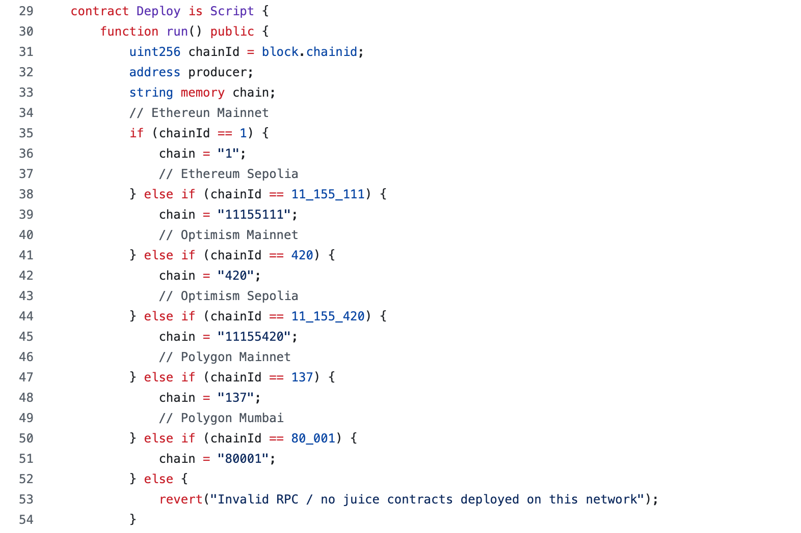
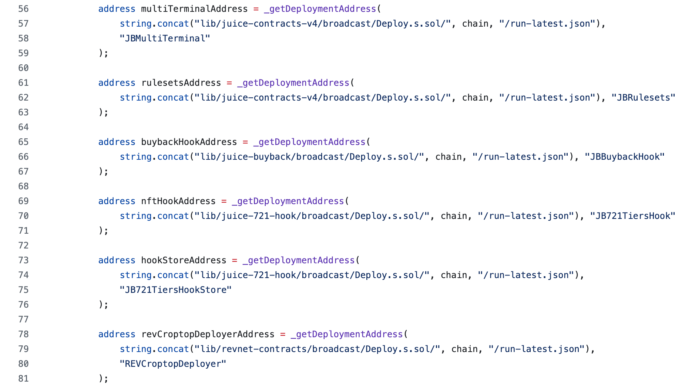
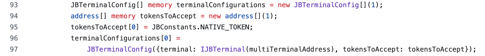
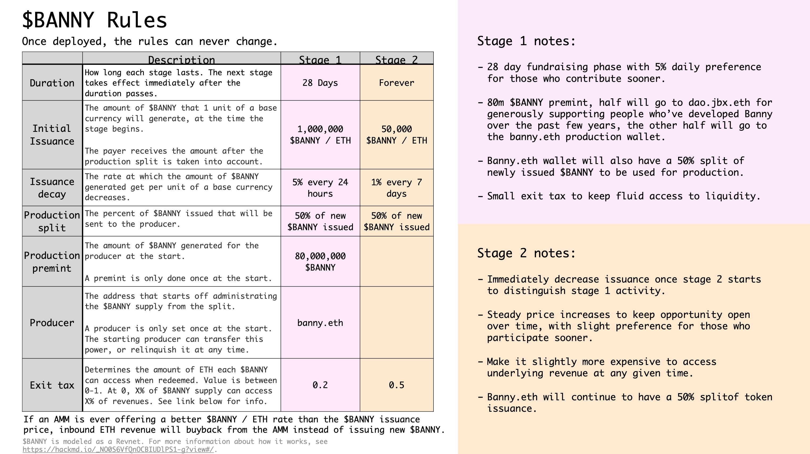
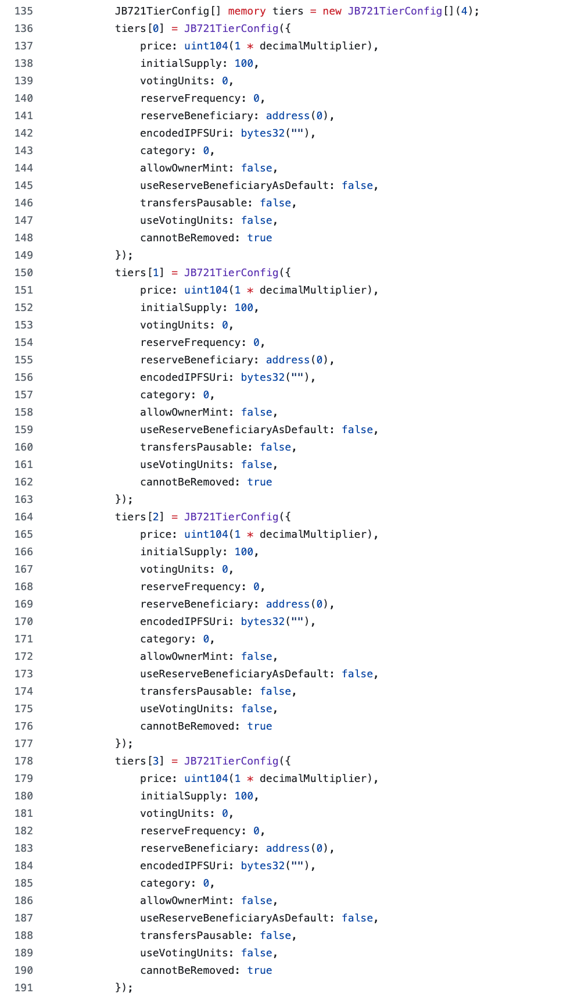
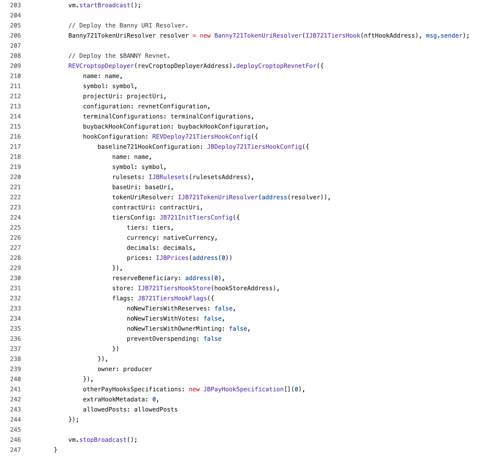
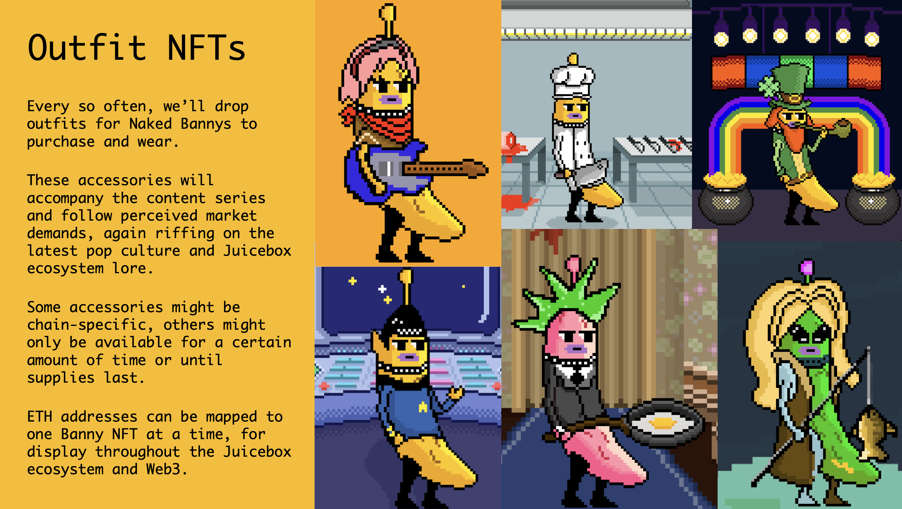
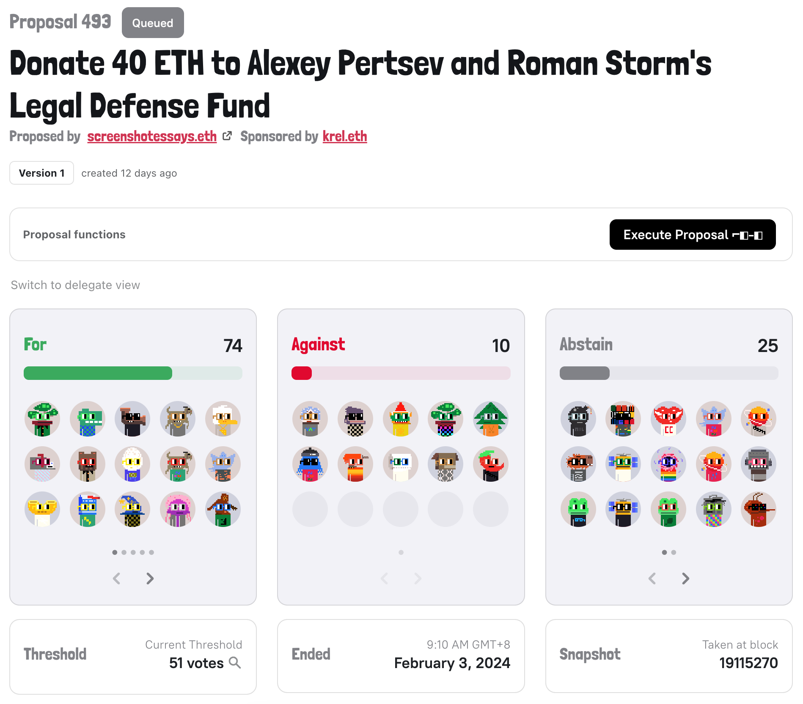
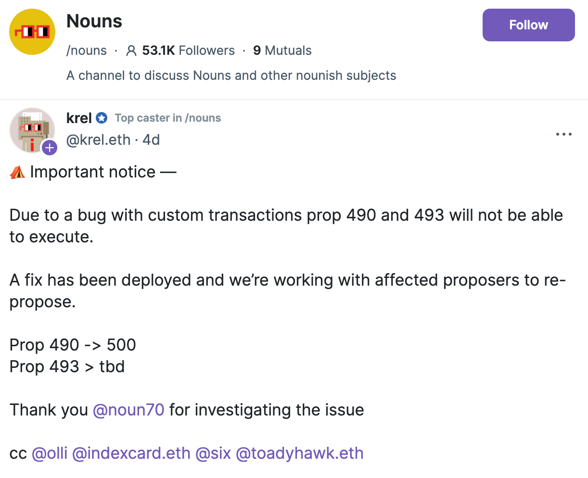

## Bannyverse Deploy Script Updates by Jango

Jango has been working on the deploy scripts for Bannyverse lately. Bannyverse is the surface level project that ties together everything we've been working on. It's very cool in that sense, but there are also a lot of components, such as the 721 hook which is the standard JBNFT, the buyback delegate attached through revnets and Juicebox V4 protocol, and also some Croptop elements alongside, basically with everything integrated into this one project.

Jango introduced that in the [Banny contract](https://github.com/mejango/banny-contract), there is one component that Bannyverse adds for its specific use, which is [the 721TokenUriResolver](https://github.com/mejango/banny-contract/blob/main/src/Banny721TokenUriResolver.sol). This token URI resolver takes NFTs in various categories and stitches them together to make a Bannyverse. It allows us to dress the Bannies we own, by showing the token URI, the SVG data and the outfit IDs of a naked Banny, realizing the visualization of dressing naked Banny with different outfits.

In the town hall, Jango went through [the deploy script of Bannyverse](https://github.com/mejango/banny-contract/blob/main/script/Deploy.s.sol) line by line, sharing the efforts that the team had been making in the last period of time, and also letting other community members try to look at things from the programmers' perspective. This deploy script is still waiting for the last two very important components, the Cross-chain Sucker and the Swap terminal, which will be added in quite easily when they are ready.

#### Chain identification

First, we need to figure out what chain we are on, because Bannyverse can be deployed basically onto any chain.

#### Dependency repos

All the contracts from these dependency repositories are as follows:

#### Load the addresses

Then we will get the addresses for multi-terminal, rulesets, buyback hook, NFT hook, hook store and the revnet Croptop deployer.

#### Top level metadata

We are going to define some top level things which include logo and all the metadata stuff that shows up on front end website like Juicebox.money.

#### Tokens to accept funds

Here is what we are going to set the terminals that the projects will accept funds through, and we will set it to accept the native token of that specific blockchain. In this case, ETH on Ethereum mainnet or anywhere else. 

This is where we would add other terminals to accept funds in other tokens, the upcoming Swap terminal will fit in right in this part.

#### Revnet stages

We are going to configure the stages for Bannyverse revnet, which is going to have 2 stages pre-set at its official launch. Both stages will set their respective start time, operator split rate, initial issuance rate, price ceiling, price floor tax intensity, etc.

#### Revnet configuration

After sticking the stages in the main revnet configuration, we set the base currency, pre-mint amount and the initial operator.

#### Buyback hook configuration

Then we are going to configure the buyback hook, setting the parameters that determine the prices to implement buyback. We will define the pool and the TWAP parameters as well. 

Down below, we will keep a reference of this buyback hook configuration, while also specifying the address of the buyback hook contract.

#### Tiers of NFTs

We are going to preload 4 naked Bannies with 4 tiers each at different price points, different supplies, etc.

#### Croptop parameters

These parameters are to allow people to post their own outfits onto NFT collections. The project owner does not have to be the only one that has permission to post items into the Bannyverse, it can eventually grow into a world where anyone can post collectibles onto the Bannyverse.

#### Broadcasting onto the chain

Now that we have everything properly set up, we are going to broadcast this onto the chain. We will send two transactions. The first one will be deploying the URI Resolver, which will be [the custom Banny resolver contract](https://github.com/mejango/banny-contract/blob/main/src/Banny721TokenUriResolver.sol). And the second transaction will be deploying the revnet, throught this `deployCroptopRevnetFor()` which will set the project in motion, passing in everything makes croptop, such as the name, the symbol, the project URI, the revnet configuration, the terminal configurations, the buyback hook configurations, the NFT hook configurations and the Croptop posting, etc.

***

Once we run the script, we should have a functioning Bannyverse revnet that is selling naked Bannies ready to go, as well as with the support for Banny outfits in the future and other normal Juicebox components.

We will also use a similar script for the Bananapus project, which is the fee collecting project of the protocol, but without NFTs or Croptop features. 

## Background of Bannyverse by Jango

Aesthetically, Bannyverse is being reborn from a rich set of assets that we put together about one and a half years ago. 

Originally these assets were meant for purpose of a more governance oriented project, where $JBX holders can stake their tokens and get veBanny NFTs in return to vote in governance with the weight proportionate to the duration and quantity that they have their $JBX locked away. That project had never been put into production for some reason.

In that period of time, JuiceboxDAO had been pursuing the prerequisites for sturdiness of the Juicebox protocol, such as protocol versioning, security related work, risk mitigation work, and recently the Revnets, there had been somewhat more prioritized prerequisite that put this Banny art project to the back burner.

Jango, Mieos and Lurkmoth met and decided that it's time to pull Bannyverse out and re-apply it for the current moment. They started to broom over how Banny might live on screen in a less Web3 NFT specific environment, but rather as a relatable character to help tell the Juicebox story. The current efforts are focused on how things can be weaved together, which have been refined and discussed in the form of a proposal with JuiceboxDAO over the past few cycles.

The Bannyverse will start with the manifestation as a collection of naked Bannies that people can mint on Ethereum mainnet and Optimism, which hopefully in the future we can scale it up into any number of chains. 

Four tiers of naked Bannies serve as the base character with different rarities, and Mieos will lead the effort of curating various Banny outfits and other fun things in the future, so that owners of naked Bannies can buy accessories and dress their Bannies as they like. These collections of Banny will be accompanied by the animation series produced by Lurkmoth, and together they are going to get the words out for the Bannyverse.

Thankful for the support from JuiceboxDAO, the Bannyverse will hopefully have a good starting point, but we also expect it to create a virtuous circle and bring attention back into the Juicebox culture, along with more contributors, new projects and new ideas. We are open to the unknown future of whatever happens.

## Unit Test for Juicebox V4 Updates by Nowonder

Nowonder has been working on unit tests for Juicebox V4 protocol, by basically covering all the logical branches of each contract in the most minimal way possible, which basically means deploying a single contract that will make other calls to other contracts, mocking those calls and returning data to make sure that all of the logic makes sense. And given Juicebox V3 protocol being a concrete piece of software, he expected that what to be found will at most just  be a few optimizations. But he also said that when changes are made to the implementation in the future, the unit test will help inform exactly what has changed, so that we can be sure those changes are safe.

Jango expressed his gratitude that this kind of work had been the only reason that we can play at these higher level of artful abstraction, because we have this splendid community of contributors doing a lot of under recognized work behind the scenes. It's a really important piece of work to allow us to play these artful abstraction.

## Nouns Proposal 493 Updates by Matthew

The [Nouns proposal 493](https://nouns.wtf/vote/493) to donate 40 ETH to the [Free Alexey & Roman project](https://juicebox.money/@free-pertsev-and-storm) to support the legal defense of the two Tornado Cash developers has been approved by a high margin. This is the first proposal that has ever been passed to actually pay a Juicebox project directly from the Nouns DAO treasury.

Unfortunately, due to some bug in Nouns's governance front end, the transaction to execute this proposal failed. Although a fix has been deployed to this problem, the proposal still needs to be re-submitted and voted for another time. Matthew said that he was not worried about going through the process again as the votes for the last one were overwhelmingly in support. 

Matthew and Brileigh thought that they could convince other DAOs to support Juicebox projects if they are good and have potentials, and it was just a question of making the right inroads with the communities and the right people over there. They will be trying to run the same strategy with larger DAOs like Arbitrum and Optimism, etc., hopefully to get more DAO treasuries to interact directly with Juicebox protocol. 

