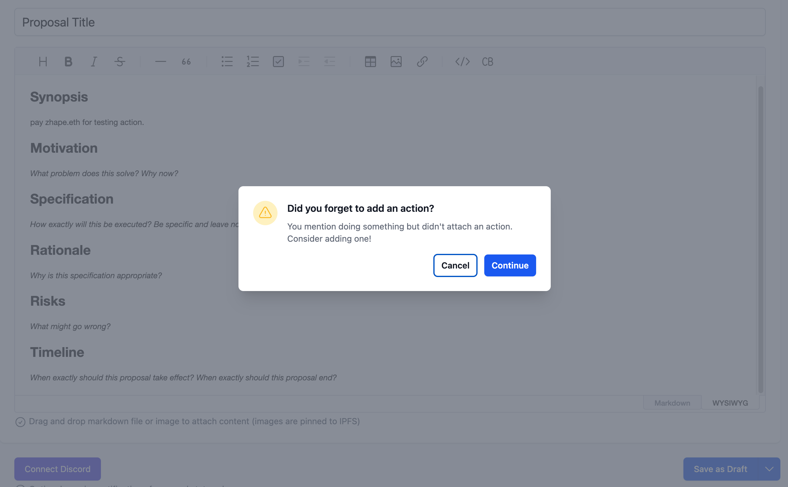
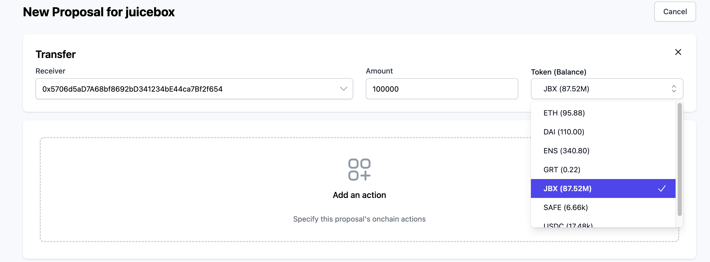
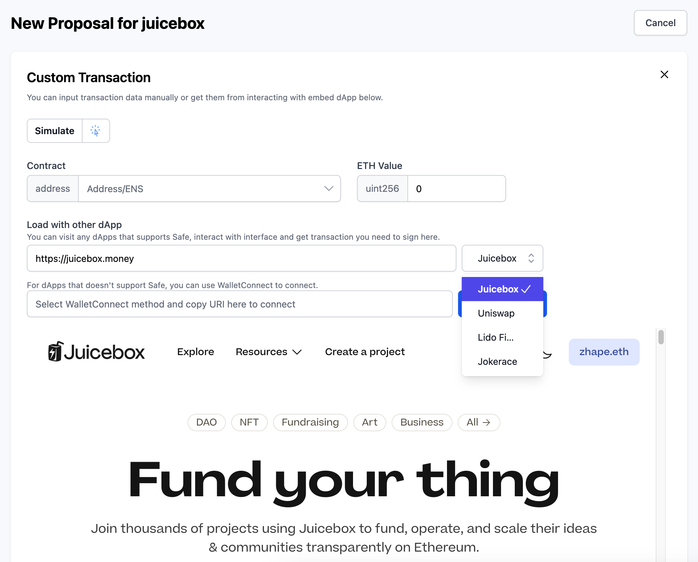
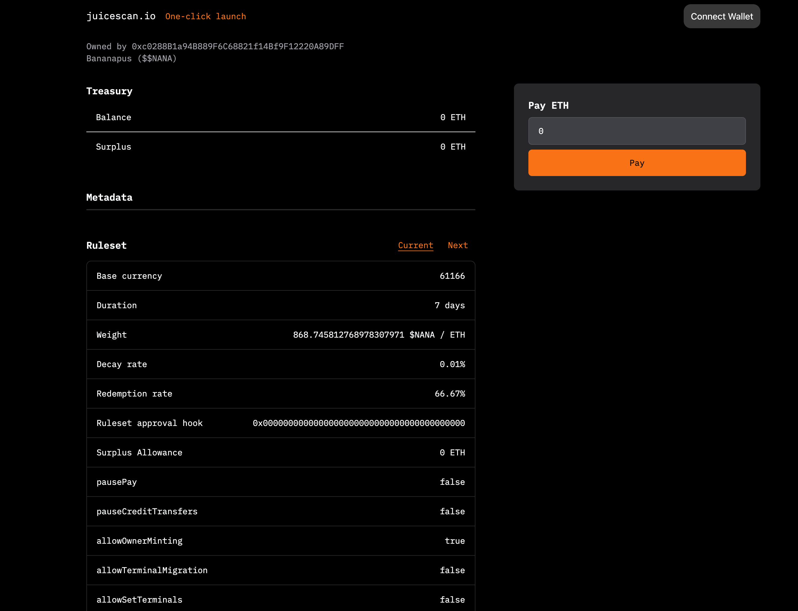
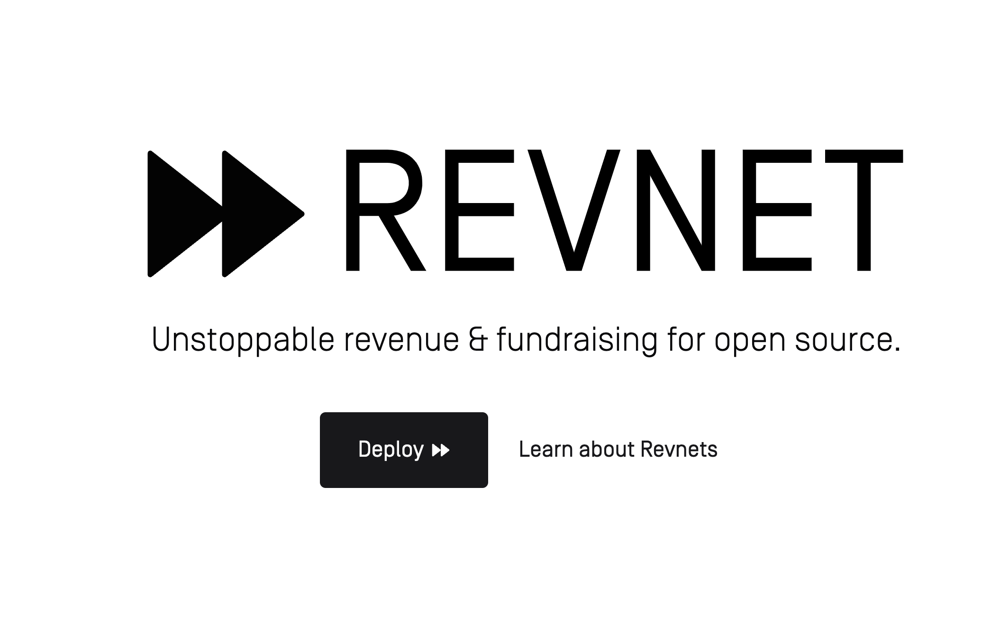

## Nance Updates by Jigglyjams

Jigglyjams introduced some of the new features on Nance for proposal actions, which help specifiying the execution details of proposals. If a proposal gets approved, its actions will be easily queued as onchain transactions to be executed by multisigs of DAOs, which is very helpful in avoiding possible miscomprehension of proposal details, as well as saving overhead burden of the multisig.

- If payment or transfer is mentioned in the body of a proposal and no action is added to it yet, there will be a pop-up window to remind users to do so. Although users can choose to override and submit a proposal without an action, this serves as a good reminder.

  

- If an action is added to make transfers from the Safe wallet of the DAO, Nance will show the balance of assets holded in the Safe wallet.

  

- And now Nance also supports actions with custom transaction, either by manual input of transaction detail or pre-defined interactions with embedded DApps.

  

As many DAOs are now using Discourse to build their communities, the Nance team is looking at the possibility to create a fundraising campaign to help fund the integration of Nance with Discourse. Jango and Jigglyjams both agreed on the direction of making Nance a upcoming Revnet network to support its future development. 

## V4 Updates by Jango

At this moment, the Juicebox V4 protocol is going through the last round of audits. The team has finished iterating on the Nana-core repo where there is only one remaining PR need to be merged, and it is now rating two audit reports for Suckers repo and the 721 hook repo respectively. We are working on an upcoming testnet version that will be likely be the production candidate of it since there is no forseen changes left to be made thereafter. Then efforts will be made to actually put some activity on this testnet to see if we catch anything in this post-audit phase.

#### Proposal to integrate V4 on Juicebox.money

During the current governance cycle, Aeolian submitted a [proposal](https://nance.app/s/juicebox/498) to fund the the integration of the V4 Juicebox contracts on juicebox.money. This proposal didn't pass the temperature check of this cycle, but Jango felt that, since we are putting quite much weight on audits and getting things tightened before launch,  it might be worthwhile to revisit this proposal sooner rather than later, to at lease let juicebox.money play on these testnets in a more experimental environment, although probably not servicing it to users as yet.

The discussions of this proposal have also brought up many questions about how $NANA token relates to Juicebox or $JBX, what the relationship between these economic networks will be, etc. According to what Jango said on the townhall:

- $JBX will not be the fee collecting token on this omnichain Juicebox V4 network, but it will continue collecting fees from the current V3 protocol;
- $NANA tokens will be collecting the revenue of V4 protocol;
- $NANA tokens will be owned by $JBX via the reserved rate allocation and an initial pre-mint;
- $JBX will become the only governance body of Juicebox.

#### Interfaces of Juicebox V4 protocol

At this stage, we have several interfaces to interact with the Juicebox V4 protocol:

- [revnet.app](https://www.revnet.app/)
- [juicebox.money](https://juicebox.money/)
- [juicescan.io](https://www.juicescan.io/p/1)

Juicescan.io, developed by Aeolian, is a very simple interface to check the full spectrum of details of projects on Juicebox protocol, which is a burden that juicebox.money has had to do for V3 protocol and all the versions till this stage. Juicescan.io can prevent juicebox.money from being too feature specific and focusing on less interesting details about a project which relate more to risky than informative value. With Juicescan.io, juicebox.money can take a stronger position as to what it's now trying to offer. 

Although juicebox.money will support deployment of a project on any chain, if various treasuries in different chains were to be owned and managed by an entity, it will be very hard to coordinate these treasuries to communicate with each other and keep them in sync. Revents, on the other hand, are specialized Juicebox projects that are contract-owned, which means they will be deterministic once they are deployed and can be kept in sync across several chains.

So revnet.app will be the primary interface if folks are doing crosschain or omnichain things, it will be the place where people interact with the omnichain capability of Juicebox protocol, where projects can operate and manage token issuance and redemptions on any chain. 

Jango indicated that Juicebox protocol is very open-ended, people can choose to express it on different front ends, like revnet.app, juicebox.money or many different little websites that do specific things, while using the same database underneath, and can also choose to expose different features of the protocol that they feel appropriate for specific purposes on those interfaces. 

